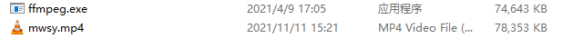

# **Air105视频播放**

## 前言

之前在Air101上我们进行过[视频播放](https://doc.openluat.com/article/3535)并制作了demo：[video_play](https://gitee.com/openLuat/LuatOS/tree/master/demo/video_play)，今天我们使用Air105在进行一遍视频播放

## 准备工作

在进行之前先说一下原理，原理很简单，就是将TF卡中的视频字节流数据读出来在LCD上绘制

那么开始准备视频字节流数据吧，我们需要用到[ffmpeg](https://www.ffmpeg.org/)

### linux平台

直接终端输入 `sudo apt install ffmpeg` 即可

### windows平台

我们在[这里](https://www.gyan.dev/ffmpeg/builds/)进行下载可以得到win版本的压缩包，解压即可获得其中的ffmpeg.exe

下面以windows平台为例

首先我们了解一下基础的ffmpeg参数

## 视频文件制作


首先准备好一段要播放的视频，由于避免版权原因这里不放视频地址了，将之前的ffmpeg.exe也准备好



powershell命令输入 `.\ffmpeg -i mwsy.mp4 -r 20 -vf scale=160:128 -pix_fmt rgb565be -vcodec rawvideo mwsy.rgb` 即可将视频转为160x128分辨率的字节流文件


将生成的mwsy.rgb放在sd卡中

## 播放视频

之后将我们开始编写代码

```lua
sys.taskInit(function()
    --初始化lcd
    spi_lcd = spi.deviceSetup(5,pin.PC14,0,0,8,48*1000*1000,spi.MSB,1,1)
    log.info("lcd.init",
    lcd.init("st7735",{port = "device",pin_dc = pin.PE08 ,pin_rst = pin.PC12,pin_pwr = pin.PE09,direction = 3,w = 160,h = 128,xoffset = 1,yoffset = 2},spi_lcd))
    --初始化sd
    local spiId = 2
    local result = spi.setup(
        spiId,--串口id
        255, -- 不使用默认CS脚
        0,--CPHA
        0,--CPOL
        8,--数据宽度
        400*1000  -- 初始化时使用较低的频率
    )
    local TF_CS = pin.PB3
    gpio.setup(TF_CS, 1)
    --fatfs.debug(1) -- 若挂载失败,可以尝试打开调试信息,查找原因
    fatfs.mount("SD", spiId, TF_CS, 24000000)
    local data, err = fatfs.getfree("SD")
    if data then
        log.info("fatfs", "getfree", json.encode(data))
    else
        log.info("fatfs", "err", err)
    end
    
    local video_w = 160
    local video_h = 128
    local rgb_file = "mwsy.rgb"

    local buff_size = video_w*video_h*2
    local file_size = fs.fsize("/sd/"..rgb_file)
    print("/sd/"..rgb_file.." file_size",file_size)
    
    local file = io.open("/sd/"..rgb_file, "rb")
    if file then
        local file_cnt = 0
        local buff = zbuff.create(buff_size)
        repeat
            if file:fill(buff) then
                file_cnt = file_cnt + buff_size
                lcd.draw(0, 0, video_w-1, video_h-1, buff)
                sys.wait(20)
            end
        until( file_size - file_cnt < buff_size )
        local temp_data = file:fill(buff,0,file_size - file_cnt)
        lcd.draw(0, 0, video_w-1, video_h-1, buff)
        sys.wait(30)
        file:close()
    end

    while 1 do
        sys.wait(1000)
    end
end)
```

可以看到代码很简单，首先初始化lcd 之后初始化并挂载sd，然后就是读视频向lcd进行draw

[demo连接](https://gitee.com/openLuat/LuatOS/tree/master/demo/video_play/Air105)

## 效果展示

[视频效果展示](https://www.bilibili.com/video/BV1Yg411R7Tc/)

## 相关连接

[LuatOS-SoC仓库](https://gitee.com/openLuat/LuatOS)

[LuatOS-SoC WIKI](https://wiki.luatos.com/index.html)

[bsp-Air101](https://gitee.com/openLuat/LuatOS/tree/master/bsp/air101)