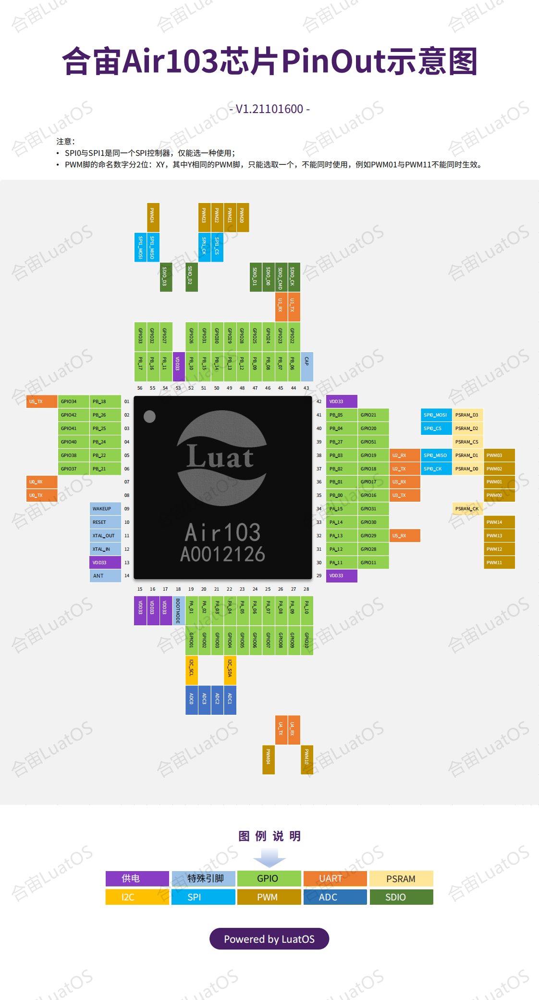

# Air103

## Air103是什么?

合宙Air103是一款QFN56 封装，6mm x 6mm 大小的mcu

## LuatOS为它提供哪些功能

* 基于Lua 5.3.6, 提供95%的原生库支持
* 适配LuaTask,提供极为友好的`sys.lua`
* 文件系统大小112KB,格式littlefs 2.1.
* `gpio` GPIO管脚控制功能(映射表后面有提供)
* `uart` 串口输入输出功能,支持uart0(芯片日志/调试/刷机)/uart1~4(用户可用)
* `i2c` iic总线master功能,并自带多种温湿度传感器驱动
* `disp` 基于i2c的显示屏支持,例如SSD1306
* `eink` 支持多款墨水屏
* `lcd` 支持多款彩色SPI屏
* `lvgl` 支持全部LVGL原生组件和动画效果,并内嵌中文字体
* `zbuff` 像C语言一样操作内存字节数组,高效可靠
* `json` lua对象与json字符串的双向转换
* `log` 简洁的日志功能
* `wdt` 硬件看门狗,安全保护
* `pwm` 多个PWM输出管脚,存在复用关系
* `adc` 2个adc通道外部电平检测,一个内部温度检测
* `sensor` 单总线驱动,默认支持DS18B20
* `pm` 功耗管理,可进入低功耗模式并定时唤醒
* `hwtimer` 硬件定时器(开发中)
* `rtc` 实时时钟(开发中)
* `sdio` 通过SDIO硬件接口读写TF卡
* `mcu` 主频调节,最低可到2M(需调低uart波特率)

LuatOS大QQ群: 1061642968

## 管脚映射表

| GPIO编号 | 命名 | 默认功能及扩展功能     |
| -------- | ---- | ---------------------- |
|0|PA0|I2S_MCLK/LSPI_CS/PWM2/I2S_DO|
|1|PA1|JTAG_CK/I2C_SCL/PWM3/I2S_LRCK/ADC_1|
|2|PA2|UART1_RTS/UART2_TX/PWM0/UART3_RTS/ADC_4|
|3|PA3|UART1_CTS/UART2_RX/PWM1/UART3_CTS/ADC_3|
|4|PA4|JTAG_SWO/I2C_SDA/PWM4/I2S_BCK/ADC_2|
|5|PA5|UART3_TX/UART2_RTS/PWM_BREAK/UART4_RTS|
|6|PA6|UART3_RX/UART2_CTS/NULL/UART4_CTS/LCD_SEG31|
|7|PA7|PWM4/LSPI_MOSI/I2S_MCK/I2S_DI/LCD_SEG3/Touch_1|
|8|PA8|PWM_BREAK/UART4_TX/UART5_TX/I2S_BCLK/LCD_SEG4|
|9|PA9|MMC_CLK/UART4_RX/UART5_RX/I2S_LRCLK/LCD_SEG5/TOUCH_2|
|10|PA10|MMC_CMD/UART4_RTS/PWM0/I2S_DO/LCD_SEG6/TOUCH_3|
|11|PA11|MMC_DAT0/UART4_CTS/PWM1/I2S_DI/LCD_SEG7|
|12|PA12|MMC_DAT1/UART5_TX/PWM2/LCD_SEG8/TOUCH_14|
|13|PA13|MMC_DAT2/UART5_RX/PWM3/LCD_SEG9|
|14|PA14|MMC_DAT3/UART5_CTS/PWM4/LCD_SEG10/TOUCH_15|
|15|PA15|PSRAM_CK/UART5_RTS/PWM_BREAK/LCD_SEG11|
|16|PB0|PWM0/LSPI_MISO/UART3_TX/PSRAM_CK/LCD_SEG12/Touch_4|
|17|PB1|PWM1/LSPI_CK/UART3_RX/PSRAM_CS/LCD_SEG13/Touch_5|
|18|PB2|PWM2/LSPI_CK/UART2_TX/PSRAM_D0/LCD_SEG14/Touch_6|
|19|PB3|PWM3/LSPI_MISO/UART2_RX/PSRAM_D1/LCD_SEG15/Touch_7|
|20|PB4|LSPI_CS/UART2_RTS/UART4_TX/PSRAM_D2/LCD_SEG16/Touch_8|
|21|PB5|LSPI_MOSI/UART2_CTS/UART4_RX/PSARM_D3/LCD_SEG17/Touch_9|
|22|PB6|UART1_TX/MMC_CLK/HSPI_CK/SDIO_CK/LCD_SEG18/Touch_10|
|23|PB7|UART1_RX/MMC_CMD/HSPI_INT/SDIO_CMD/LCD_SEG19/Touch_11|
|24|PB8|I2S_BCK/MMC_D0/PWM_BREAK/SDIO_D0/LCD_SEG20/Touch_12|
|25|PB9|I2S_LRCK/MMC_D1/HSPI_CS/SDIO_D1/LCD_SEG21/Touch_13|
|26|PB10|I2S_DI/MMC_D2/HSPI_DI/SDIO_D2/LCD_SEG22|
|27|PB11|I2S_DO/MMC_D3/HSPI_DO/SDIO_D3/LCD_SEG23|
|28|PB12|HSPI_CK/PWM0/UART5_CTS/I2S_BCLK/LCD_SEG24|
|29|PB13|HSPI_INT/PWM1/UART5_RTS/I2S_LRCLK/LCD_SEG25|
|30|PB14|HSPI_CS/PWM2/LSPI_CS/I2S_DO/LCD_SEG26|
|31|PB15|HSPI_DI/PWM3/LSPI_CK/I2S_DI/LCD_SEG27|
|32|PB16|HSPI_DO/PWM4/LSPI_MISO/UART1_RX/LCD_SEG28|
|33|PB17|UART5_RX/PWM_BREAK/LSPI_MOSI/I2S_MCLK/LCD_SEG29|
|34|PB18|UART5_TX/LCD_SEG30|
|35|PB19|UART0_TX/PWM0/UART1_RTS/I2C_SDA|
|36|PB20|UART0_RX/PWM1/UART1_CTS/I2C_SCL|
|37|PB21|UART0_RTS/PCM_SYNC/LCD_COM1|
|38|PB22|UART0_CTS/PCM_CK/LCD_COM2|
|40|PB24|LSPI_CK/PWM2/LCD_SEG2|
|41|PB25|LSPI_MISO/PWM3/LCD_COM0|
|42|PB26|LSPI_MOSI/PWM4/LCD_SEG1|
|43|PB27|PSRAM_CS/UART0_TX/LCD_COM3|

开机时仅配置了`BOOT`和`UART0_TX/RX`, 其他数字脚均为GPIO脚, 状态为输入高阻.

| ADC编号（LuatOS） | 功能         |
| ----------------- | ------------ |
| 0                 | 模块ADC0-PA1 |
| 1                 | 模块ADC1-PA4 |
| 10                | CPU温度      |

## 刷机烧录教程

[串口烧录教程](flash.html#id2)

**注意：烧录前请设置波特率为921600**

## 模块购买

[手机访问mall.m.openluat.com](https://mall.m.openluat.com)

## 开发板PinOut

待更新

## 芯片PinOut

