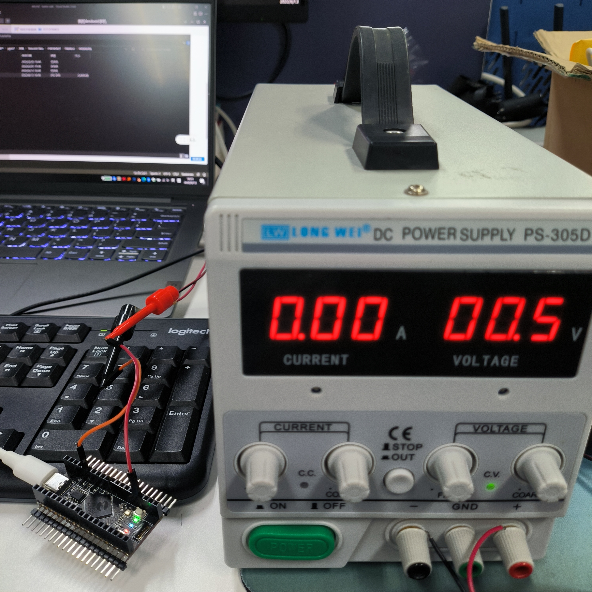

# ADC

本章介绍LuatOS的ADC功能，实现使用Air105开发板读取外部电压并在日志中打印

## 简介

模拟数字转换器即A/D转换器，或简称ADC，通常是指一个将模拟信号转变为数字信号的电子元件。

Air105共有7路ADC，开发板引出了4路，通道分别为1，2，5，6（参考[Air105 核心板使用手册V1.1.pdf](https://cdn.openluat-luatcommunity.openluat.com/attachment/20220303111656608_Air105%20%E6%A0%B8%E5%BF%83%E6%9D%BF%E4%BD%BF%E7%94%A8%E6%89%8B%E5%86%8CV1.1.pdf)）

参考[Air105芯片数据手册_1.1.pdf](https://cdn.openluat-luatcommunity.openluat.com/attachment/20220114193313925_Air105%E8%8A%AF%E7%89%87%E6%95%B0%E6%8D%AE%E6%89%8B%E5%86%8C_1.1.pdf)可知，ADC 的参考电压为 1.8V，ADC 通道 1~通道 6 采集电压范围可配，使能内部分压时采集电压范围 0~3.6V，不使能内部分压时采集电压范围 0~1.8V，在LuatOS中未使能内部分压，所以我们直接使用只能采集0~1.8V的电压，`外接输入一定不要超过1.8V，否则会烧毁芯片！！`


## 硬件准备

Air105开发板一块，可调电源一台，接线示意如下

```
        PC0/ADC1 ----------- +
Air105                         可调电源
        GND      ----------- -
```


> 注意：先打开可调电源，调到1.8V以下，防止直接连接开机电压过高烧毁芯片


## 软件部分

接口文档可参考：[ADC库](https://wiki.luatos.com/api/adc.html)

代码如下

```lua
PROJECT = "ADC"
VERSION = "1.0.0"

sys = require("sys")

MOD_TYPE = rtos.bsp()
log.info("MOD_TYPE", MOD_TYPE)

function test()
    log.info(PROJECT, "START")
    -- 打开ADC通道1
    assert(adc.open(1) == true, PROJECT .. ".open ERROR")
    -- 读取ADC通道1的值
    log.info(PROJECT .. ".read", adc.read(1))
    -- 关闭ADC通道1
    adc.close(1)
    log.info(PROJECT, "DONE")
end

-- 创建一个携程循环执行test函数
sys.taskInit(function()
    while true do
        test()
        sys.wait(1000)
    end
end)

sys.run()

```
>注意：`adc.read`有两个返回值，第一个值为原始值，第二个值为转换值，单位为mV

成功下载后，观察日志输出如下，根据`adc.read`返回的第二个值可知测量电压为1712mV左右

```
main 663:bootloader build release Jun 10 2022 09:15:48!
Jump_AppRun 76:jump to 0x01010400 !
main 174:APP Build release Jun 10 2022 09:17:23!
I/main LuatOS@AIR105 core V0007 bsp V0008
I/main ROM Build: Jun 10 2022 09:17:38

D/main loadlibs luavm 204792 14728 14984
D/main loadlibs sys   362984 22600 23264
I/user.MOD_TYPE	AIR105
I/user.ADC	START
I/user.ADC.read	3882	1712
I/user.ADC	DONE
I/user.ADC	START
I/user.ADC.read	3889	1709
I/user.ADC	DONE
I/user.ADC	START
I/user.ADC.read	3898	1713
I/user.ADC	DONE
...
...

```

缓慢下调可调电源的电压值，观察日志输出的电压值对应可调电源的电压值


```
I/user.ADC.read	2667	1172
I/user.ADC	DONE
I/user.ADC	START
I/user.ADC.read	2672	1174
I/user.ADC	DONE
I/user.ADC	START
I/user.ADC.read	2678	1177
I/user.ADC	DONE
I/user.ADC	START
I/user.ADC.read	2661	1169
I/user.ADC	DONE
I/user.ADC	START
I/user.ADC.read	2670	1173
I/user.ADC	DONE
I/user.ADC	START
I/user.ADC.read	2675	1175
I/user.ADC	DONE
I/user.ADC	START
I/user.ADC.read	2673	1174
I/user.ADC	DONE

```


```
I/user.ADC	START
I/user.ADC.read	1361	598
I/user.ADC	DONE
I/user.ADC	START
I/user.ADC.read	1345	591
I/user.ADC	DONE
I/user.ADC	START
I/user.ADC.read	1362	598
I/user.ADC	DONE
I/user.ADC	START
I/user.ADC.read	1354	595
I/user.ADC	DONE
I/user.ADC	START
I/user.ADC.read	1350	593
I/user.ADC	DONE
I/user.ADC	START
I/user.ADC.read	1348	592
I/user.ADC	DONE

```