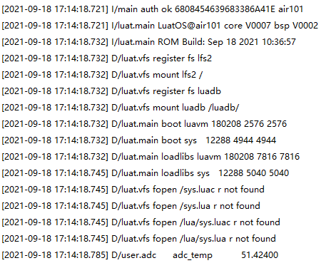

# ADC

本章将会向大家介绍LuatOS的ADC功能。将会实现使用Air101开发板读取内部温度并在日志中打印。

## 简介

模拟数字转换器即A/D转换器，或简称ADC，通常是指一个将模拟信号转变为数字信号的电子元件。通常的模数转换器是将一个输入电压信号转换为一个输出的数字信号。Air101芯片具有两路16位ADC，最高采样率1KHz。

## 硬件准备

Air101开发板一块

## 软件使用

接口文档可参考：[ADC库](https://wiki.luatos.com/api/adc.html)

代码展示

```lua
adc.open(10) -- CPU温度
log.debug("adc", "adc_temp", adc.read(10)/1000)--读取温度并显示
-- 使用完毕后关闭,可以使得休眠电流更低.
adc.close(10)
```

代码日志


