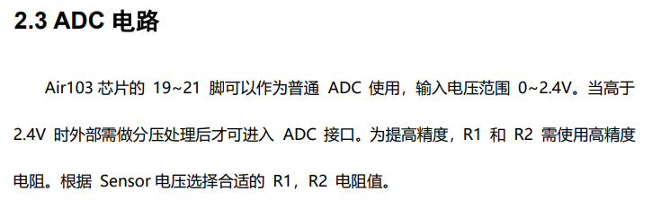
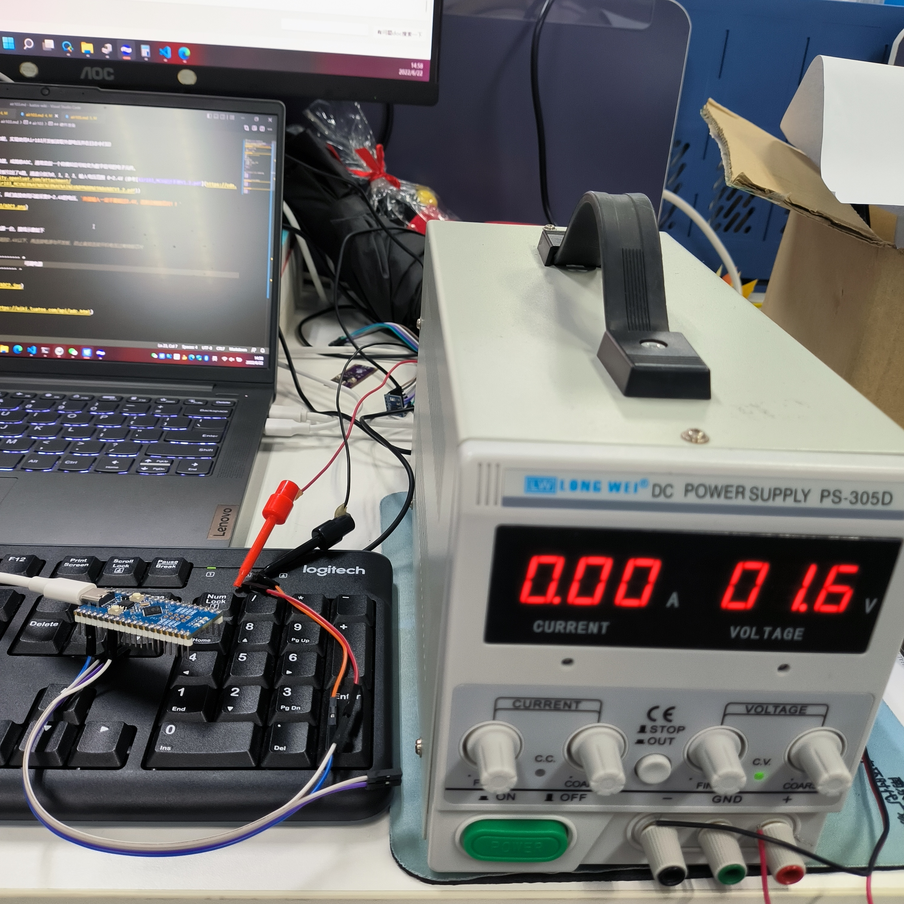
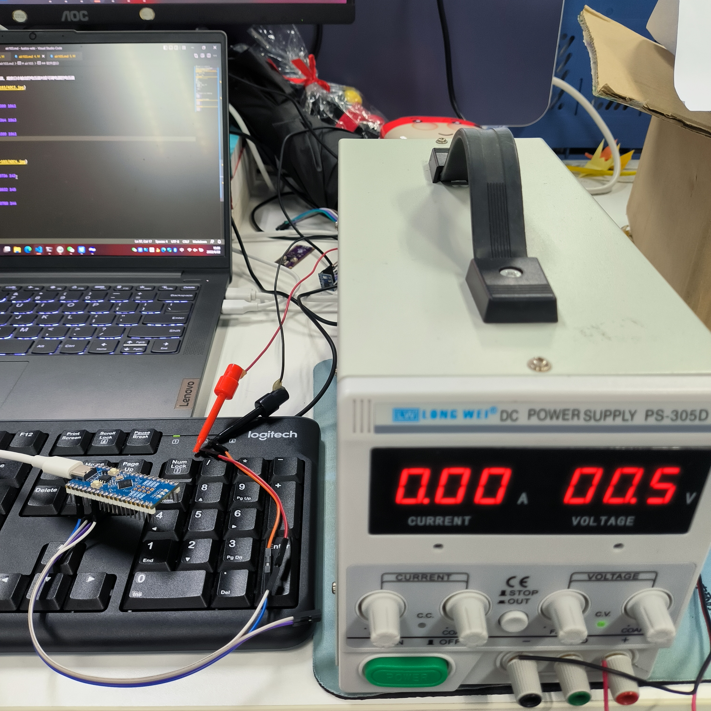

# air103

本章介绍LuatOS的adc功能，实现使用Air103开发板读取外部电压并在日志中打印

## 简介

模拟数字转换器即A/D转换器，或简称ADC，通常是指一个将模拟信号转变为数字信号的电子元件。

Air103共有4路ADC，开发板引出了4路，通道分别为0，1，2，3，输入电压范围 0~2.4V（参考[Air103_MCU设计手册V1.2.pdf](https://cdn.openluat-luatcommunity.openluat.com/attachment/20211202193606476_Air103_MCU%E8%AE%BE%E8%AE%A1%E6%89%8B%E5%86%8CV1.2.pdf))

没有使用分压电路的情况下，我们直接使用只能采集0~2.4V的电压，`外接输入一定不要超过2.4V，否则会烧毁芯片！！`



## 硬件准备

Air103开发板一块，可调电源一台，接线示意如下

> 注意：先打开可调电源，调到2.4V以下，再连接电源与开发板，防止直接连接开机电压过高烧毁芯片

```example
        PA04/ADC1 ----------- +
Air103                         可调电源
        GND      ----------- -
```



## 软件部分

接口文档可参考：[ADC库](https://wiki.luatos.com/api/adc.html)

代码如下

```lua
PROJECT = "ADC"
VERSION = "1.0.0"

sys = require("sys")

MOD_TYPE = rtos.bsp()
log.info("MOD_TYPE", MOD_TYPE)

function test()
    log.info(PROJECT, "START")
    -- 打开ADC通道1
    assert(adc.open(1) == true, PROJECT .. ".open ERROR")
    -- 读取ADC通道1的值
    log.info(PROJECT .. ".read", adc.read(1))
    -- 关闭ADC通道1
    adc.close(1)
    log.info(PROJECT, "DONE")
end

-- 创建一个携程循环执行test函数
sys.taskInit(function()
    while true do
        test()
        sys.wait(1000)
    end
end)

sys.run()

```

>注意：`adc.read`有两个返回值，第一个值为原始值，第二个值为转换值，单位为mV

成功下载后，观察日志输出如下，根据`adc.read`返回的第二个值可知测量电压为1712mV左右

```log
I/user.ADC.read 97672 1600
I/user.ADC DONE
I/user.ADC START
I/user.ADC.read 97700 1601
I/user.ADC DONE
I/user.ADC START
I/user.ADC.read 97656 1600
I/user.ADC DONE
...
...
```

缓慢下调可调电源的电压值，观察日志输出的电压值对应可调电源的电压值


```log
I/user.ADC START
I/user.ADC.read 80300 1061
I/user.ADC DONE
I/user.ADC START
I/user.ADC.read 80364 1063
I/user.ADC DONE
I/user.ADC START
I/user.ADC.read 80300 1061
I/user.ADC DONE
...
...
```



```log
I/user.ADC START
I/user.ADC.read 62060 494
I/user.ADC DONE
I/user.ADC START
I/user.ADC.read 62052 494
I/user.ADC DONE
I/user.ADC START
I/user.ADC.read 61984 492
I/user.ADC DONE
...
...
```
