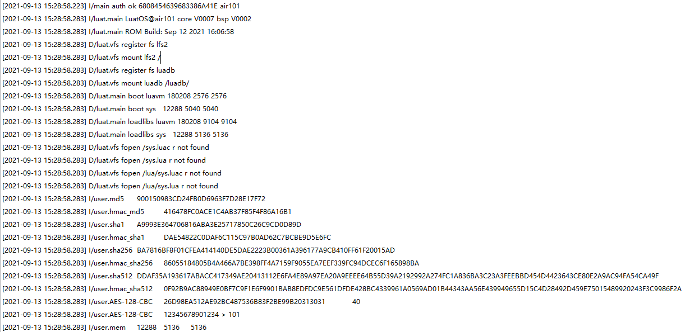

# CRYPTO

本章将会向大家介绍LuatOS的CRYPTO功能。将会实现使用Air101开发板进行加密、解密并在日志中打印。

## 简介

加密是以某种算法改变原有的信息数据，使得未授权用户即使获得了已加密信息，因不知解密的方法，无法得知信息真正的含义，通过这种方式提高网络数据传输的安全性，加密算法常见的有哈希算法、HMAC 算法、签名、对称性加密算法和非对称性加密算法，加密算法也分为可逆和不可逆，比如 `md5` 就是不可逆的hash算法，我们在开发中经常使用这些加密算法，`crypto` 模块提供了加解密功能。

## 硬件准备

Air101开发板一块

## 软件使用

接口文档可参考：[crypto库](https://wiki.luatos.com/api/crypto.html)

```lua
-- MD5,输出结果已经hex编码
log.info("md5", crypto.md5("abc"))
log.info("hmac_md5", crypto.hmac_md5("abc", "1234567890"))

-- SHA1,输出结果已经hex编码
log.info("sha1", crypto.sha1("abc"))
log.info("hmac_sha1", crypto.hmac_sha1("abc", "1234567890"))

-- SHA256,输出结果已经hex编码
log.info("sha256", crypto.sha256("abc"))
log.info("hmac_sha256", crypto.hmac_sha256("abc", "1234567890"))

-- SHA512,输出结果已经hex编码
log.info("sha512", crypto.sha512("abc"))
log.info("hmac_sha512", crypto.hmac_sha512("abc", "1234567890"))

-- AES加密, 未经Hex编码
local data2_encrypt = crypto.cipher_encrypt("AES-128-CBC", "PKCS7", "12345678901234 > ".. "101", "1234567890123456", "1234567890666666")
log.info("AES-128-CBC", data2_encrypt:toHex())

-- AES解密, 未经Hex编码
local data2_decrypt = crypto.cipher_decrypt("AES-128-CBC", "PKCS7", data2_encrypt, "1234567890123456", "1234567890666666")
log.info("AES-128-CBC", data2_decrypt)
```

从打印日志查看


