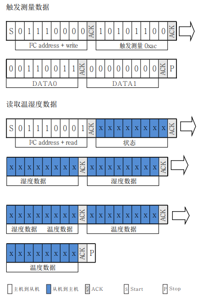

# i2c

本章介绍LuatOS的i2c库使用方式

## 简介

i2c库提供LuatOS与使用i2c协议外设的通讯

I2C总线是由Philips公司开发的一种简单、双向二线制同步串行总线。它只需要两根线即可在连接于总线上的器件之间传送信息。

## 硬件准备

+ Air105开发板

+ AHT10

Air105有1路i2c控制器

AHT10是一款温湿度传感器，使用I2C通信协议，7位i2c设备地址为`0x38`

接线示意

```example
         PE7/GPIO71/I2C_SDA  ------     SDA
Air105   PE6/GPIO70/I2C_SCL  ------     SCL   AHT10
         +3.3V               ------     VIN
         GND                 ------     GND
```


## 软件部分

接口文档可参考：[i2c库](https://wiki.luatos.com/api/i2c.html)

### 初始化硬件i2c

代码如下

```lua
-- Air105 硬件i2c ID
i2cId = 0
-- 初始化i2c
local setupRes = i2c.setup(i2cId, i2c.FAST)
log.info(PROJECT .. ".setup", setupRes)
if setupRes ~= i2c.FAST then
    log.error(PROJECT .. ".setup", "ERROR")
    return
end
```

日志如下

```log
I/user.i2c.setup 1
```

setup函数返回值与初始化时的i2c速度一致代表初始化成功

### 发送指令给AHT10触发测量并读数

根据AHT10数据手册中5.3节可知，AHT10的触发测量命令为`0xac`，读取温湿度数据时从机共返回6个字节，第一个字节为从机状态，后5个字节为温湿度信息，主机和从机的数据传输图如下


注意AHT10在采集时需要时间,主机发出测量指令`0xAC`后，延时75毫秒以上再读取转换后的数据

读出的数据需要通过如下公式进行转换


代码如下

```lua
-- AHT10 7位地址
i2cSlaveAddr = 0x38
-- 发送测量命令
i2c.send(i2cId, i2cSlaveAddr, string.char(0xac, 0x33, 0x00))
-- 等待测量完成
sys.wait(500)
-- 读取温湿度数据
receivedData = i2c.recv(i2cId, i2cSlaveAddr, 6)
-- 分离温度数据 包含读取数据中的第6位，第5位以及第4位的低四位
local tempBit = string.byte(receivedData, 6) + 0x100 * string.byte(receivedData, 5) + 0x10000 *
                    (string.byte(receivedData, 4) & 0x0F)
-- 分离湿度数据 包含读取数据中的第2位，第3位以及第4位的高四位
local humidityBit = (string.byte(receivedData, 4) & 0xF0) + 0x100 * string.byte(receivedData, 3) + 0x10000 *
                        string.byte(receivedData, 2)
humidityBit = humidityBit >> 4
-- 转换温湿度结果
local calcTemp = (tempBit / (2 ^ 20)) * 200 - 50
local calcHum = humidityBit / (2 ^ 20)
log.info(PROJECT .. ".当前温度", string.format("%.2f℃", calcTemp))
log.info(PROJECT .. ".当前湿度", string.format("%.2f%%", calcHum * 100))
```

日志如下

```log
I/user.i2c.当前温度 27.78℃
I/user.i2c.当前湿度 63.51%
```

完整代码如下

```lua
PROJECT = "i2c"
VERSION = "1.0.0"
sys = require("sys")

-- AHT10 7位地址
i2cSlaveAddr = 0x38
-- Air105 硬件i2c ID
i2cId = 0

function getAHT10Data()
    -- 发送测量命令
    i2c.send(i2cId, i2cSlaveAddr, string.char(0xac, 0x33, 0x00))
    -- 等待测量完成
    sys.wait(500)
    -- 读取温湿度数据
    receivedData = i2c.recv(i2cId, i2cSlaveAddr, 6)
    -- 分离温度数据
    local tempBit = string.byte(receivedData, 6) + 0x100 * string.byte(receivedData, 5) + 0x10000 *
                        (string.byte(receivedData, 4) & 0x0F)
    -- 分离湿度数据
    local humidityBit = (string.byte(receivedData, 4) & 0xF0) + 0x100 * string.byte(receivedData, 3) + 0x10000 *
                            string.byte(receivedData, 2)
    humidityBit = humidityBit >> 4
    -- 转换温湿度结果
    local calcTemp = (tempBit / (2 ^ 20)) * 200 - 50
    local calcHum = humidityBit / (2 ^ 20)
    log.info(PROJECT .. ".当前温度", string.format("%.2f℃", calcTemp))
    log.info(PROJECT .. ".当前湿度", string.format("%.2f%%", calcHum * 100))

end
sys.taskInit(function()
    -- 初始化i2c
    local setupRes = i2c.setup(i2cId, i2c.FAST)
    log.info(PROJECT .. ".setup", setupRes)
    if setupRes ~= i2c.FAST then
        log.error(PROJECT .. ".setup", "ERROR")
        i2c.close(i2cId)
        return
    end
    while true do
        getAHT10Data()
        sys.wait(5000)
    end
end)

sys.run()

```
