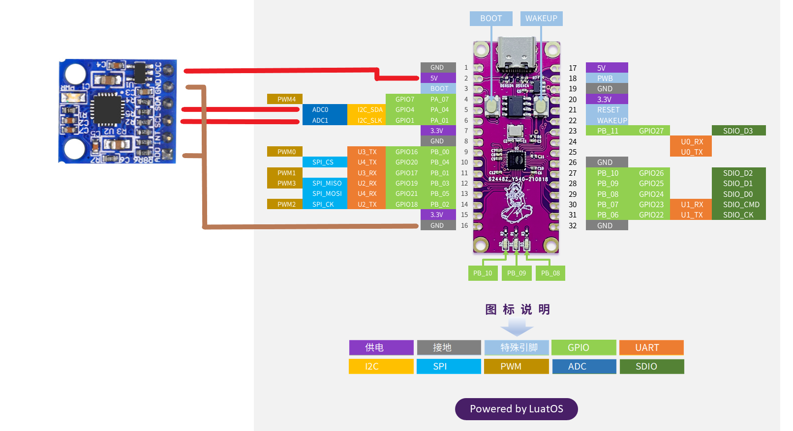
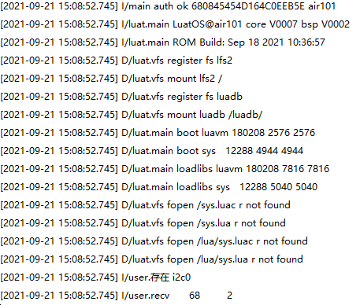

# I2C

本章将会向大家介绍LuatOS的I2C功能。将会实现使用Air101开发板I2C读取mpu6050的id并在日志中打印。

## 简介

I2C（Inter Integrated Circuit）总线是 PHILIPS 公司开发的一种半双工、双向二线制同步串行总线。I2C 总线传输数据时只需两根信号线，一根是双向数据线 SDA（serial data），另一根是时钟线 SCL（serial clock）

## 硬件准备

Air101开发板一块，I2C器件一个，这里使用mpu6050，带上拉电阻,电平3.3V

硬件连接图



## 软件使用

接口文档可参考：[i2c库](https://wiki.luatos.com/api/i2c.html)

代码展示

```lua
sys.taskInit(function()
    if i2c.setup(0, i2c.FAST, 0x68) == 1 then
        log.info("i2c", "存在 i2c0")
    else
        i2c.close(0) -- 除非i2c的id错误,通常不会失败
        return
    end
    i2c.send(0, 0x68, string.char(0x75))--发送器件地址
    sys.wait(50)
    local revData = i2c.recv(0, 0x68, 1)--读器件地址
    log.info("recv",revData:toHex())--打印
    i2c.close(0)
end)
```

上述代码打印日志


