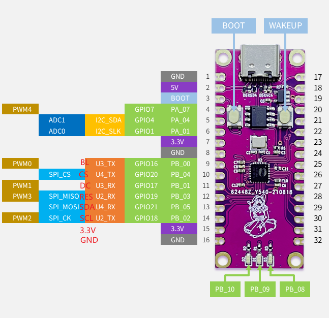
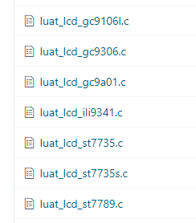

# LCD驱动屏幕

本章将会向大家介绍LuatOS如何驱动屏幕，并在屏幕上显示内容。

## 简介

通常驱动屏幕是一件很复杂的事情，因为LCD屏幕有很多指令，显示数据还要制作字库。LuatOS将LCD进行了封装，内置了多种常用的屏幕驱动，不在列表的也可以通过Lua脚本配置指令进行驱动。



## 硬件准备

Air101开发板一块，SPI接口的LCD屏一个，我这里使用ST7735（128*160）

硬件连接图



## 软件使用

接口文档可参考：[lcd库](https://wiki.luatos.com/api/lcd.html)

修改demo中的lcd示例，将屏幕驱动改为st7735，各引脚配置成我们连接的，就可以在屏幕上看到我们绘制的点线

```lua
spi.setup(0, 20, 0, 0, 8, 40 * 1000 * 1000, spi.MSB, 1, 1)
log.info("lcd.init", lcd.init("st7735",{port = 0,pin_cs = 20,pin_dc = 17, pin_pwr = 16,pin_rst = 19,direction = 0,w = 128,h = 160}))
log.info("lcd.drawLine", lcd.drawLine(20,30,80,30,0x001F))
log.info("lcd.drawRectangle", lcd.drawRectangle(20,40,80,80,0x001F))
log.info("lcd.drawCircle", lcd.drawCircle(120,120,20,0x001F))
```
