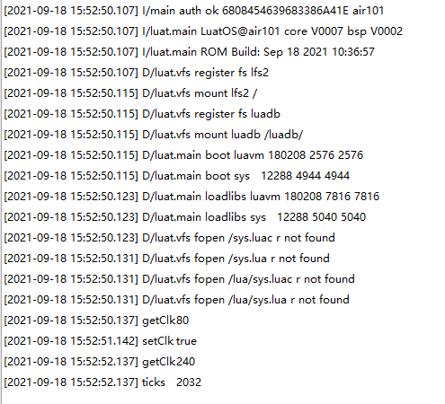

# MCU

本章将会向大家介绍LuatOS的MCU模块。将会实现使用Air101开发板展示并在日志中打印效果。

## 简介

MCU模块封装mcu一些特殊操作

## 硬件准备

Air101开发板一块

## 软件使用

接口文档可参考：[mcu库](https://wiki.luatos.com/api/mcu.html)

代码展示

```lua
sys.taskInit(function()
    print("getClk", mcu.getClk())--打印主频
    sys.wait(1000)--延迟
    print("setClk", mcu.setClk(240))--设置主频
    sys.wait(1000)--延迟
    print("getClk", mcu.getClk())--打印主频
    print("ticks", mcu.ticks())--打印ticks
end)
```

上述代码打印日志


