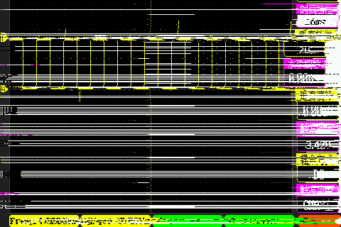

# PWM

本章将会向大家介绍LuatOS的PWM功能。将会实现使用Air101开发板PWM1通道进行波形输出。

## 简介

PWM(Pulse Width Modulation , 脉冲宽度调制) 是一种对模拟信号电平进行数字编码的方法，通过不同频率的脉冲使用方波的占空比用来对一个具体模拟信号的电平进行编码，使输出端得到一系列幅值相等的脉冲，用这些脉冲来代替所需要波形的设备。

## 硬件准备

Air101开发板一块，示波器一台

## 软件使用

接口文档可参考：[pwm库](https://wiki.luatos.com/api/pwm.html)

代码展示

```lua
-- PWM4 --> PA7-7
-- PWM3 --> PB3-19
-- PWM2 --> PB2-18
-- PWM1 --> PB1-17
-- PWM0 --> PB0-16
sys.taskInit(function()
    pwm.open(1, 1000, 50)--打开PWM1，频率1KHZ，占空比百分之50
    sys.wait(5000)--延迟5秒
    pwm.close(1)--关闭PWM1
end)
```

上述代码可在示波器查看波形输出


