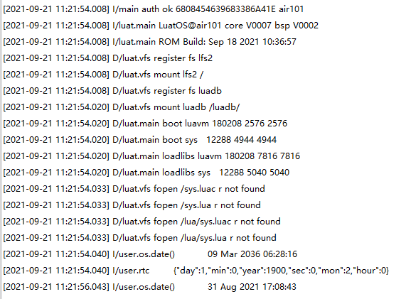

# RTC

本章将会向大家介绍LuatOS的RTC功能。将会实现使用Air101开发板读取RTC的值并在日志中打印。

## 简介

RTC （Real-Time Clock）实时时钟可以提供精确的实时时间，它可以用于产生年、月、日、时、分、秒等信息。目前实时时钟芯片大多采用精度较高的晶体振荡器作为时钟源。有些时钟芯片为了在主电源掉电时还可以工作，会外加电池供电，使时间信息一直保持有效

## 硬件准备

Air101开发板一块

## 软件使用

接口文档可参考：[rtc库](https://wiki.luatos.com/api/rtc.html)

代码展示

```lua
log.info("os.date()", os.date())--打印时间
local t = rtc.get()--获取RTC时间
log.info("rtc", json.encode(t))--打印RTC时间
sys.wait(2000)--延迟
rtc.set({year=2021,mon=8,day=31,hour=17,min=8,sec=43})--rtc时间设置
log.info("os.date()", os.date())--打印时间
```

上述代码打印日志


