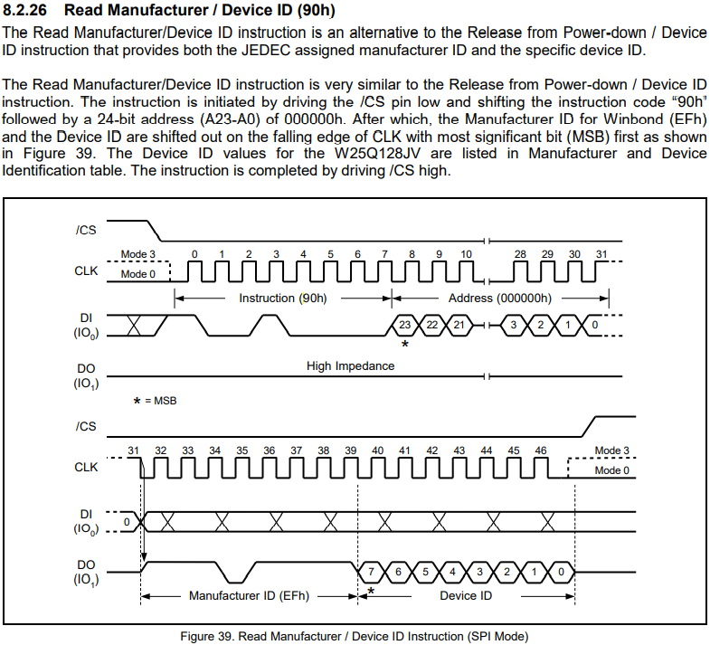

# air103

本章介绍LuatOS的spi库使用方式

## 简介

spi库提供LuatOS与使用spi协议外设的通讯

SPI 是英语 (Serial Peripheral interface) 的缩写，顾名思义就是串行外围设备接口。是 `Motorola` 首先在其 `MC68HCXX` 系列处理器上定义的

SPI 接口主要应用在 EEPROM，FLASH，实时时钟，AD 转换器，还有数字信号处理器和数字信号解码器之间。SPI 是一种高速的，全双工，同步的通信总线，并且在芯片的管脚上只占用四根线，节约了芯片的管脚，同时为 PCB 的布局上节省空间，提供方便

参考[Air103_MCU设计手册V1.2.pdf](https://cdn.openluat-luatcommunity.openluat.com/attachment/20211202193606476_Air103_MCU%E8%AE%BE%E8%AE%A1%E6%89%8B%E5%86%8CV1.2.pdf)可知，air103有1路SPI，但支持映射到不同的管脚组合，通道可以为0，1  我们选择通道0

## 硬件准备

+ air103开发板

+ SPI FLASH 这里选择`W25Q128` [W25Q128数据手册](https://www.winbond.com/resource-files/w25q128jv_dtr%20revc%2003272018%20plus.pdf)

W25Q128是一款支持SPI通信协议的128M-Bit的FLASH

接线示意

```example
        SPI_CS/GPIO20    -----  CS
        SPI_MISO/GPIO19  -----  DO
        SPI_MOSI/GPIO21  -----  DI
air103  SPI_CLK/GPIO18   -----  CLK   SPI_FLASH
        3.3V             -----  VCC
        GND              -----  GND
```

## 软件部分

接口文档可参考：[spi库](https://wiki.luatos.com/api/spi.html)

SPI的操作有两种方式，一种是直接对SPI通道进行读写，一种是抽象为一个SPI设备再进行读写

### 直接对SPI通道进行读写

#### 初始化CS引脚手动控制

使用air103时，需要我们手动控制CS拉低来使能设备

将spi.transfer封装成一个新的函数起来前后用CS操作环绕

代码如下

```lua
function transfer(CS, spiID, data, sendLen, recvLen)
    CS(0)
    local res = spi.transfer(spiID, data, sendLen, recvLen)
    CS(1)
    return res
end
```

#### 初始化SPI

初始化SPI通道0，24MHz CLK，半双工模式

代码如下

```lua
local spiID, CS_GPIO = 0, 20
-- CS 参数传255代表手动控制CS引脚，最后一个mode参数传0代表半双工模式
local setupRes = spi.setup(spiID, 255, 0, 0, 8, 24 * 1000 * 1000, spi.MSB, 1, 0)
if setupRes ~= 0 then
    log.error(PROJECT .. ".setup", "ERROR")
    return
end
```

#### 读取SPI FLASH的制造商和设备ID

查阅[W25Q128数据手册](https://www.winbond.com/resource-files/w25q128jv_dtr%20revc%2003272018%20plus.pdf)可知 查询制造商和设备ID的指令为`0x90`

指令描述如下图



代码如下

```lua
log.info(PROJECT .. ".chipID", string.toHex(transfer(CS, spiID, string.char(0x90, 0, 0, 0), 4, 2)))
```

日志如下

```log
I/user.spi.chipID EF17 4
```

返回值`0xEF17`中`EF`为制造商`Winbond Serial Flash`,`17`为型号`W25Q128JV`

#### 擦除指定地址扇区

查阅[W25Q128数据手册](https://www.winbond.com/resource-files/w25q128jv_dtr%20revc%2003272018%20plus.pdf)可知 擦除指定地址扇区的指令为`0x20`

在执行擦除指令之前需要执行写使能指令`0x06`

擦除地址`0x01`开始的4K-bytes大小的扇区

代码如下

```lua
transfer(CS, spiID, string.char(0x06), 1, 0)
sys.wait(100)
transfer(CS, spiID, string.char(0x20, 0x00, 0x00, 0x01), 4, 0)
-- 擦除需要消耗一定的时间
sys.wait(1000)
```

#### 读写SPI FLASH

查阅[W25Q128数据手册](https://www.winbond.com/resource-files/w25q128jv_dtr%20revc%2003272018%20plus.pdf)可知 页写的指令为`0x02`，一次最多写入256字节的数据，读取数据的指令为`0x03`

在执行擦除指令之前需要执行写使能指令`0x06`

代码如下

```lua
transfer(CS, spiID, string.char(0x06), 1, 0)
sys.wait(100)
transfer(CS, spiID, string.char(0x02, 0x00, 0x00, 0x01) .. PROJECT, 4 + string.len(PROJECT), 0)
sys.wait(100)
local readRes = transfer(CS, spiID, string.char(0x03, 0x00, 0x00, 0x01), 4, string.len(PROJECT))
log.info(PROJECT .. ".readRes", readRes)
```

日志如下

```log
I/user.spi.readRes spi
```

观察日志，读出的数据与我们写入的数据一致

#### 禁用写使能并关闭对应的SPI通道和CS GPIO

查阅[W25Q128数据手册](https://www.winbond.com/resource-files/w25q128jv_dtr%20revc%2003272018%20plus.pdf)可知 禁用写使能的指令为`0x04`

代码如下

```lua
transfer(CS, spiID, string.char(0x04), 1, 0)
gpio.close(CS_GPIO)
spi.close(spiID)
```

### 抽象为一个SPI设备再进行读写

#### 抽象SPi外设

抽象SPI通道5的SPI FLASH，24MHz CLK，半双工模式

代码如下

```lua
local spiID, CS_GPIO = 0, 20
-- 最后一个mode参数传0代表半双工模式
local spiFlash = spi.deviceSetup(spiID, CS_GPIO, 0, 0, 8, 24 * 1000 * 1000, spi.MSB, 1, 0)
```

#### 读取SPI FLASH的制造商和设备ID

查阅[W25Q128数据手册](https://www.winbond.com/resource-files/w25q128jv_dtr%20revc%2003272018%20plus.pdf)可知 查询制造商和设备ID的指令为`0x90`

指令描述如下图


代码如下

```lua
log.info(PROJECT .. ".chipID", string.toHex(spiFlash:transfer(string.char(0x90, 0, 0, 0), 4, 2)))
```

日志如下

```log
I/user.spi.chipID EF17 4
```

返回值`0xEF17`中`EF`为制造商`Winbond Serial Flash`,`17`为型号`W25Q128JV`

#### 擦除指定地址扇区

查阅[W25Q128数据手册](https://www.winbond.com/resource-files/w25q128jv_dtr%20revc%2003272018%20plus.pdf)可知 擦除指定地址扇区的指令为`0x20`

在执行擦除指令之前需要执行写使能指令`0x06`

擦除地址`0x01`开始的4K-bytes大小的扇区

代码如下

```lua
spiFlash:send(string.char(0x06))
sys.wait(100)
spiFlash:send(string.char(0x20, 0x00, 0x00, 0x01))
-- 擦除需要消耗一定的时间
sys.wait(1000)
```

#### 读写SPI FLASH

查阅[W25Q128数据手册](https://www.winbond.com/resource-files/w25q128jv_dtr%20revc%2003272018%20plus.pdf)可知 页写的指令为`0x02`，一次最多写入256字节的数据，读取数据的指令为`0x03`

在执行擦除指令之前需要执行写使能指令`0x06`

代码如下

```lua
spiFlash:send(string.char(0x06))
sys.wait(100)
spiFlash:send(string.char(0x02, 0x00, 0x00, 0x01) .. PROJECT)
sys.wait(100)
local readRes = spiFlash:transfer(string.char(0x03, 0x00, 0x00, 0x01), 4, string.len(PROJECT))
log.info(PROJECT .. ".readRes", readRes)
```

日志如下

```log
I/user.spi.readRes spi
```

观察日志，读出的数据与我们写入的数据一致

#### 禁用写使能并关闭对应的SPI通道

查阅[W25Q128数据手册](https://www.winbond.com/resource-files/w25q128jv_dtr%20revc%2003272018%20plus.pdf)可知 禁用写使能的指令为`0x04`

代码如下

```lua
spiFlash:send(string.char(0x04))
log.info(PROJECT .. ".device_close", spiFlash:close())
```

日志如下

```log
I/user.spi.device_close true
```

## 完整代码

```lua
PROJECT = "spi"
VERSION = "1.0.0"
sys = require("sys")

function transfer(CS, spiID, data, sendLen, recvLen)
    CS(0)
    local res = spi.transfer(spiID, data, sendLen, recvLen)
    CS(1)
    return res
end

local function test()
    local spiID, CS_GPIO = 0, 20
    local setupRes = spi.setup(spiID, 255, 0, 0, 8, 10 * 1000 * 1000, spi.MSB, 1, 0)
    if setupRes ~= 0 then
        log.error(PROJECT .. ".setup", "ERROR")
        return
    end
    local CS = gpio.setup(CS_GPIO, 0)
    log.info(PROJECT .. ".chipID", string.toHex(transfer(CS, spiID, string.char(0x90, 0, 0, 0), 4, 2)))
    transfer(CS, spiID, string.char(0x06), 1, 0)
    sys.wait(100)
    transfer(CS, spiID, string.char(0x20, 0x00, 0x00, 0x01), 4, 0)
    sys.wait(1000)
    transfer(CS, spiID, string.char(0x06), 1, 0)
    sys.wait(100)
    transfer(CS, spiID, string.char(0x02, 0x00, 0x00, 0x01) .. PROJECT, 4 + string.len(PROJECT), 0)
    sys.wait(100)
    local readRes = transfer(CS, spiID, string.char(0x03, 0x00, 0x00, 0x01), 4, string.len(PROJECT))
    log.info(PROJECT .. ".readRes", readRes)
    transfer(CS, spiID, string.char(0x04), 1, 0)
    gpio.close(CS_GPIO)
    spi.close(spiID)
    local spiFlash = spi.deviceSetup(spiID, CS_GPIO, 0, 0, 8, 10 * 1000 * 1000, spi.MSB, 1, 0)
    log.info(PROJECT .. ".chipID", string.toHex(spiFlash:transfer(string.char(0x90, 0, 0, 0), 4, 2)))
    spiFlash:send(string.char(0x06))
    sys.wait(100)
    spiFlash:send(string.char(0x20, 0x00, 0x00, 0x01))
    sys.wait(1000)
    spiFlash:send(string.char(0x06))
    sys.wait(100)
    spiFlash:send(string.char(0x02, 0x00, 0x00, 0x01) .. PROJECT)
    sys.wait(100)
    local readRes = spiFlash:transfer(string.char(0x03, 0x00, 0x00, 0x01), 4, string.len(PROJECT))
    log.info(PROJECT .. ".readRes", readRes)
    spiFlash:send(string.char(0x04))
    log.info(PROJECT .. ".device_close", spiFlash:close())
end

sys.taskInit(test)

sys.run()

```
