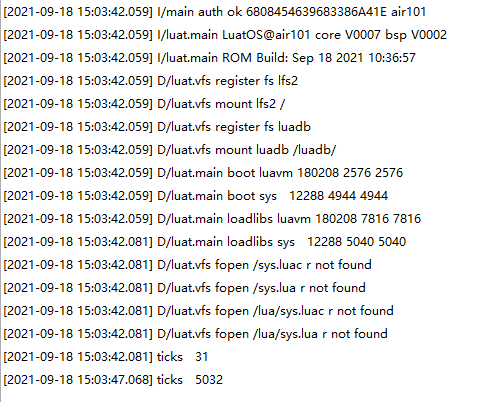

# TIMER

本章将会向大家介绍LuatOS的TIMER功能。将会实现使用Air101开发板展示并在日志中打印效果。

## 简介

TIMER模块使用的是mcu的硬件定时器

## 硬件准备

Air101开发板一块

## 软件使用

接口文档可参考：[timer库](https://wiki.luatos.com/api/timer.html)

代码展示

```lua
print("ticks", mcu.ticks())--打印ticks
timer.mdelay(5000)--阻塞延迟5000
print("ticks", mcu.ticks())--打印ticks
```

上述代码打印日志


