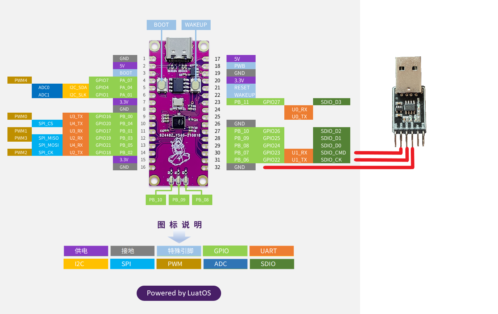

# UART

本章将会向大家介绍LuatOS的UART功能。将会实现使用Air101开发板循环向UART1发送数据并将UART1接收的数据在日志中打印。

## 简介

UART（Universal Asynchronous Receiver/Transmitter）通用异步收发传输器，UART 作为异步串口通信协议的一种，工作原理是将传输数据的每个字符一位接一位地传输。是在应用程序开发过程中使用频率最高的数据总线。

UART 串口的特点是将数据一位一位地顺序传送，只要 2 根传输线就可以实现双向通信，一根线发送数据的同时用另一根线接收数据。UART 串口通信有几个重要的参数，分别是波特率、起始位、数据位、停止位和奇偶检验位，对于两个使用 UART 串口通信的端口，这些参数必须匹配，否则通信将无法正常完成。

## 硬件准备

Air101开发板一块，USB转TTL模块一块

硬件连接图



如图将TTL的TX、RX、GND分别连接Air101的U1_RX、U1_TX、GND。

## 软件使用

接口文档可参考：[uart库](https://wiki.luatos.com/api/uart.html)

代码介绍

```lua

local uartid = 1--串口id
--初始化
local result = uart.setup(
    uartid,--串口id
    115200,--波特率
    8,--数据位
    1--停止位
)
--循环发数据
sys.timerLoopStart(uart.write,1000,uartid,"test")--定时器循环向串口1发送数据
uart.on(uartid, "receive", function(id, len)
    log.info("uart", "receive", id, len, uart.read(uartid, len))
end)--注册串口1接收事件回调
uart.on(uartid, "sent", function(id)
    log.info("uart", "sent", id)
end)--注册串口1发送事件回调
```
