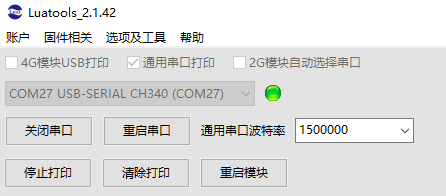
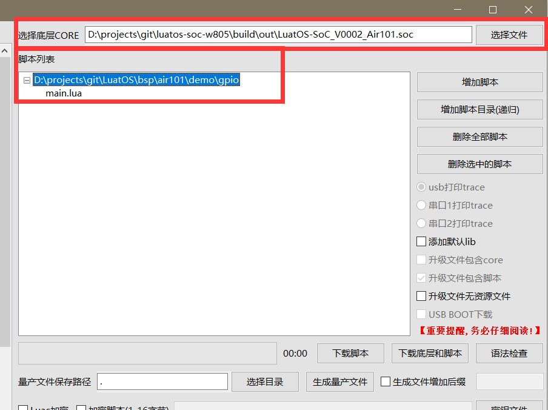
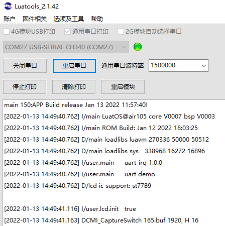

# 烧录教程

> 视频教程参见此处：[【LuatOS】①烧录教程](https://www.bilibili.com/video/BV1Mq4y1e7Eb)

## 串口烧录

准备工作：

一根typec口的USB连接线

一台window系统的电脑（推荐win10以上）

### 工具配置

首先下载最新版本的Luatools：[点我下载](https://luatos.com/luatools/download/last)

建议新建一个Luatools文件夹，将exe文件放入其中后，再打开exe文件

luatos-soc请勾选通用串口打印

修改通用串口波特率，设置波特率为芯片专属的烧录波特率（如：Air101/103 使用的是921600 Air105是1500000）

如果是第一批Air101开发板第一次使用官方开发板，有可能会提示未激活，建议点击`账户`--`登录`按提示操作即可，用户名为购买人手机号，密码默认八个8，后面的开发板出厂已经激活，不再需要激活了

[详细激活教程](https://doc.openluat.com/article/3608)

### 烧录固件

将设备通过usb线连接到电脑，可以看到出现一个新的COM口，勾选`通用串口打印`，并在工具中选中这个COM口

前往LuatOS官方仓库下载最新固件

正式版可以在发行版页面下载：

[https://gitee.com/openLuat/LuatOS/releases](https://gitee.com/openLuat/LuatOS/releases)

也可以使用官方的**云编译**功能，自定义固件中包含的模块

[云编译教程点我查看](https://wiki.luatos.com/develop/compile/Cloud_compilation.html)

固件下载后解压，可以得到相应的固件，拓展名为soc的文件，这里用Air101的固件进行举例：

（或者找到Luatools所在的文件夹，文件夹的`resource\对应文件夹`也会自动下载正式版本的固件）

接着返回Luatools，点击`下载固件`按钮，选中刚刚下载的soc文件，直接下载即可：

如果是ESP32开发板一定要安装CH343的驱动才能正常下载固件，默认的CDC驱动打印日志没问题，但是速率太慢会导致下载失败。[驱动传送门](http://www.wch.cn/downloads/CH343SER_EXE.html)

### 烧录脚本

点击`项目管理测试`按钮，点击左下角的`创建项目`新建一个新项目

选好芯片使用的固件，选好脚本即可下载

demo类的脚本，可以前往[LuatOS官方仓库](https://gitee.com/openLuat/LuatOS)，在`demo`文件夹可以找到

Luatools工具也自动下载了正式版本的一些实例脚本可以在`resource\某种型号\某个版本\demo`文件夹看到，可以直接选择脚本进行烧录测试

如果芯片当前已经烧录的固件版本，和这里选择的固件相同，那么可以点击`下载脚本`只下载脚本；反之，建议点击`下载底层和脚本`，进行全刷

### 查看日志

如果没有打开串口，点击`打开串口`即可查看日志

如果还没反应，检查通用串口打印是否勾选， 重新选择串口打开，或者试试点击`重启串口`

