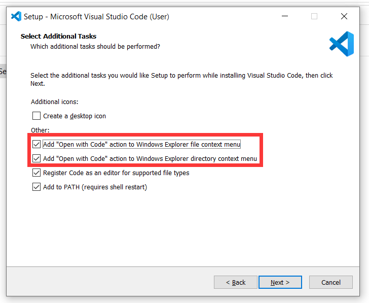
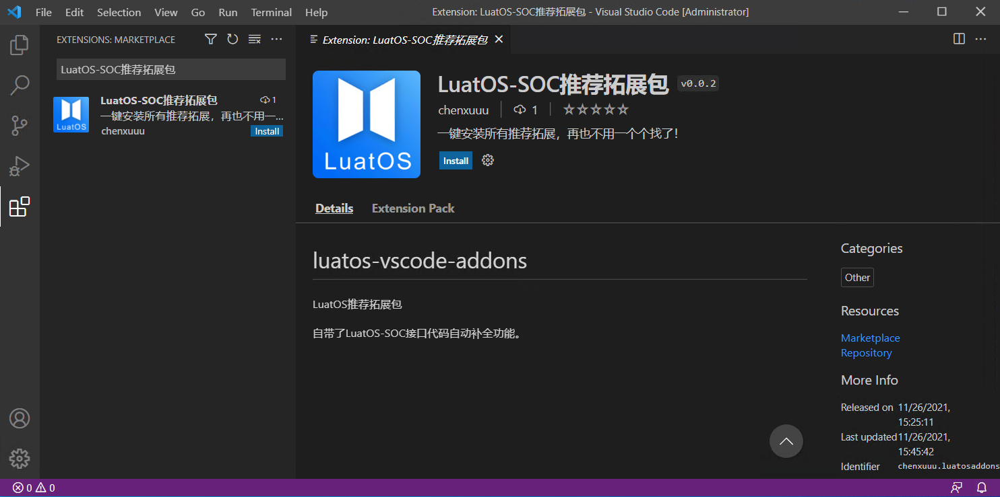
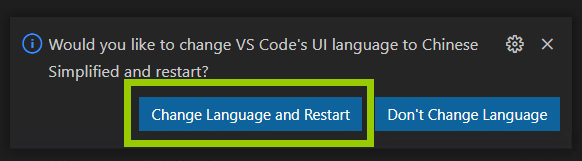
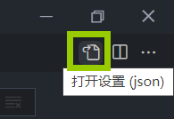
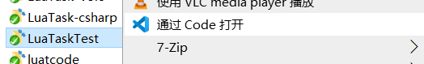

# 开发环境搭建

既然是使用LuatOS进行开发，那一定有一个好用的编辑器环境吧？

是的，有。这里推荐使用微软推出的Visual Studio Code（简称vscode）代码编辑器来编写代码

## 装上vscode

打开vscode官网：[https://code.visualstudio.com/](https://code.visualstudio.com/)

点击那个大大的**Download for xxxxxx**，下载该软件

 > 当然，可能有些同学会发现下载速度很慢，怎么办呢？当然是有办法的，我们可以复制当前正在下载的文件**下载链接**，将域名（`https://`和下一个`/`中间的东西）替换成`vscode.cdn.azure.cn`再下载，速度就快了。

打开安装包后，需要注意其中两个选项要勾选（图片是英文的，也一样）：

- 将"通过Code打开"操作添加到Windows资源管理器文件上下文菜单
- 将"通过Code打开"操作添加到Windows资源管理器目录上下文菜单



装完打开就好了，你可能会发现软件都是英文，没关系，下一步装个插件就是中文了

## 安装推荐的拓展

点击左侧的拓展按键，搜索`LuatOS-SOC推荐拓展包`，认准作者，点击`Install`安装即可



装完之后，点击右下角的`Change Language and Restart`，就变成中文啦



## 更改默认的配置

在正常页面，按下快捷键`Ctrl+,（逗号）`，打开设置页面

点击右上角的`打开设置(json)`图标



将文件内容替换成下面的数据，保存即可（如果已经有东西了，请自行添加缺少项）

```json
{
    "editor.fontFamily": "Consolas, 'Microsoft Yahei UI Light','Courier New', monospace",
    "editor.renderLineHighlight": "all",
    "editor.emptySelectionClipboard": false,
    "files.autoGuessEncoding": true,
    "files.insertFinalNewline": true,
    "files.trimTrailingWhitespace": true,
    "editor.bracketPairColorization.enabled": true,
    "editor.guides.bracketPairs":"active",
    "Lua.diagnostics.globals": [
        "adc","crypto","ctiot","disp","eink","fdb","fs","gpio","http","i2c","ir",
        "json","keyboard","lcd","lcdseg","libcoap","libgnss","log","lpmem","lvgl",
        "mcu","nbiot","pm","pwm","rtc","rtos","sdio","sensor","sfd","sfud","socket",
        "spi","statem","string","timer","u8g2","uart","wdt","wlan","zbuff","sys"
    ],
}
```

## 新建/编辑已有项目

推荐写代码时，每个项目都新建一个文件夹

打开项目时，推荐使用右键，选择`通过使用 Code 打开`，这样插件才能完美运行



特别提醒：如果遇到下面的提示，请按图片描述进行操作，不然安装的拓展不会运行


