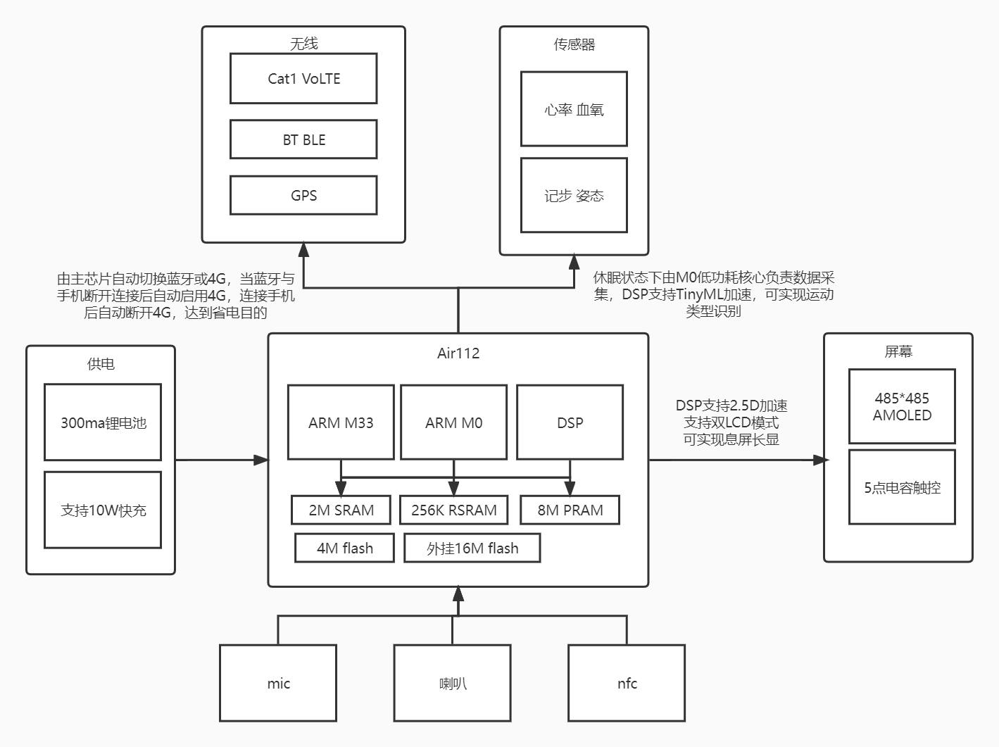

# Air Watch

## 概述

Air Watch是一款全开源的智能手表，主控采用Air112芯片+4GModem+GPS，配备1.4英寸高清大屏，支持多功能NFC、心率追踪、睡眠监测、运动模式识别等功能，可脱离手机独立接打电话。

## 主控

Air112是一颗三核异构芯片，包含一颗高性能ARM M33大核，最高频率240M，可处理负责应用；一颗ARM M0低功耗小核，最高48M，能效比可达11.8uA/MHz @3.3V负责设备休眠状态下的数据处理，实现更长续航；一颗专用DSP，支持2.5D加速和TinyML加速，图像加速能力可实现480*480分辨率下60fps的渲染速度，TinyML可以实现运动姿态的识别，更低的功耗更准确的识别。芯片内置2Msram，三个核心共享；256K的低功耗不掉电ram，可在待机模式下保持数据；8Mpsram，为复杂应用提供大内存支持。内置4Mflash，支持xip模式。板载16Mflash采用QSPI连接，可储存资源文件和设备数据。

## 无线

Air112内置蓝牙，支持蓝牙5.2，用于和手机之间直接传输数据。外挂4GModem芯片，支持VoLTE高清通话，可独立工作，跑步健身手机不在身边也不漏收消息，并支持蓝牙和4G自动切换，当连接手机后自动断开4G达到省电目的，断开蓝牙后可在10秒内连接4G网络，不错过一条重要消息。外挂双频GNSS芯片支持GPS，北斗，伽利略，格洛纳斯多系统定位，准确记录户外运动路径。

## 电源

选用300mah电池，待机可达15天以上，配备10W快充，10分钟即可充满，不再面临电量焦虑。

## 软件

全部功能采用LuatOS开发，界面为lvgl提供底层渲染，用户可通过脚本快速嵌入自己的应用逻辑。全部通信协议开源，并提供数据接口，可以对获得的数据进行自由处理。