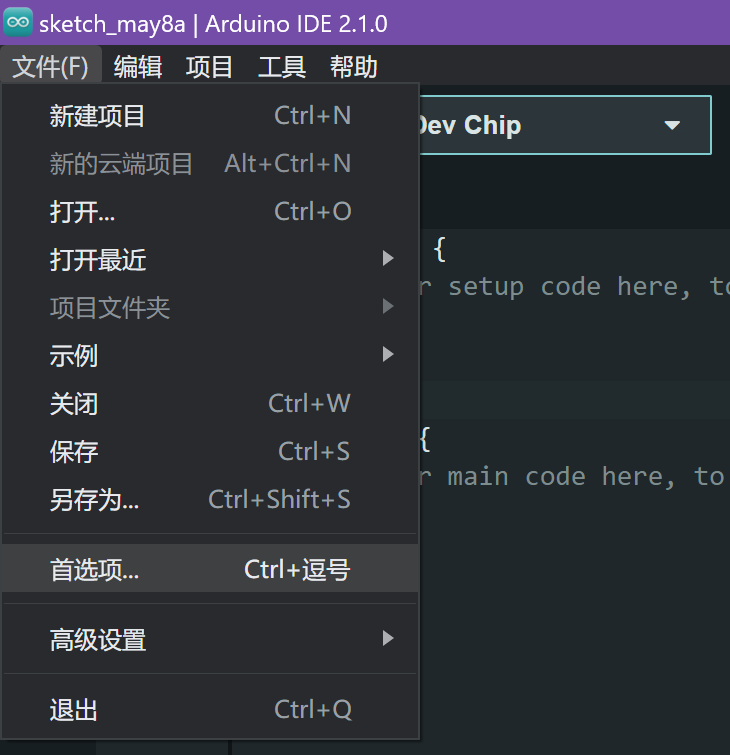
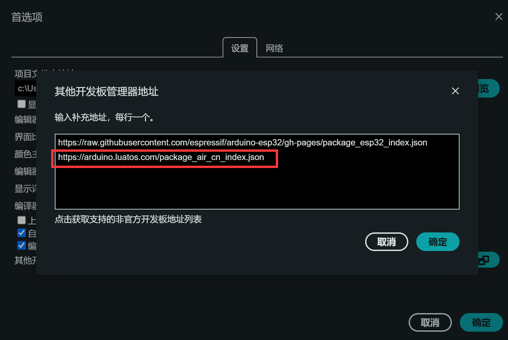
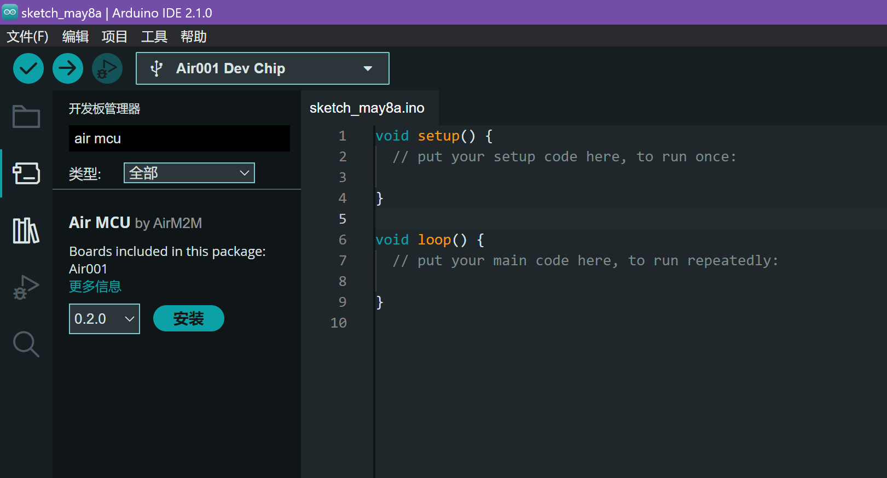
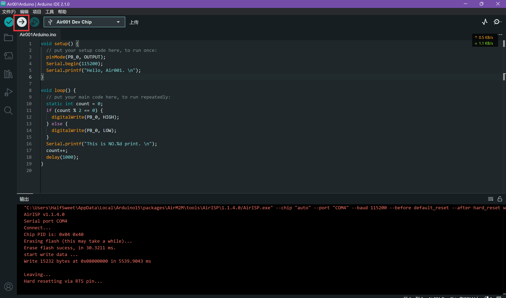
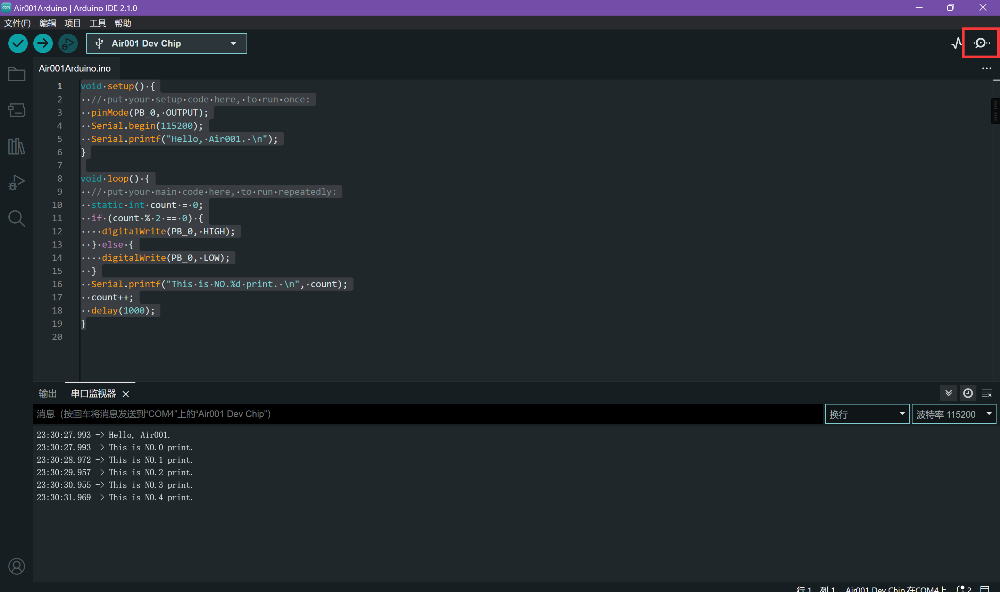

# Air001基于Arduino的用户手册

## 使用Arduino IDE开发
### 准备工作
安装[Arduino IDE](https://www.arduino.cc/en/software)，建议安装Arduino IDE 2.x

### 添加开发板地址
点击Arduino IDE左上角的文件-首选项

在`其它开发板管理器地址`中输入AirMCU的地址 `https://arduino.luatos.com/package_air_cn_index.json`



### 安装开发板
在`开发板管理器`中搜索`Air MCU`

安装最新版即可

```{note}
安装过程需要安装多个工具链，可能会稍慢，请耐心等待
```

### 选择开发板
开发板选择AirMCU-Air001 Board，端口选择连接的串口

### 添加代码
在主函数中添加一些测试代码

```cpp
void setup() {
  // put your setup code here, to run once:
  pinMode(PB_0, OUTPUT);
  Serial.begin(115200);
  Serial.printf("Hello, Air001. \n");
}

void loop() {
  // put your main code here, to run repeatedly:
  static int count = 0;
  if (count % 2 == 0) {
    digitalWrite(PB_0, HIGH);
  } else {
    digitalWrite(PB_0, LOW);
  }
  Serial.printf("This is NO.%d print. \n", count);
  count++;
  delay(1000);
}
```

### 编译下载
点击上传按钮，等待编译并上传测试代码


### 查看串口输出
如果代码编译上传正常，那么打开串口监视器，即可看到输出的相关日志

并可观察到LED以1秒的间隔闪烁