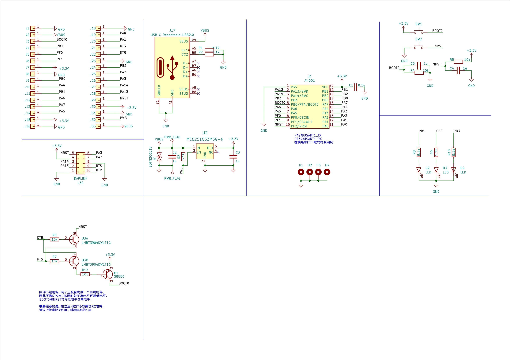

# 硬件资料

## 资料文件

[AIR001芯片数据手册.pdf](https://cdn.openluat-luatcommunity.openluat.com/attachment/20230703104209543_AIR001芯片数据手册.pdf)

## 开发板资料

[PCB Layout](https://wiki.luatos.com/_static/bom/Air001.html)
