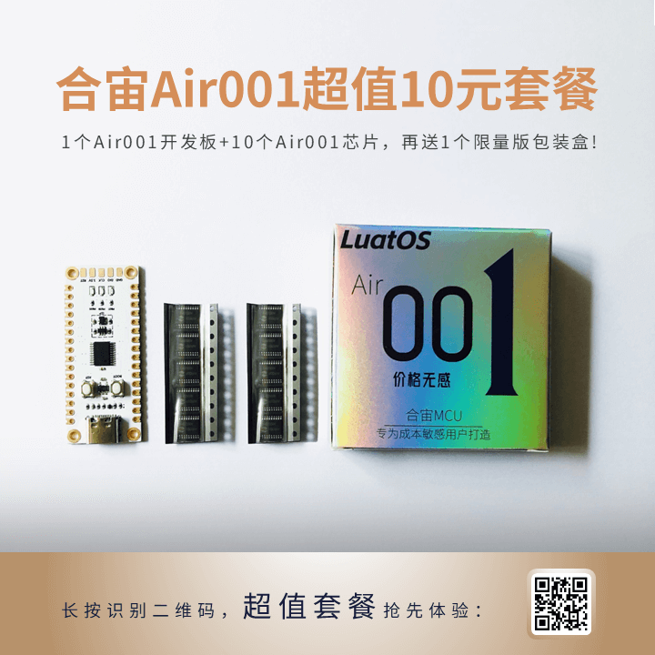
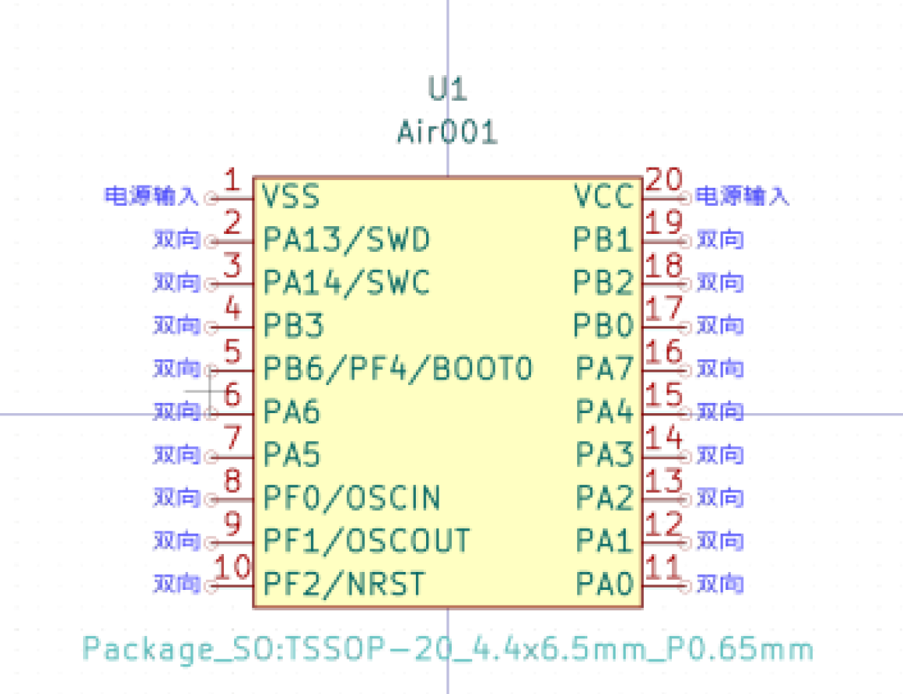

# Air001芯片

## Air001是什么?

合宙Air001是一款TSSOP20封装的MCU，采用高性能的32位ARM®Cortex®-M0+内核，内置32Kbytes的Flash和4Kbytes的RAM。芯片集
成多路USART、IIC、SPI等通讯外设，5个16bit定时器以及1路12bit ADC和2路比较器。详细信息见数据手册，[AIR001芯片数据手册.pdf](https://cdn.openluat-luatcommunity.openluat.com/attachment/20230703104209543_AIR001芯片数据手册.pdf)和寄存器手册[Air001寄存器手册]。

LuatOS大QQ群: 1061642968

## 环境搭建教程
[Air001基于Keil MDK的用户手册](https://wiki.luatos.com/chips/air001/Air001-MDK.html)

[Air001基于Arduino的用户手册](https://wiki.luatos.com/chips/air001/Air001-Arduino.html)

## 刷机烧录教程

[Air001基于Keil MDK的用户手册](https://wiki.luatos.com/chips/air001/Air001-MDK.html)

[Air001基于Arduino的用户手册](https://wiki.luatos.com/chips/air001/Air001-Arduino.html)

## 芯片购买

* [合宙商城](https://appc6kjfor22343.h5.xiaoeknow.com)

* [淘宝店](https://luat.taobao.com)

  

## 芯片PinOut

