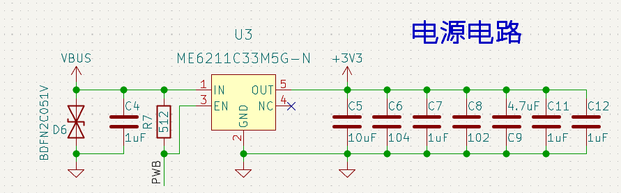
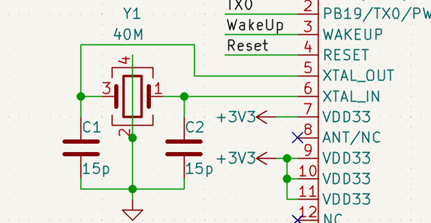
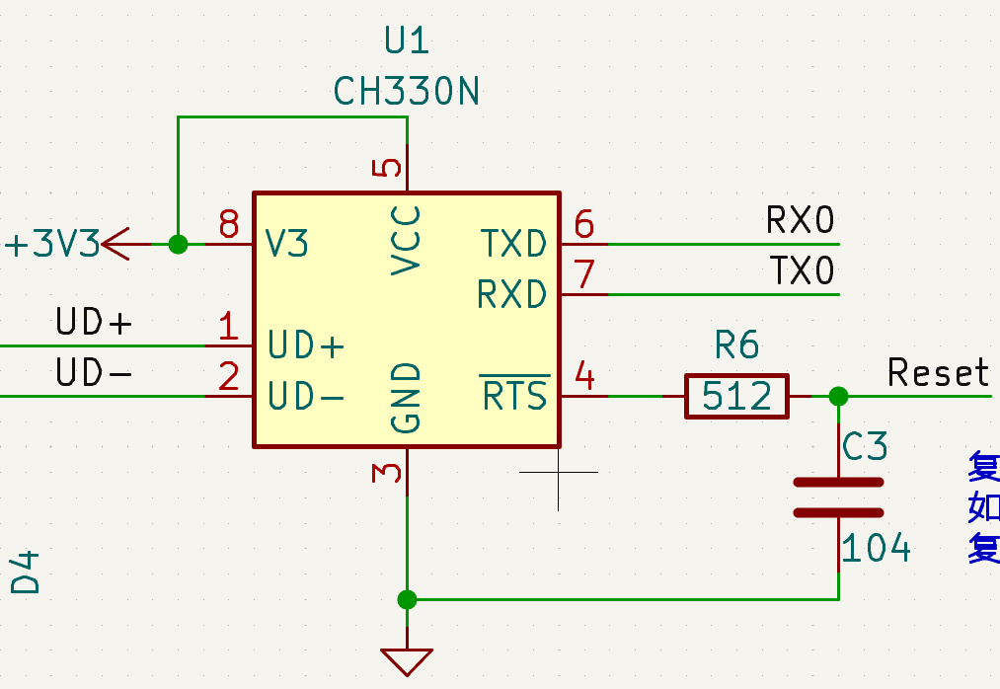
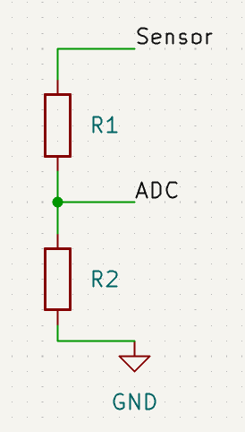

# Air101硬件设计教程

## 资源准备

首先你需要掌握至少一种EDA工具，例如AD，PADS，KICAD等。推荐使用KICAD，开源免费，合宙MCU系列产品的硬件设计均使用KICAD。

Air101相关的硬件资料，可以在wiki下载[Air101硬件资料](https://wiki.luatos.com/chips/air101/hardware.html)

## 最小系统

硬件最小系统包含芯片工作的最小电路，对于Air101来说，最小系统仅需电源和晶振即可。

### 电源

芯片的供电范围 **3.0V-3.6V**。请勿超过该范围。**超过 3.6V可能会对芯片造成永久性损坏**。低于 3.0V 可能整体性能会下降。

不同管脚放置电容见下述要求：

芯片 7 脚需放置 1uf 滤波器电容。

芯片 9 脚需放置 1nf 滤波器电容。

芯片 10 脚附近放置 47uf 滤波电容。

芯片 11 脚附近放置 47uf 滤波电容。

推荐客户在模块电源入口处放置 330uf 电解电容。

芯片 17,24,31 脚附近放置 1uf 滤波电容。

**芯片** **25** **脚** **CAP** **必须外接** **4.7uf** **滤波电容。**

并且为了防止ESD导致芯片损坏，在模块的总电源入口处需增加 TVS 管，提高防静电能力。芯片电源输入脚应放置相应滤波电容改善产品性能，外部对整个芯片供电建议选用 LDO，且总电流建议 500mA 及以上。总电源走线线宽要求不低于 30mil。可以参考Air101开发板的电源进行设计。

芯片上电瞬间会有较大电流，因此一定要选择动态响应速度高的电源芯片，或者增大电源入口的电容保证不会电压跌落。

### 晶振

晶体摆放尽量靠近芯片，走线尽量短远离干扰源，时钟周围多地孔隔离。时钟下面各层禁止其它走线穿过，防止干扰时钟源。晶振频率为40M。客户根据实际产品需求选用不同温度等级、稳定度、负载电容值的晶体。晶体两端所接负载电容根据不同厂家晶体及频偏情况需要调整。

### 问题排查

通常情况下按参考电路进行设计最小系统，芯片就能正常工作了。可是自己设计的却不行，这时候该如何排查问题呢？

首先检查硬件是否有虚焊等问题，确保接触良好，并测量是否有短路现象。

然后使用示波器测量电源电压是否符合要求，纹波是否过大，电压是否会有明显跌落，一定要用示波器看，万用表是平均值无法观察电压突变。

再使用示波器测量晶振是否起振，正常情况下应为40MHz的正弦波。

以上都不存在问题则最小系统肯定可以正常工作。

## 下载与调试

### 复位

复位电路建议设计为 RC 电路，上电自动复位，Air101低电平复位。如果使用外部控制 RESET 管脚，当电平值低于 2.0v 时，芯片处于复位状态。复位时低电平需持续 100us 以上。

### 下载电路

芯片默认 UART0 为下载口，芯片无固件初始下载时，直接连接 UART0 接口，通过相关下载软件即可实现固件下载。当芯片内有固件，再次进入下载模式，可以通过拉低 PA0，然后上电进入下载模式。下载完成后去掉 PA0 拉低的操作，需要重启，固件才能运行。

在上电前把PA0拉低则芯片会进入下载模式，UART0_TX 会一直以115200波特率发送ccccc等待下载指令。芯片出厂未烧录程序时会一直处于下载模式，并以115200波特率一直发送ccccc，可用于判断芯片是否能够工作。

烧录教程链接[烧录教程 - LuatOS 文档](https://wiki.luatos.com/boardGuide/flash.html)

### 调试

芯片上电后 1，2 脚默认为 UART0 端口，该端口提供下载及指令端口以及 log 输出端口。客户使用 时候注意不要随意使用该端口作为 GPIO 使用，防止被占用无法下载及调试。在系统起来后，该端口可以复 用为其它端口使用。确需复用的一定呀留好boot引脚，保证可以进行固件烧录。

可参考Air101的原理图设计自动下载电路，配合luatools可实现自动下载。量产时可留出RX0，TX0和Reaet引脚的测试点，使用夹具进行自动下载。

## ADC

芯片 14 脚（PA1）及 15 脚（PA4）脚可以作为普通 ADC 使用，输入电压范围 0~2.4V。当高于 2.4V 时外部需做分压处理后才可进入 ADC 接口。使用分压电路时请务必选用高精度电阻，根据分压制选用合适阻值。分压电路参考如下。

## GPIO与唤醒

所有 GPIO 如果配置上拉电阻，典型上拉电阻值为 40K，如果 配置为下拉，典型下拉电阻值为 49K。 

Wakeup脚为外部唤醒脚，当芯片进入睡眠状态后，Wakeup 脚给高电平时，芯片唤醒。正常工作状 态，该端口为低电平。
