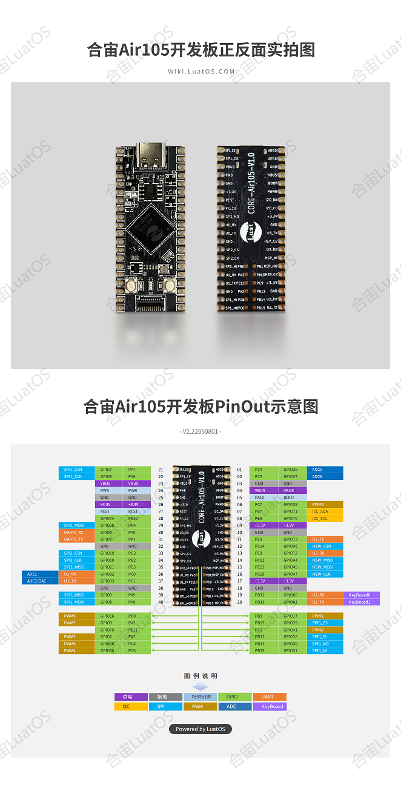

# Air105开发板

## Core-Air105

开发板使用说明文档

[Air105开发板使用说明](https://cdn.openluat-luatcommunity.openluat.com/attachment/Air105%20%E6%A0%B8%E5%BF%83%E6%9D%BF%E4%BD%BF%E7%94%A8%E6%89%8B%E5%86%8CV1.1.pdf)

开发板原理图: [CORE-Air105-V1.1.pdf](https://cdn.openluat-luatcommunity.openluat.com/attachment/20220110133139675_CORE-Air105-V1.1.pdf)

## 刷机烧录教程

[串口烧录教程](https://wiki.luatos.com/boardGuide/flash.html)

[固件下载](https://gitee.com/openLuat/LuatOS/releases)

**注意：烧录前请设置波特率为1500000** , 并勾选 "通用串口打印" , 否则刷机后日志会乱码.

## 开发板PinOut

3个LED分别为 PD14/PD15/PC3

开发板排针尺寸:
1. 管脚之间的距离, 10mil, 2.54mm
2. 两排管脚之间的距离, 700mil, 17.78mm

**注意：HSPI编程时为SPI5，ADC部分，LuatOS中未使能内部分压，通道1~6采集电压范围0~1.8V**
