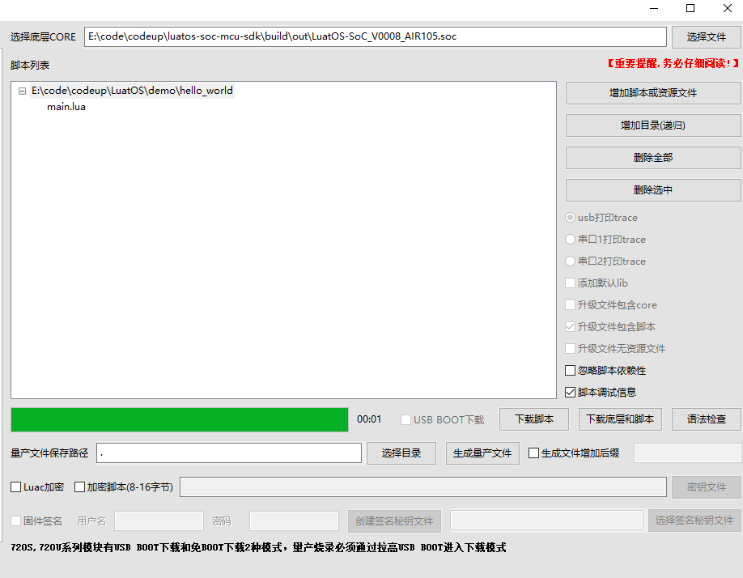
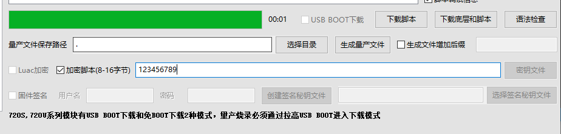
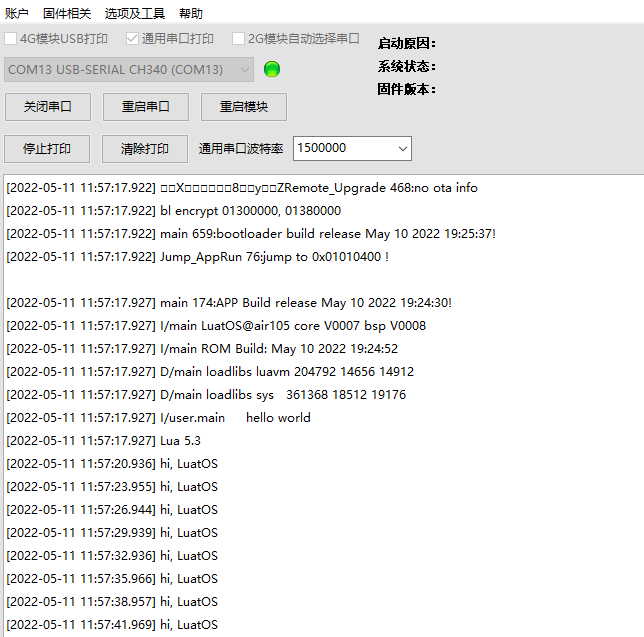
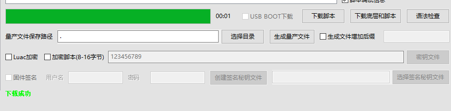
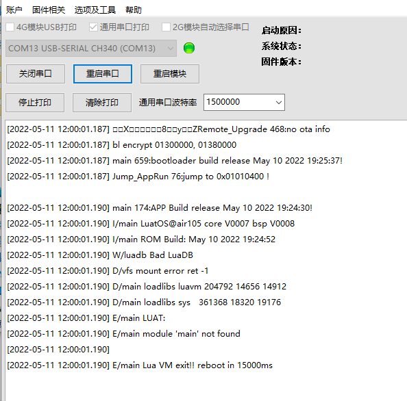

# Air105脚本加密

我们的程序可不可以加密呢？

当然可以，下面我们来演示一下使用Luatools进行脚本加密

**注意：要是用2.1.53以及之后的Luatools和20220511之后的Air105固件**

**预览此篇之前请确保会使用Luatools进行刷机，如不会请参考[烧录教程](https://wiki.luatos.com/boardGuide/flash.html)**

打开我们的程序下载界面，也就是Luatools-项目管理测试：

勾选加密脚本并输入密码

随后点击下载底层和脚本，等待下载成功

可以看到程序正常运行，此时我们的脚本就是加密过的了

如何验证呢？我们去掉脚本加密的勾选，再下载一次脚本

可以看到脚本无法运行了，脚本加密生效

**注意：要是用2.1.53以及之后的Luatools和20220511之后的Air105固件**