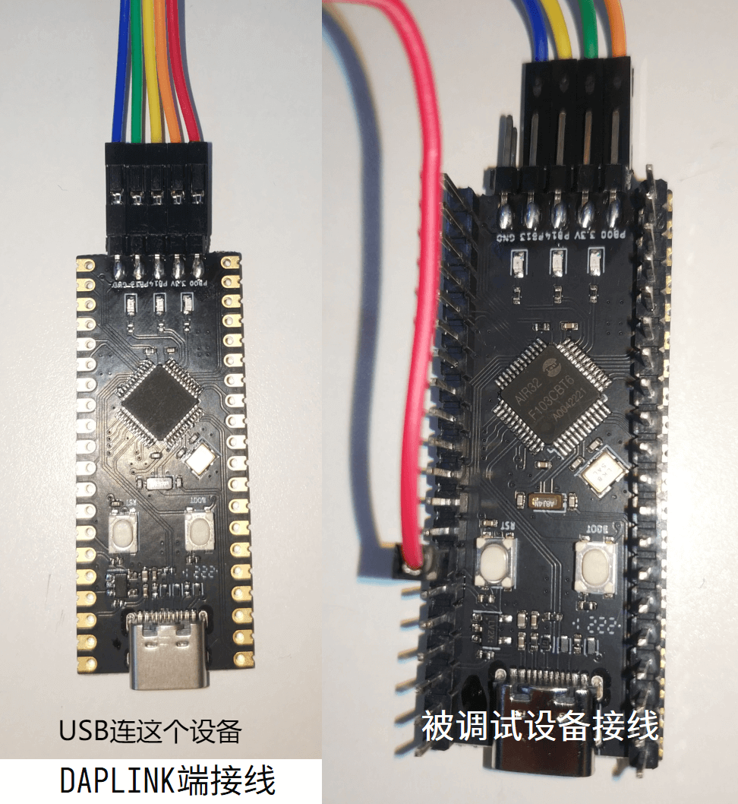

# 开发板

芯片数据手册[AIR32F103芯片数据手册1.0.0.pdf](https://cdn.openluat-luatcommunity.openluat.com/attachment/20220605164850945_AIR32F103芯片数据手册1.0.0.pdf)

开发板原理图[AIR32CBT6.pdf](https://cdn.openluat-luatcommunity.openluat.com/attachment/20220605164915340_AIR32CBT6.pdf)

开发板工程[传送门](https://gitee.com/openLuat/luatos-broads/tree/master/broads/Air32F103-Board)

## 开发板PinOut

## 使用说明

开发板出厂默认为daplink固件，固件支持**对外控制**调试下载功能，并且支持U盘模式烧录和虚拟串口，引脚对应关系如下：

|引脚|功能|
|:-:|:-:|
|PB13|SWD_CLK（daplink固件**对外控制**）|
|PB14|SWD_DIO（daplink固件**对外控制**）|
|PB0|RST复位（daplink固件**对外控制**）|
|PA2|虚拟串口的TX|
|PA3|虚拟串口的RX|

PB13连接**被调试设备的SWDCLK**，PB14连接**被调试设备的SWDIO**，PB0连接**被调试设备的复位**：

整体连接图如下图所示：

中间绿色的灯指示与被连接设备的通信情况。插入电脑后会显示一个名为daplink的U盘，一个COM口，以及一个便携设备daplink。在keil或其他开发软件中选择调试器为CMSIS DAP即可。目前支持的开发环境如下：

- KEIL MDK
- IAR
- PyOCD
- 其他支持CMSIS-DAP协议的软件
