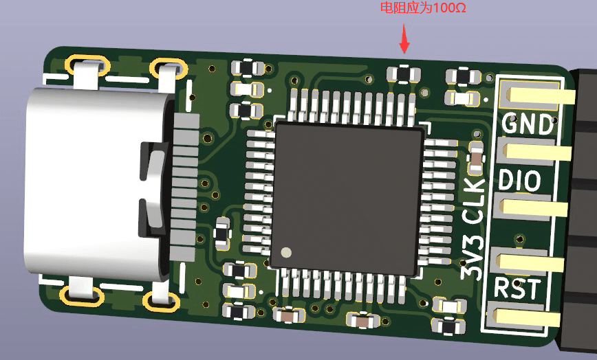
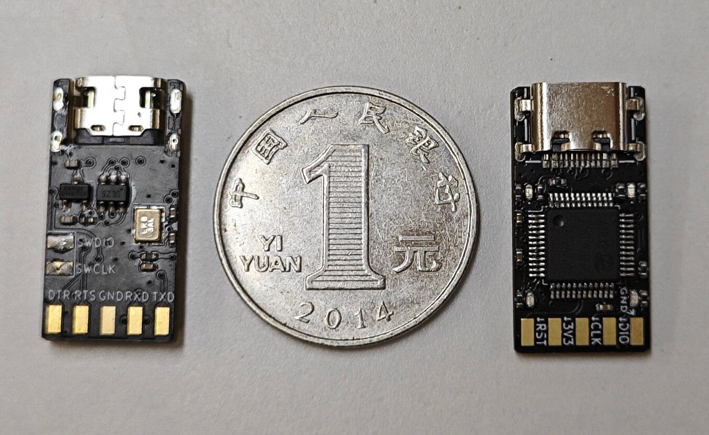
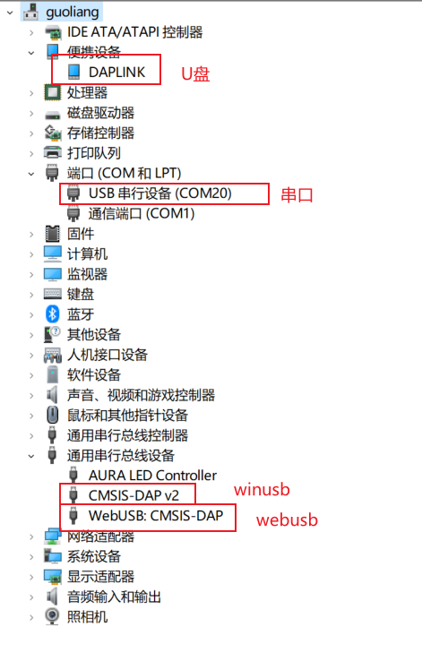
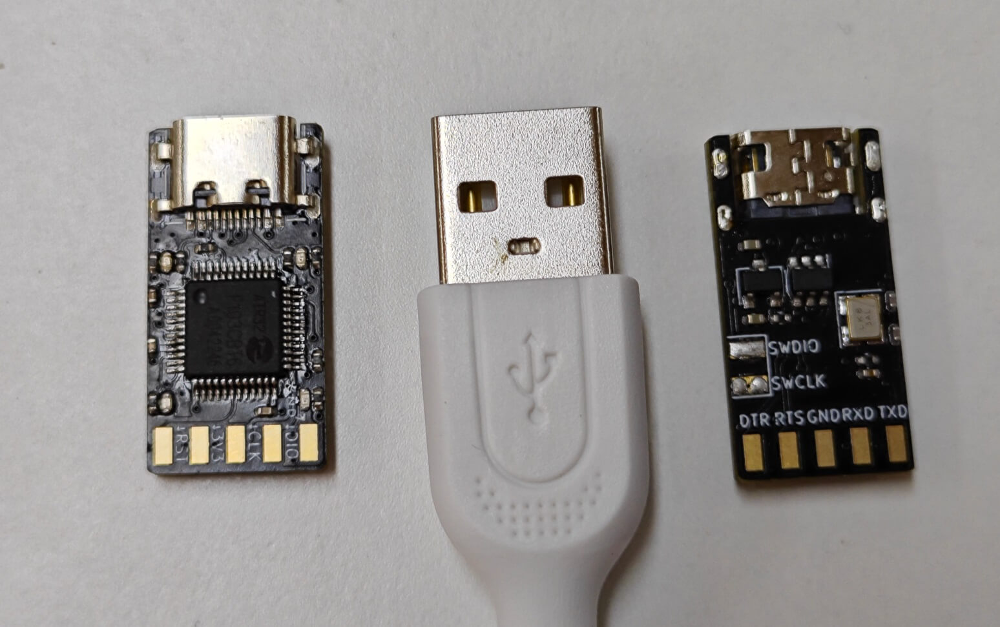
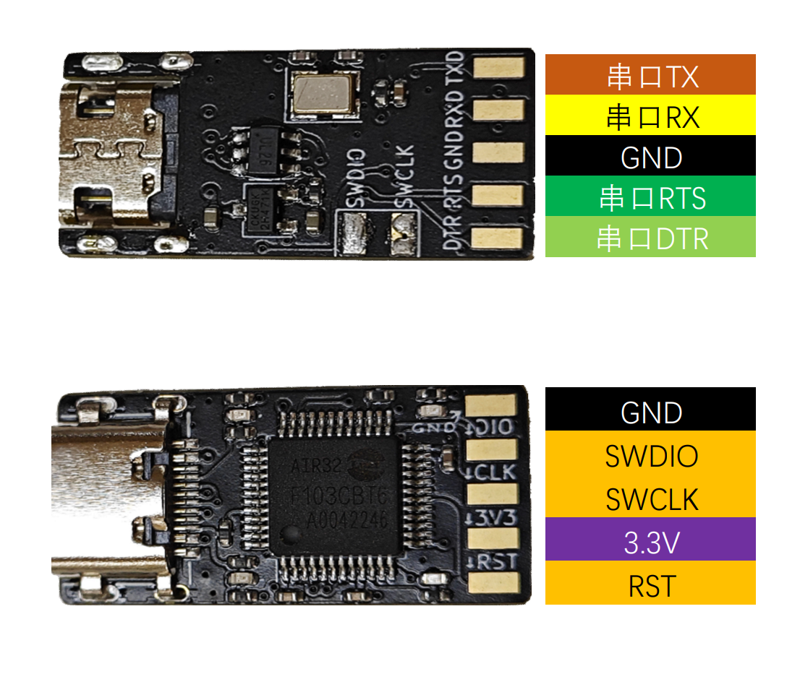
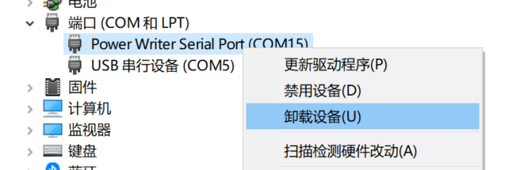
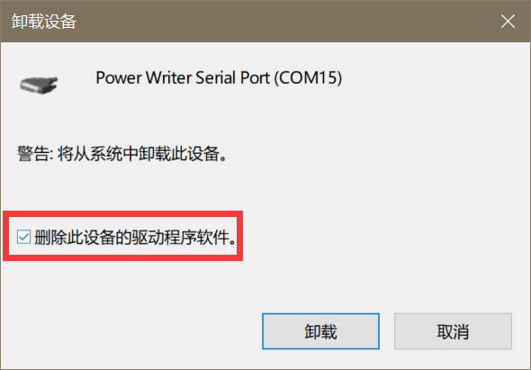

# DAPLink使用手册

```{warning}
⚠特殊说明：2023年6月17日前发货的用户请注意：

:::{dropdown} 展开查看
由于第一批板子贴错电阻，会导致无法使用高速下载  
如若符合`2023年6月17日前发货`的情况，请联系客服免费补发修正后的DAPLink（已收到货的板子无需退回）

此批次烧录器的使用解决方案如下：

1. 改低速度使用，速度需要尽量低
2. 自行更换电阻为100Ω，如下图：


:::
```

## **概述**

DAPLink是ARM官方开源的一个调试器方案，官方地址为[ARMmbed/DAPLink (github.com)](https://github.com/ARMmbed/DAPLink)，可以用来调试arm cortex内核的几乎所有单片机，最新出的M33，M85内核也支持调试。

合宙基于ARM官方代码移植到了Air32F103CBT6，并适配了**216M主频**和**96K大RAM**的资源，支持更快的的下载速度（[固件开源](https://gitee.com/openLuat/daplink)），并设计了一个超小体积的DAPLink硬件



## 主要功能

- **全系列**Arm-cortex内核芯片的调试和烧录，ARM官方维护，后续新内核依然会支持
- 一个**全功能USB转串口**（CDC），带硬件DTR和RTS，可以实现自动下载功能
- 带**U盘拖拽烧录**功能，可以直接将hex或者bin文件拖拽到U盘实现烧录（仅支持烧录CBT6）
- 适配**DAPLink V2** WINUSB版本，速度对比HID版本提升3到10倍，极大节约了下载时间
- 支持**WEBUSB**功能，可以网页烧录固件，支持插入弹窗，无需担心不会用
- 支持Keil，IAR，PyOCD等多种调试环境



## 硬件

- 尺寸仅有2.5*1.3cm大小，比USBA口都要小
- 使用**4层沉金**PCB设计
- 选用**沉板TYPEC口**更加结实稳定
- USB口使用**TI的ESD芯片**保护
- **大电流LDO**在稳定为air32供电的同时还能为外界设备提供电源



四颗LED功能分别为：

- dap运行指示灯，常亮
- 串口CDC指示，串口有数据时闪烁
- DEBUG指示，烧录或调试时亮
- MSC U盘烧录功能指示，有数据时闪烁

## 开源教程

这么好用想学学自己做一个，当然可以。合宙开源这个DAPLink的全部资料，软件硬件全部统统开源：

- [软件开源](https://gitee.com/openLuat/daplink)
- [硬件开源](https://gitee.com/openLuat/luatos-broads/tree/master/broads/DAPLink-V2)

为了让小白也能学习，稀饭大神还贴心的为大家录制了PCB设计的完整教程，使用全开源的KICAD设计软件，从画符号、画原理图、画PCB、走线、生产文件制作，到如何下单打样进行全流程教学，跟着教程走，轻松学会4层板的设计

教程地址： [合集·KiCad7.0教程-制作DAPLink](https://space.bilibili.com/393224264/channel/collectiondetail?sid=1241842)

## 使用教程

DAPLink引脚功能分配如下



```{note}
由于设计仅适配3.3V电平，若连接5V设备调试，须自行承担烧毁风险
```

### KEIL配置

点击工程配置魔术棒，找到Debug选项卡，在下拉列表中选择CMSIS-DAP Debugger，点击Settings


查看设备是否连接正常，连接正常可以在SW Device列表里看到设备，可以调整时钟速度提高效率

```{note}
由于该DAPLink使用的是实际设置速度，所以如果设备列表是空的，可能是因为被调试的芯片无法支持较高频率，可以调低频率后再使用
```


### 更新固件

后续如果修复BUG，DAPLink固件会有更新，这时候我们就需要进行下面的操作  

```{note}
有些电脑系统仍在使用Win7，无法使用DAPLink V2版本固件，这时候就需要降级到V1固件
```

1. 从[Air32的SDK仓库](https://gitee.com/openLuat/luatos-soc-air32f103/tree/master/AIR_Jlink_Keil)获取你需要的固件，请选择`iap.hex`结尾的固件
2. 短接DAPLink板子的`RST`与`GND`
3. 插入USB，电脑上会出现一个名为`MAINTENANCE`的USB存储器
4. 断开`RST`与`GND`之间的短接连线
5. 将`iap.hex`结尾的固件文件复制进这个USB存储器
6. 复制完几秒钟后，DAPLink会进行升级，几秒钟后会自动重连，升级完成

## 常见问题

### 插电脑上没有驱动

- 如果是WIN7设备，推荐按上面的教程刷成v1固件，或者自行研究如何安装驱动。
- 若连上之后，串口设备名称为`mdeb Serial Port`，并且无法自动识别WINUSB驱动。则为驱动被污染，解决方法如下：
    - 设备管理器-`串口(COM和LPT)`-`mdeb Serial Port(COMxx)`-`右击`-`卸载设备`，勾选`删除此设备的驱动程序软件`，点击确定
    - 设备管理器-`通用串行总线控制器`-`mdeb`开头的一个设备-`右击`-`卸载设备`，勾选`删除此设备的驱动程序软件`，点击确定
    - 点击设备管理器上方的`扫描检测硬件改动`按钮

### 设备管理器有设备，但是KEIL不认

请升级至最新版本的KEIL

或驱动有问题，用的是假的驱动，参考上个问题

### 设备管理器有设备，但是openocd不认

请升级至最2023年后的新版本的openocd

### 烧录器连上了，但是KEIL设备列表里不显示被调试的板子

- 被调试的芯片无法支持较高频率，可以调低频率后再使用
- 被调试板子关闭了SWD功能

### 无法识别虚拟U盘

```{warning}
⚠特别警告：安装`创新工坊`(PWLINK)的驱动后，会导致所有基于ARM官方DAPLINK固件的设备功能异常，包括但不限于：虚拟U盘消失、无法烧录。  

:::{dropdown} 请参考此处卸载相关驱动
连接DAPLink到电脑，打开设备管理器，找到如下设备，`右击`--`卸载设备`



勾选`删除此设备的驱动程序软件`，点击确定即可卸载



请勿再次安装该驱动，以免设备无法使用  
我们正在与该厂家取得联系，以免影响其它家的DAPLink设备
:::
```
