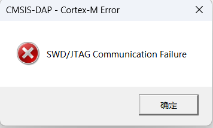
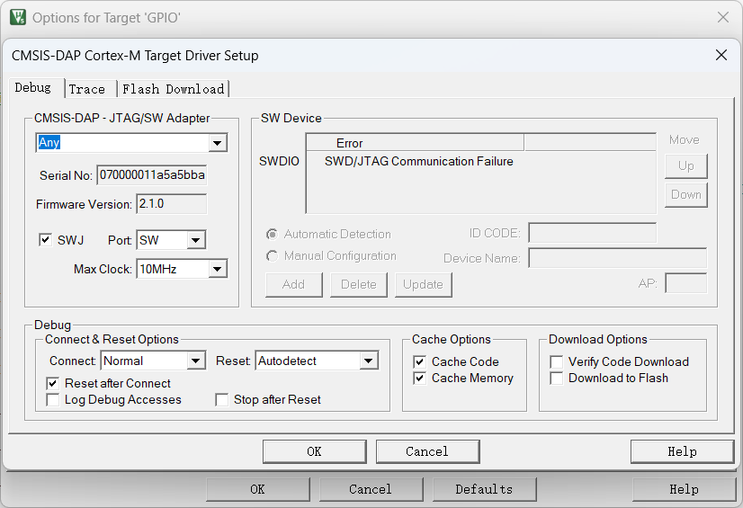
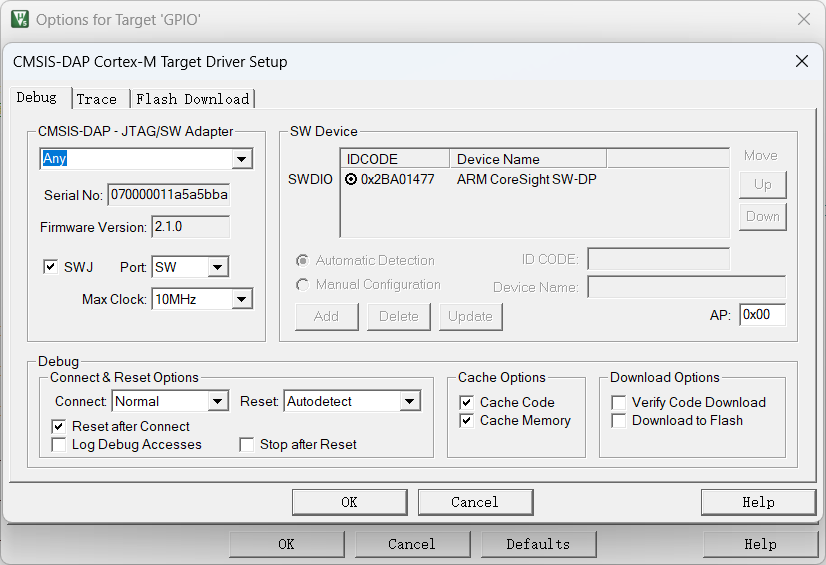
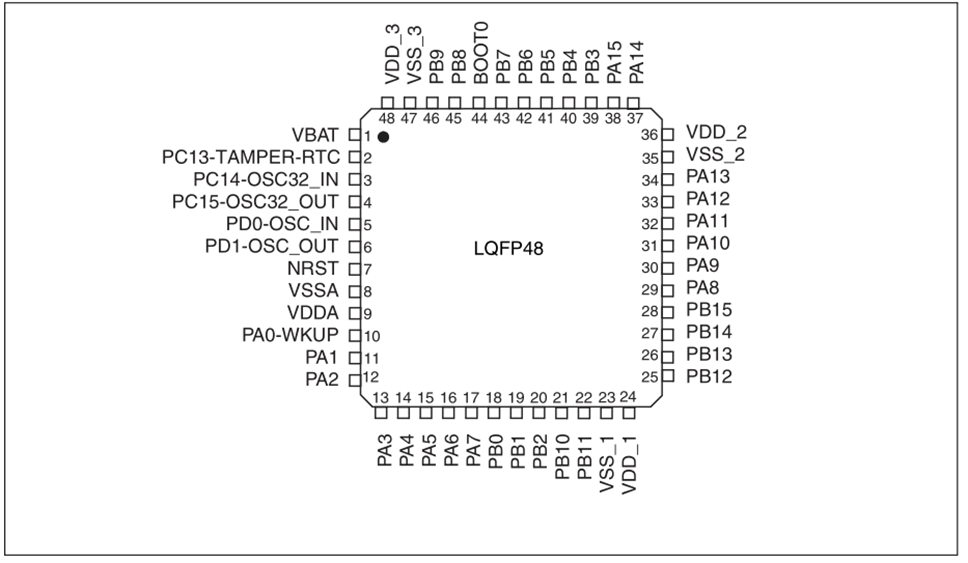

# AIR32F103芯片

## AIR32F103是什么?

Air32F103为系列芯片，首发型号为Air32F103CBT6，其外设和硬件设计兼容市场上一些主流F103型号，主频最高可达216M，32K RAM+128K Flash，每个IO都可设置独立的内部上下拉电阻。详细信息见数据手册，[Air32F103芯片手册](https://cdn.openluat-luatcommunity.openluat.com/attachment/20220605164850945_AIR32F103%E8%8A%AF%E7%89%87%E6%95%B0%E6%8D%AE%E6%89%8B%E5%86%8C1.0.0.pdf)

## 环境搭建教程

[Air32F103使用手册](https://wiki.luatos.com/chips/air32f103/Air32f103.html)

[AIR32F103的SDK与demo](https://gitee.com/openLuat/luatos-soc-air32f103)

## 替换其他芯片说明

使用Air32F103替换其他F103芯片说明[从SXX32F103移植到AIR32F103](https://wiki.luatos.com/chips/air32f103/switchFromSxx.html)

## 注意事项

由于开发板默认的daplink固件封堵了SWD调试接口，所以**第一次**使用swd下载时，请先按住被调试板子的BOOT按键，再按一下复位按键，最后松开BOOT按键，然后点击keil中的下载按钮。第一次下载完成后，下次下载就不用这样操作了（或在下载前先按住被调试板子的复位按键，在点击keil的下载按钮后马上松开按键/或者直接用ISP工具擦除芯片）

下载遇到如下报错

在debug选项卡也看不到设备

按住被调试板子的复位按键，然后再打开debug选项卡就可以正常看到设备了

这时候一样只要按住被调试板子的复位按键，然后点击keil中的下载按钮，点完以后再释放复位按键即可。

## 模块购买

* [手机访问mall.m.openluat.com](https://mall.m.openluat.com)
* [淘宝店](https://openluat.taobao.com)

## 芯片PinOut

