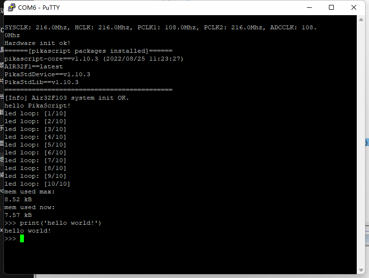

# PikaScript

Air32f103cb 基于 PikaScript 提供了 Python 编程的支持。


[(点击查看最新的适配进度)](https://gitee.com/Lyon1998/pikascript#mcu-support)

## 什么是 PikaScript?

PikaScript 是一个完全重写的超轻量级python 引擎，零依赖，零配置，可以在少于4KB 的 RAM 下运行 (如 stm32g030c8 和stm32f103c8)，极易部署和扩展。

代码仓库：[GitHub](https://github.com/pikastech/pikascript)/[Gitee](https://gitee.com/lyon1998/pikascript)

## 快速开始

从 [PikaScript 官网](http://pikascript.com) 下载工程，平台选择 `air32f103cb`，模块使用默认配置，然后点击开始生成，即可下载工程。


工程使用官方的 Keil 模板制作，直接在 main.py 中编写 Python 脚本，然后编译下载即可。


默认的脚本驱动了开发板上的 LED 灯, 运行结束后进入交互式运行模式。

``` python
import PikaStdLib
import machine

print('[Info] Air32F103 system init OK.')
print('hello PikaScript!')

def gpio_init(pin, mode):
    io = machine.GPIO()
    io.setPin(pin)
    io.setMode('out')
    io.enable()
    return io

led1 = gpio_init('PB2', 'out')
led2 = gpio_init('PB10', 'out')
led3 = gpio_init('PB11', 'out')
time = machine.Time()

led_loop_num = 10
for i in range(0, led_loop_num):
    print('led loop: [%d/%d]' % (i + 1, led_loop_num))
    led1.high()
	led2.low()
	led3.low()
	time.sleep_ms(200)
	led1.low()
	led2.high()
	led3.low()
	time.sleep_ms(200)
	led1.low()
	led2.low()
	led3.high()
	time.sleep_ms(200)


mem = PikaStdLib.MemChecker()
print('mem used max:')
mem.max()
print('mem used now:')
mem.now()

```

连接串口 1 进入交互式运行模块，强烈推荐使用 putty 作为串口终端。



更多的使用说明请参考 [PikaScript 官方文档](https://pikadoc.readthedocs.io/zh/latest/index.html)。

遇到问题请使用 gitee/github 提交 issue, 或者在 [论坛](https://whycan.com/f_55.html) 发帖, 欢迎加入交流群：


