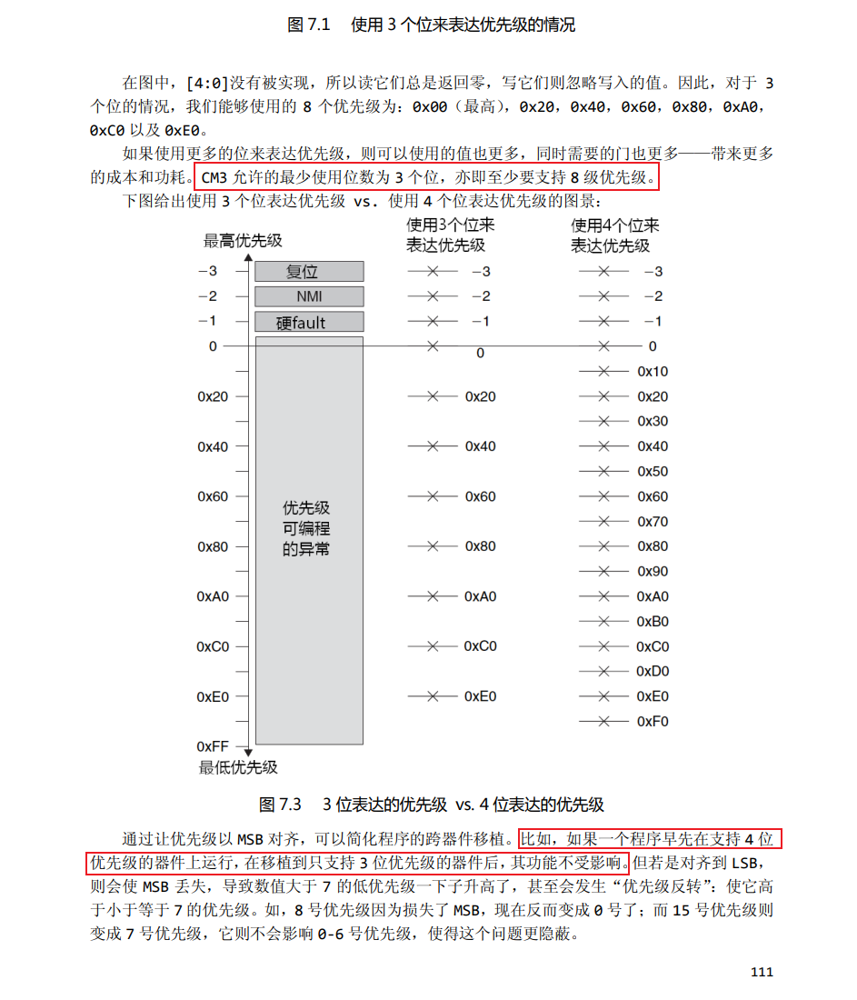
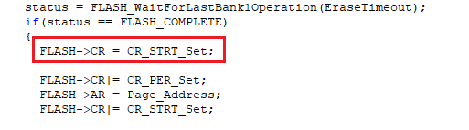

# 从SXX32F103移植

## 前言

这篇迁移指南旨在帮助您分析从现有的SXX32F103器件移植到AIR32F103器件所需的步骤。本文档收集了最重要的信息，并列出了需要注意的重要事项。

要将应用程序从SXX32F103系列移植到AIR32F103系列，用户需要分析硬件移植、外设移植和固件移植。

> AIR32F103系列微控制器基本兼容SXX32F103系列，同时强化许多功能，有些许地方与SXX32F103不同，详述于本文档。

## 快速替换 SXX32F103 芯片

1. 比对外设规格、Flash容量、SRAM容量等，解焊SXX32F103，换成AIR32F103对应型号
2. 使用ISP或KEIL,下载SXX32F103 HEX文件或BIN文件。
3. 如果有需要, 下载SXX32F103 HEX文件或BIN文件以外的资料或进行系统校正。
4. 查看程序能否正常运行。
5. 其他问题快速排查请参考外设使用差别章节。
6. 如果经过上述步骤后程序仍无法正常运行, 请参考本文件其他章节, 或联系支持人员协助解决。

## AIR32F103硬件使用差别

## TIM2 模块复用差异

AIR32F103 芯片 TIM2 的 Channel1 - Channel4 输出可复用引脚和 SXX32F103 不同，详细差异如下表：

<style>
.x21
 {
 mso-style-parent:style0;
 mso-number-format:General;
 text-align:center;
 vertical-align:middle;
 white-space:nowrap;
 mso-pattern:auto;
 border-top:1px solid windowtext;
 border-right:1px solid windowtext;
 border-bottom:1px solid windowtext;
 border-left:1px solid windowtext;
 mso-diagonal-down:none;
 mso-diagonal-up:none;
 mso-protection:locked visible;
 }
.x22
 {
 mso-style-parent:style0;
 mso-number-format:General;
 text-align:center;
 vertical-align:middle;
 white-space:nowrap;
 mso-pattern:auto;
 border-top:1px solid windowtext;
 border-right:1px solid windowtext;
 border-bottom:1px solid windowtext;
 border-left:1px solid windowtext;
 mso-diagonal-down:none;
 mso-diagonal-up:none;
 mso-protection:locked visible;
 }
.x23
 {
 mso-style-parent:style0;
 mso-number-format:General;
 text-align:center;
 vertical-align:middle;
 white-space:nowrap;
 mso-pattern:auto;
 border-top:1px solid windowtext;
 border-right:1px solid windowtext;
 border-bottom:1px solid windowtext;
 border-left:1px solid windowtext;
 mso-diagonal-down:none;
 mso-diagonal-up:none;
 mso-protection:locked visible;
 }
.x24
 {
 mso-style-parent:style0;
 mso-number-format:General;
 text-align:center;
 vertical-align:middle;
 white-space:nowrap;
 mso-pattern:auto;
 border-top:1px solid windowtext;
 border-right:1px solid windowtext;
 border-bottom:1px solid windowtext;
 border-left:1px solid windowtext;
 mso-diagonal-down:none;
 mso-diagonal-up:none;
 mso-protection:locked visible;
 }
.x25
 {
 mso-style-parent:style0;
 mso-number-format:General;
 text-align:center;
 vertical-align:middle;
 white-space:nowrap;
 mso-pattern:auto;
 border-top:1px solid windowtext;
 border-right:none;
 border-bottom:1px solid windowtext;
 border-left:1px solid windowtext;
 mso-diagonal-down:none;
 mso-diagonal-up:none;
 mso-protection:locked visible;
 }
.x26
 {
 mso-style-parent:style0;
 mso-number-format:General;
 text-align:center;
 vertical-align:middle;
 white-space:nowrap;
 mso-pattern:auto;
 border-top:none;
 border-right:1px solid windowtext;
 border-bottom:1px solid windowtext;
 border-left:1px solid windowtext;
 mso-diagonal-down:none;
 mso-diagonal-up:none;
 mso-protection:locked visible;
 }
.x27
 {
 mso-style-parent:style0;
 mso-number-format:General;
 text-align:center;
 vertical-align:middle;
 white-space:nowrap;
 mso-pattern:auto;
 border-top:1px solid windowtext;
 border-right:none;
 border-bottom:none;
 border-left:1px solid windowtext;
 mso-diagonal-down:none;
 mso-diagonal-up:none;
 mso-protection:locked visible;
 }
.x28
 {
 mso-style-parent:style0;
 mso-number-format:General;
 text-align:center;
 vertical-align:middle;
 white-space:nowrap;
 mso-pattern:auto;
 border-top:1px solid windowtext;
 border-right:1px solid windowtext;
 border-bottom:none;
 border-left:none;
 mso-diagonal-down:none;
 mso-diagonal-up:none;
 mso-protection:locked visible;
 }
.x29
 {
 mso-style-parent:style0;
 mso-number-format:General;
 text-align:center;
 vertical-align:middle;
 white-space:nowrap;
 mso-pattern:auto;
 border-top:none;
 border-right:none;
 border-bottom:1px solid windowtext;
 border-left:1px solid windowtext;
 mso-diagonal-down:none;
 mso-diagonal-up:none;
 mso-protection:locked visible;
 }
.x30
 {
 mso-style-parent:style0;
 mso-number-format:General;
 text-align:center;
 vertical-align:middle;
 white-space:nowrap;
 mso-pattern:auto;
 border-top:none;
 border-right:1px solid windowtext;
 border-bottom:1px solid windowtext;
 border-left:none;
 mso-diagonal-down:none;
 mso-diagonal-up:none;
 mso-protection:locked visible;
 }
.x31
 {
 mso-style-parent:style0;
 mso-number-format:General;
 text-align:center;
 vertical-align:middle;
 white-space:nowrap;
 mso-pattern:auto;
 border-top:1px solid windowtext;
 border-right:none;
 border-bottom:none;
 border-left:none;
 mso-diagonal-down:none;
 mso-diagonal-up:none;
 mso-protection:locked visible;
 }
.x32
 {
 mso-style-parent:style0;
 mso-number-format:General;
 text-align:center;
 vertical-align:middle;
 white-space:nowrap;
 mso-pattern:auto;
 border-top:none;
 border-right:none;
 border-bottom:1px solid windowtext;
 border-left:none;
 mso-diagonal-down:none;
 mso-diagonal-up:none;
 mso-protection:locked visible;
 }
</style>
<table border='0' cellpadding='0' cellspacing='0' width='792' style='border-collapse: 
 collapse;table-layout:fixed;width:594pt'>
 <col width='111' style='mso-width-source:userset;width:83.25pt'>
 <col width='87' style='mso-width-source:userset;width:65.25pt'>
 <col width='85' style='mso-width-source:userset;width:63.75pt'>
 <col width='84' span='3' style='mso-width-source:userset;width:63pt'>
 <col width='85' span='2' style='mso-width-source:userset;width:63.75pt'>
 <col width='87' style='mso-width-source:userset;width:65.25pt'>
 <tr height='18' style='mso-height-source:userset;height:14pt' id='r0'>
<td rowspan='3' height='54' class='x25' width='111' style='border-right:1px solid windowtext;border-bottom:1px solid windowtext;height:40.5pt;width:83.25pt;'>复用功能</td>
<td colspan='2' class='x27' width='172'>TIM2_REMAP[1:0] = 00</td>
<td colspan='2' class='x27' width='168' style='border-right:1px solid windowtext;'>TIM2_REMAP[1:0] = 01</td>
<td colspan='2' class='x27' width='169' style='border-right:1px solid windowtext;'>TIM2_REMAP[1:0] = 10</td>
<td colspan='2' class='x27' width='172' style='border-right:1px solid windowtext;'>TIM2_REMAP[1:0] = 11</td>
 </tr>
 <tr height='18' style='mso-height-source:userset;height:14pt' id='r1'>
<td colspan='2' class='x29' style='border-bottom:1px solid windowtext;'>(没有重映像)</td>
<td colspan='2' class='x29' style='border-right:1px solid windowtext;border-bottom:1px solid windowtext;'>(部分重映像)</td>
<td colspan='2' class='x29' style='border-right:1px solid windowtext;border-bottom:1px solid windowtext;'>(部分重映像)</td>
<td colspan='2' class='x29' style='border-right:1px solid windowtext;border-bottom:1px solid windowtext;'>(完全重映像)</td>
 </tr>
 <tr height='18' style='mso-height-source:userset;height:14pt' id='r2'>
<td class='x26'>SXX32F103</td>
<td class='x26'>AIR32F103</td>
<td class='x26'>SXX32F103</td>
<td class='x26'>AIR32F103</td>
<td class='x26'>SXX32F103</td>
<td class='x26'>AIR32F103</td>
<td class='x26'>SXX32F103</td>
<td class='x26'>AIR32F103</td>
 </tr>
 <tr height='18' style='mso-height-source:userset;height:14pt' id='r3'>
<td height='16' class='x22' style='height:12.5pt;'>TIM2_CH1_ETR</td>
<td colspan='2' class='x21' style='border-right:1px solid windowtext;border-bottom:1px solid windowtext;'>PA0</td>
<td class='x22'>PA15</td>
<td class='x24'>不支持</td>
<td class='x22'>PA0</td>
<td class='x24'>不支持</td>
<td colspan='2' class='x21' style='border-right:1px solid windowtext;border-bottom:1px solid windowtext;'>PA15</td>
 </tr>
 <tr height='18' style='mso-height-source:userset;height:14pt' id='r4'>
<td height='16' class='x22' style='height:12.5pt;'>TIM2_CH2</td>
<td colspan='2' class='x21' style='border-right:1px solid windowtext;border-bottom:1px solid windowtext;'>PA1</td>
<td colspan='2' class='x21' style='border-right:1px solid windowtext;border-bottom:1px solid windowtext;'>PB3</td>
<td class='x22'>PA1</td>
<td class='x24'>不支持</td>
<td class='x22'>PB3</td>
<td class='x24'>不支持</td>
 </tr>
 <tr height='18' style='mso-height-source:userset;height:14pt' id='r5'>
<td height='16' class='x22' style='height:12.5pt;'>TIM2_CH3</td>
<td class='x22'>PA2</td>
<td class='x23'>不支持</td>
<td class='x22'>PA2</td>
<td class='x24'>不支持</td>
<td class='x22'>PB10</td>
<td class='x24'>不支持</td>
<td class='x22'>PB10</td>
<td class='x24'>不支持</td>
 </tr>
 <tr height='18' style='mso-height-source:userset;height:14pt' id='r6'>
<td height='16' class='x22' style='height:12.5pt;'>TIM2_CH4</td>
<td colspan='4' class='x21' style='border-right:1px solid windowtext;border-bottom:1px solid windowtext;'>PA3</td>
<td colspan='4' class='x21' style='border-right:1px solid windowtext;border-bottom:1px solid windowtext;'>PB11</td>
 </tr>
<![if supportMisalignedColumns]>
 <tr height='0' style='display:none'>
  <td width='111' style='width:83.25pt'></td>
  <td width='87' style='width:65.25pt'></td>
  <td width='85' style='width:63.75pt'></td>
  <td width='84' style='width:63pt'></td>
  <td width='84' style='width:63pt'></td>
  <td width='84' style='width:63pt'></td>
  <td width='85' style='width:63.75pt'></td>
  <td width='85' style='width:63.75pt'></td>
  <td width='87' style='width:65.25pt'></td>
 </tr>
 <![endif]>
</table>

## GPIO 引脚耐压说明

AIR32F103 的 PA11、PA12 引脚耐压上限为 3.6V，硬件电路设计时注意电压范围。

- PA11 引脚可选复用功能为 CAN_RX、USART1_CTS、USBDM、TIM1_CH4
- PA12 引脚可选复用功能为 CAN_TX、USART1_RTS、USBDP、TIM1_ETR

## 自举模式选择引脚

BOOT0 管脚悬空时，为浮空状态，芯片复位启动后有概率从非 Flash 区域开启执行程序。若需从用户 Flash 启动，请避免 BOOT0 出现悬空情况

**推荐 BOOT0 引脚外接 10K 下拉电阻或直接接地**，可以稳定从用户 Flash 启动。

|BOOT1|BOOT0|自举模式|别名使用|
|:-:|:-:|:-:|:-:|
|X|0|用户 Flash|选择用户 Flash 作为自举空间|
|0|1|系统存储器|选择系统存储器作为自举空间|
|1|1|嵌入式 SRAM|选择嵌入式 SRAM 作为自举空间|

## AIR32F103软件使用差别

## 系统功能

### 配置DEBUG状态，使能SW，关断JTAG差异

配置DEBUG状态，将SW使能，JTAG关断，如下图使用

```c
GPIO_PinRemapConfig(GPIO_Remap_SWJJTAGDISABLE, ENABLE);
```

SXX32F103：JTAG关断，正常使用SW 进行DEBUG

AIR32F103：程序复位。Air32仅支持**完全关闭SWD与JTAG功能**与**同时开启SWD与JTAG功能**两种设置

会导致的一些问题，例如在cubemx配置为SW调试，下载一次固件以后就连接不上设备了，解决方法是在`sxx32f1xx_hal_msp.c`文件的`HAL_MspInit`函数加入`__HAL_AFIO_REMAP_SWJ_ENABLE();`

```c
/* USER CODE END 0 */
/**
  * Initializes the Global MSP.
  */
void HAL_MspInit (void)
{
    /* USER CODE BEGIN MspInit 0 */

    /* USER CODE END MspInit 0 */

    __HAL_RCC_AFIO_CLK_ENABLE();
    __HAL_RCC_PWR_CLK_ENABLE();

    /* System interrupt init */

    /** NOJTAG:. JTAG-DP Disabled and SW-DP Enabled
    */
    __HAL_AFIO_REMAP_SWJ_NOJTAG();

    /* USER CODE BEGIN MspInit 1 */
    __HAL_AFIO_REMAP_SWJ_ENABLE();
    /* USER CODE END MspInit 0 */
}
/* USER CODE BEGIN 1 */
```

### 仿真状态下将 JTAG 关断或者将 JTRST 释放会导致复位

仿真状态下，将 JTAG 关断或者将 JTRST 释放，会导致芯片立刻复位，无法执行后续代码。

解决方案：

- 仿真状态下，不要执行 JTAG 关断或者将 JTRST 释放的代码
- 非仿真状态下，JTAG 关断和 JTRST 释放功能正常，不影响程序运行。

### 软复位时不会重新加载自举模式的配置选项

异常情况举例（通过 ISP 开启读/写保护）：

- BOOT0 接高，BOOT1 接低，外部 Reset，使用 ISP 成功连接
- 将 BOOT0 修改为接低，通过 ISP 开启读/写保护
- 读/写保护成功开启后发现 Flash 中程序没有执行

问题原因：

通过 ISP 开启读/写保护后芯片会自动发起系统复位，由于软复位时不会重新加载自举模式的配置管脚，还会保持上一次 BOOT 管脚的配置状态，所以又进入了系统存储器执行程序，导致 Flash 中程序没有执行。

解决方案：

自举模式修改后，通过外部 RESET 复位，或者重新上下电的方式对芯片进行复位。

### 不支持某些SXX32F103专用烧录器下载

AIR32F103和SXX32F103 ARM M3 Core版本、SW、JTAG IDCODE不同

|芯片|SXX32F103|AIR32F103|
|:-:|:-:|:-:|
|Core ID|0x411FC231|0x412FC230|
|SW IDCODE|0x1BA01477|0x2BA01477|
|JTAG IDCODE|0x3BA00477|0x4BA00477|

当使用某些SXX32F103专用烧录器时，会判断Core ID和SW IDCODE、JTAG IDCODE等信息，故不支持某些SXX32F103专用烧录器

解决方法：

使用不判断Core ID和SW IDCODE、JTAG IDCODE的烧录器

### 第三方某些烧录器下载失败问题

对于某些烧录器在RESET拉低的情况下进行SW/JTAG交互，是不支持的。因为AIR32F103当RESET拉低时，SW和JTAG是无法使用的（如：WizPro200ST8编程器）

解决方法：

1. 配置烧录器，在烧录时将RESET拉高
2. 悬空芯片NRST管脚，不和烧录器相连

### 非32bit对齐访问APB总线时，现象差异

访问APB总线时，必须32bit对齐，否则无法访问，如：

ADC 配置为左对齐模式时，从 0x4001244E 地址获取转化完的高 8bit 数据，发现获取到的数值固定为 0

解决方法：

访问 APB 总线的寄存器时，需要按照 32bit 对齐。若需要 32bit 寄存器中某一字段，32bit 对齐读出后再进行处理

### 中断控制器差异

SXX32F103：

1. 最多支持60个可屏蔽中断通道
2. 16个可编程的优先等级(使用了4位中断优先级)

AIR32F103：

1. 最多支持71个可屏蔽中断通道
2. 8个可编程的优先等级(使用了3位中断优先级)

会导致的问题：

cubemx或者其他freertos工程的`configPRIO_BITS`设置是4，需要改成3，不然会导致异常，注意如果是cubemx会导致每次生成代码以后都要重新设置，所以可用直接注释掉`FreeRTOSConfig.h`里的这句话

```c
/* USER CODE BEGIN 1 */
// #define configASSERT( x ) if ((x) == 0) {taskDISABLE_INTERRUPTS(); for( ;; );}
/* USER CODE END 1 */
```

可以查看ARM的手册，3位中断优先级和4位兼容，不会有任何问题，cubemx中的configASSERT配置实际很影响运行效率，freertos的手册中建议关闭。所以按这个方案修改不会有任何bug，无需担心。



### 区分 Air32 芯片和 SXX32F103 芯片的方法

读取基地址 0x1FFFF7E8，获取 32bit 标识进行区分。

|型号|型号标识|
|:-:|:-:|
|AIR32F103CBT6|0x1A5A5BBX|
|AIR32F103CCT6|0x1A5A5CCX|
|AIR32F103RPT6|0x1A6A5CDX|
|AIR32F103VET6|0x1A8A6DDX|
|AIR32F103VGT6|0x1A8A6EDX|
|AIR32F103ZET6|0x1A9A6DDX|

### 软件延时差异

使用其他平台实现的一些软件延时需要进行调整，比如下图简单软件延时函数

```c
void delay()
{
    uint8_t i = 100;
    while(i--);
}
```

- SXX32F103 执行该函数的延时时间是 10us
- AIR32F103 执行该函数的延时时间是 7.2us

如果应用中对软件延时时间要求比较严格，请对软件实现的延时参数做一定的调整

### TRACESWO 作为 Printf 功能使用说明

使用 TRACESWO 管脚(PB3)作为 Log 输出，发现并无 Log 正常输出

问题原因：

AIR32F103 PB3 作为 JTDO 功能的优先级要高于 TRACESWO 功能。

解决方案：

使用 TRACESWO 管脚(PB3)作为 Log 输出，需要配置 JTAG 复用。如下：

```c
RCC_APB2PeriphClockCmd(RCC_APB2Periph_AFIO,ENABLE);
GPIO_PinRemapConfig(GPIO_Remap_SWJ_JTAGDisable,ENABLE);
```

## ADC

### 配置 ADC 连续采样且使能 ADC 后，只关闭 ADC 使能无法停止转化

复现问题步骤如下：

- 配置 ADC 为连续采样模式（连续触发模式），开启 DMA 搬运。软件触发后 ADC 每转化完成一次，DMA 搬运一次，进一次 DMA 完成中断
- 在 DMA 完成中断中配置关闭 ADC 使能
- AIR32F103 在关闭 ADC 使能后，ADC 还会持续转化，还会持续进 DMA 完成中断

解决方案：

配置 ADC 为单次转化并且等待上一次采样周期个 ADC_CLK 后，再关闭 ADC 使能

如，例子配置的 ADC 时钟为 9M，采样周期为 239.5，所以等待的时间为(239.5+12.5)*1/9000 ≈ 27.922us，故以下代码等待 30us 是足够的

```c
void DMA1_Channel1_IRQHandler(void)
{
    if(DMA_GetITStatus(DMA1_IT_TC1) != RESET)
    {
        DMA_ClearITPendingBit(DMA1_IT_TC1);
        DMA_ClearFlag(DMA1_IT_TC1);

        //处理电流数据

        ADC1->CR2 &= ~BIT(1); // 配置adc为单次转化
        Delay_Us(30);   //等待30us
        ADC_Cmd(ADC1, DISABLE); //关闭ADC使能
    }
}
```

### ADC 连续两次使能 ADON 再进行外部事件的软件触发注意事项

```c
ADC_Cmd(ADC1, ENABLE);
ADC_Cmd(ADC1, ENABLE);
ADC_SoftwareStartConvCmd(ADC1, ENABLE);
```

以上操作，AIR32F103 会出现 EOC 置位后无法清 0，并且 ADC 转化值异常现象

解决方案：

使能 ADC 后，再次使能 ADC，等待 EOC 置位，读取量化值，如下

```c
ADC_Cmd(ADC1, ENABLE);
ADC_Cmd(ADC1, ENABLE);
while(ADC_GETFlagStatus(ADC1,ADC_Flag_EOC) == RESET);
ADC_GetConversionValue(ADC1);
ADC_SoftwareStartConvCmd(ADC1, ENABLE);
```

注意：

当 ADC 使能后，再次使能 ADC，SXX32F103 和 AIR32F103 均会触发一次 ADC 转化。

### ADC连续两次使能外部事件的软件触发注意事项

```c
ADC_SoftwareStartConvCmd(ADC1, ENABLE);
ADC_SoftwareStartConvCmd(ADC1, ENABLE);
```

以上操作，AIR32F103 会出现 EOC 置位后无法清 0，并且 ADC 转化值异常现象

解决方法：

外部事件的软件触发，等待 EOC 置位，读取量化值

```c
ADC_SoftwareStartConvCmd(ADC1, ENABLE);
while(ADC_GETFlagStatus(ADC1, ADC_FLAG_EOC) == RESET);
ADCGetConversionValue(ADC1);
ADC_SoftwareStartConvCmd(ADC1, ENABLE);
while(ADC_GETFlagStatus(ADC1, ADC_FLAG_EOC) == RESET);
ADCGetConversionValue(ADC1);
```

### 双 ADC 不同模式差异

同步注入、交替触发模式下：

- SXX32F103：注入组通道/规则组通道被触发后，均正常转化
- AIR32F103：注入组通道被触发后，正常转化；规则组通道被触发后，不进行转化

同步规则、快速交叉、慢速交叉模式下：

- SXX32F103：注入组通道/规则组通道被触发后，均正常转化
- AIR32F103：规则组通道被触发后，正常转化；注入组通道被触发后，不进行转化

### ADC 和 DMA 配置使用注意事项

问题描述：

配置ADC连续采样多个通道且使用 DMA搬运数据时，出现ADC 量化值出错(错位)现象。  
例如转化 5 个通道，配置为规则组，连续扫描转换  
期望值为{0V,1V,1.5V,2V,2.5V, 0V,1V,1.5V,2V,2.5V, 0V,1V,1.5V,2V,2.5V …}  
实际软件获取的值为{1.5V,2V,2,5V,0V,1V, 1.5V,2V,2,5V,0V,1V, 1.5V,2V,2,5V,0V,1V …}  

解决方案：

先配置 DMA，再使能 ADC，则不会出现 ADC 量化值出错(错位)问题

### ADC使用ADC自动注入转换差异

SXX32F103：ADC自动注入转换直接使用

AIR32F103：ADC自动注入转换获取到值为0

解决方法：AIR32F103使用自动注入转换ADC_ScanConvMode需要配置为开启

```c
ADC_InitStructure.ADC_ScanConvMode = ENABLE;
```

## TIM

### 通用定时器 TIM2 - TIM5 的 Channel3 不支持比较输出功能

AIR32F103 通用定时器 TIM2-TIM5 的 Channel3 不支持比较输出功能，仅支持捕获输入功能

解决方法：

选择 TIM2-TIM5 的其他通道,或者选择其他 TIM 的通道进行输出使用

### 连续两次刹车的时间间隔小于一个 TIM 时钟周期时 BIF 无法清零

当连续两次刹车的时间间隔小于一个 TIM 时钟周期时，会出现 BIF(刹车中断标记)置 1 后，无法清 0 现象

解决方法（二选一）：

1. 软件配置刹车信号为普通输入IO中断，不使用 BIF和刹车中断
2. 在BIF内置1，进行软复位TIM

### 软件修改 CNT 值后 TIM 没有重新配置 CNT 进行计数

某些情况下软件修改 CNT 值后，TIM 并未重新配置的 CNT 进行计数

案例1：

1．TIM 配置为单脉冲模式并开启更新中断

```c
TIM_SelectOnePulseMode(TIMx, TIM_OPMode_Single); //配置为单脉冲模式
TIM_ITConfig(TIMx, TIM_IT_Update, ENABLE);
TIM_Cmd (TIMx, ENABLE);
```

2．在更新中断中配置CNT，使能CEN

```c
if (TIM_GetITStatus(TIMx, TIM_IT_Update) != RESET)
{
    TIM_ClearITPendingBit(TIMx, TIM_IT_Update);
    TIM_SetCounter(TIMx, NewCnt); //软件配置CNT值
    TIM_Cmd(TIMx, ENABLE);  //试能TIM
}
```

注意：
单脉冲模式下，SXX32F103 和 AIR32F103 的 TIM 计数器自动在产生下一个更新事件 UEV时停止

案例2：

- TIM 不配置单脉冲模式
- 在中断中软件关闭 TIM，修改 CNT 值，软件再使能 TIM

```c
void TIM3_IRQHandler(void)
{
    if(TIM_GetITStatus(TIMx,TIM_IT_Update) != RESET)
    {
        TIM_Cmd(TIMx, DISABLE);
        TIM_ClearITPendingBit(TIMx, TIM_IT_Update);
        TIM_SetCounter(TIMx, 1999);
        TIM_Cmd(TIMx, ENABLE);
    }
}
```

问题原因：

只有 CEN 处于使能状态时，软件修改 CNT 才生效

解决方案：

- 若配置为单脉冲模式时产生更新事件后，若需要手动修改 CNT 值，应当先使能 TIM再修改
- 若没有配置单脉冲模式，手动修改 CNT 值时不要将 TIM 关闭

## CAN

### 休眠模式下配置过滤器注意事项

问题描述：

CAN 模块先初始化过滤器，再初始化控制器，导致可以发送数据，无法接收数据的现象

问题原因：

AIR32F103 配置 CAN 过滤器时，需要确保 CAN 处于非休眠模式

解决方案：

先初始化 CAN 控制器，再配置过滤器可解决

### CAN发送时间戳时，时间戳填充报文的位置差异

CAN配置时间触发通讯模式，在最后2个数据字节发送时间戳时  
由于设计不同，AIR32F103 使用 CAN 发送时间戳，CAN_TDTxR 寄存器中 TIME[15:0]字段填充报文位置和 SXX32F103 不同

SXX32F103：TIME[7:0] 作为第 7 个字节，TIME[15:8] 为第 8 个字节，它们替换了写入 CAN_TDHxR[31:16]的数据(DATA6[7:0]和 DATA7[7:0])

AIR32F103：TIME[7:0] 作为第 8 个字节，TIME[15:8] 为第 7 个字节，它们替换了写入 CAN_TDHxR[31:16]的数据(DATA6[7:0]和 DATA7[7:0])

解决方法：

其他CAN节点使用接受到的时间戳时，软件进行翻转

### TXFP 为 1 时，FIFO 优先级差异

由于设计不同，AIR32F103 配置 TXFP 为 1，当有多个报文等待发送时，报文发送的优先级和 SXX32F103 不同

SXX32F103：TXFP 为 1 时，多个报文等待发送时，报文发送的顺序由请求的顺序决定

AIR32F103：TXFP 为 1 时，多个报文等待发送时，报文发送的顺序由邮箱号优先级的顺序决定。  
邮箱号优先级：邮箱号 0 > 邮箱号 1 > 邮箱号 2

## FLASH

### FLASH写保护第一块后，第一次擦除其他Page，现象差异

SXX32F103：写保护第一块后，擦除其他Page，可正常擦除

AIR32F103：写保护第一块后，第一次擦除其他Page，擦除失败，并上报WRPRTERR写保护错误

解决方法：

在配置Page擦除之前，先配置一次Strt，如下图所示



### 调用 FLASH_EraseOptionBytes()接口擦除选项字节时有概率 Fault

程序中使用 FLASH_EraseOptionBytes()接口进行擦除选项字节区时，有概率进 HardFault_Handler 异常中断

解决方案：

AIR32F103 将 FLASH_EraseOptionBytes()接口做出修改，使用`SetStrt()`接口替换以下指令：

```c
//这些注释掉
// FLASH->CR |= CR_OPTER_Set;
// FLASH->CR |= CR_STRT_Set;
// FLASH_WaitForLastOperation(EraseTimeout);
SetStrt();//换成这个接口
```

## USART

### 智能卡模式无时钟输出

SXX32F103：USART 智能卡模式时钟输出，无需配置USART TE(发送使能)/RE(接收使能)

AIR32F103：USART 智能卡模式时钟输出，需要配置USART TE(发送使能)/RE(接收使能)，否则无时钟输出

问题原因：

AIR32F103 的 USART 智能卡模式的时钟输出条件和 SXX32F103 不同，还受发送使能 TE 控制

解决方法：

在初始化USART时，将USART TE(发送使能)/RE(接收使能) 使能  
配置时钟分频、使能智能卡模式后，将发送使能 TE 置 1，可解决

### 使用 DMA 发送数据，通过 USART TC 标志位判断数据是否全部发送完成注意事项

使用 DMA 进行发送大于 2Byte 数据时，通过判断 USART TC 标志位，来确认数据是否发送完毕。  
应在配置 DMA 前，将 TE 关闭；配置完 DMA 后，再将 TE 开启，进行数据发送。

## SPI/IIS

### IIS 在主接收模式、并且处于PCM标准模式下时，关闭I2SE现象差异

SXX32F103：可通过配置I2SE，停止主机输出时钟

AIR32F103：不可通过配置I2SE，停止主机输出时钟

解决方法：

1. 通过配置I2SMOD，停止主机输出时钟
2. 通过软复位模块方式，停止主机输出时钟

### 作为 Master，全双工模式下收发数据注意事项

使用 SPI 作为 Master 进行通讯时，接收数据异常，比如：

SPI 配置为 Master 两线全双工模式，按照下图进行收发数据操作

```c
//发送Data0 , Datal；不操作接收DR
SPI_I2S_SendData(SPIx,Data0);
while (SPI_12s_GetFlagstatus (SPIx，SPI_12S_FLAG_TXE)==RESET);
while (SPr_I2s_cetFlagStatus(SPIx,SPI_12S_FLAG_BSY) == RESET);
SPI_I2S_SendData(SPIx,Datal);
while (SPI_I2s_GetFlagStatus(SPIx,SPI_12S_FLAG_TXE) == RESET);
while (SPr_I2s_cetFlagStatus(SPIx,SPI_12S_FLAG_BSY) == RESET);
//读取1次DR，将之前接收到的数据清除
while (SPI_12s_GetFlagStatus (SPIx,SPI_I2S_FLAG_RXNE)== RESET);
SPI_I2S_ReceiveData(SPIx);
//发送数据Data2；并读取DR,获取接收的数据receive
SPI_I2S_SendData(SPIx,Data2);
while (SPI_12s_GetFlagStatus (SPIx,SPI_I2S_FLAG_TXE) ==RESET);
while (SPI_12s_GetFlagStatus (SPIx,SPI_I2s_FLAG_BSY) == RESET);
while (SPI_I2s_GetFlagStatus(SPIx，SPI_I2S_FLAG_RXNE) == RESET);
receive = SPI_I2s_ReceiveData (SPIx);
```

AIR32F103 发送 Data2 所接收到的数据 receive 是异常数据。

问题原因：

AIR32F103 SPI 具有 16Byte 接收 FIFO。上述发送 Data0，Data1 所接收到的数据缓存到了接收 FIFO 中，读取 1 次 DR 的操作并没有将 FIFO 中无用的数据全部清除，导致后续发送 Data2 所接收到的数据不是期望数据

解决方案：

作为 Master 每次发送数据后，都读取一次 DR，确保 FIFO 中无残留数据可解决。

```c
//发送Data0 , Datal；每次发数据后都读取一次DR
SPI_I2S_SendData(SPIx,Data0);
while (SPI_12s_GetFlagStatus (SPIx,SPI_I2S_FLAG_TXE) ==RESET);
while (SPI_12s_GetFlagStatus (SPIx,SPI_I2s_FLAG_BSY) == RESET);
while (SPI_I2s_GetFlagStatus(SPIx，SPI_I2S_FLAG_RXNE) == RESET);
SPI_I2S_ReceiveData(SPIx);

SPI_I2S_SendData(SPIx,Data0);
while (SPI_12s_GetFlagStatus (SPIx,SPI_I2S_FLAG_TXE) ==RESET);
while (SPI_12s_GetFlagStatus (SPIx,SPI_I2s_FLAG_BSY) == RESET);
while (SPI_I2s_GetFlagStatus(SPIx，SPI_I2S_FLAG_RXNE) == RESET);
SPI_I2S_ReceiveData(SPIx);

//发送数据Data2；并读取DR,获取接收的数据receive
SPI_I2S_SendData(SPIx,Data0);
while (SPI_12s_GetFlagStatus (SPIx,SPI_I2S_FLAG_TXE) ==RESET);
while (SPI_12s_GetFlagStatus (SPIx,SPI_I2s_FLAG_BSY) == RESET);
while (SPI_I2s_GetFlagStatus(SPIx，SPI_I2S_FLAG_RXNE) == RESET);
SPI_I2S_ReceiveData(SPIx);
```

### 在 BUSY 状态下关开 SPE 有概率无法收发数据

操作 SPI 时，软件关开 SPE 时如果没有判断非 BUSY 状态，有概率出现后续无法正常收发数据情况。如下操作，可以正常发送 0xAA，无法发送 0x55：

```c
SPI_I2S_SendData(SPIx,0xAA);
while (SPI_12s_GetFlagStatus (SPIx,SPI_I2s_FLAG_BSY) == RESET);
SPI_Cmd(SPI1,DISABLE);
SPI_Cmd(SPI1,ENABLE);

while (SPI_12s_GetFlagStatus (SPIx,SPI_I2s_FLAG_TXE) == RESET);
SPI_I2S_SendData(SPIx,0x55);
```

问题原因：

AIR32F103 SPI 在 BUSY 状态下，若进行关开 SPE，则关 SPE 在数据发送时完成(非 BUSY 状态下)生效，开 SPE 动作忽略不生效

解决方案：

在关 SPE 之前，要判断是否为 BUSY 状态；处于非 BUSY 状态下，才可以关闭 SPE

### SPI使用DMA传输数据

在SPI使用DMA传输数据时，建议`外设DAM使能`和`DMA通道使能`同时`ENABLE`和`DISABLE`。否则可能遇到接收到数据不正确问题

```c
DMA_Cmd(FLASH_SPI_RX_DMA_CHANNEL, ENABLE);
DMA_Cmd(FLASH_SPI_TX_DMA_CHANNEL, ENABLE);
SPI_I2S_DMACmd (FLASH_SPI_MASTER, SPI_I2S_DMAReq_Tx, ENABLE);
SPI_I2S_DMACmd (FLASH_SPI_MASTER, SPI_I25_DMAReq_Rx, ENABLE);
```

```c
SPI_I2S_DMACmd (FLASH_SPI_MASTER, SPI_I2S_DMAReq_Tx, DISABLE);
SPI_I2S_DMACmd (FLASH_SPI_MASTER, SPI_I25_DMAReq_Rx, DISABLE);
DMA_Cmd(FLASH_SPI_TX_DMA_CHANNEL, DISABLE);
DMA_Cmd(FLASH_SPI_RX_DMA_CHANNEL, DISABLE);
```

### SPI RXE置位，读取DR后，DR中的数据保留

SXX32F103：当RXE置位，读操作将返回接收缓冲区里的数据，并且会将DR清0

AIR32F103：当RXE置位，读操作将返回接收缓冲区里的数据，不会将DR清0

解决方法：

不影响正常收发数据

## USB 模块

USB 配置为 Slave 模式，Host 端在短时间内连续下发不同端点的请求或者同一端点不同方向的请求，有概率出现死机现象

问题原因：

AIR32F103 USB 的 USB_ISTR(中断状态寄存器)中 EP_ID 和 DIR 更新机制和 SXX32F103 不同

解决方案：

修改 CTR_LP()接口，如下所示，可解决；并且修改后兼容 SXX32F103

```c
void CTR_LP(void)
{
////start///////////////////////////////////////////
  uint32_t i = 0;
  uint16_t nstr = 0;
////end///////////////////////////////////////////
  uint32_t wEPVal = 0;
  /* stay in loop while pending ints */
  while (((wIstr = _GetISTR()) & ISTR_CTR) != 0)
  {
////start///////////////////////////////////////////
    for(i=0;i<8;i++)
    {
      nstr = _GetENDPOINT(i);
      if(nstr & (EP_CTE_RX|EP_CTR_TX))
      {
        EPindex = i;
        if(nstr & EP_CTR_RX)
        {
          wIstr |= ISTR_DIR;
        }
        if(nstr & EP_CTR_TX)
        {
          wIstr &= ISTR_DIR;
        }
        break;
      }
    }
    /* extract highest priority endpoint number */
    //EPindex = (uint8_t)(wIstr & ISTR_EP_ID);
////end///////////////////////////////////////////
    if (EPindex == 0)
    {
      /* Decode and service control endpoint interrupt */
      /* calling related service routine */
      /* (Setup0_Process, In0_Process, Out0_Process) */
.......
```

## DMA 模块

当 DMA 模块有 Channel 正在搬运数据时，修改其他 Channel 的 CNT 值(数据传输数量)，有概率不生效

问题原因：
AIR32F103 DMA Channel 的 CNT(数据传输数量)修改生效条件和 SXX32F103 不同。

解决方案：

软件避免 DMA Channel 正在搬运数据时，修改其他 Channel 的 CNT 值(数据传输数量)

## ISP、仿真器、脱机烧录器使用注意事项

### ISP 工具

AIR32F103 支持目前市面上常用的 ISP 工具，包括 STMFlashLoader 、FlyMcu、STM32CubeProgrammer 等  
**不支持 mcuisp V0.993**

### 仿真器

AIR32F103 支持的仿真器包括 ST-LINKV2、JLINK、ARM Emulator 等  
**不支持 ST-LINKV3**

### 使用 Keil.SXX32F1xx_DFP.2.3.0 版本以上的 pack 包注意事项

使用 ULINK2 或者 CMSIS-DAP 仿真器并且使用的是 Keil.SXX32F1xx_DFP.2.3.0 版本以上(包含 2.3.0 版本)的 pack 包时，无法下载程序。下载时提示信息`Not a genuine ST Device! Abort connection`

解决方案：

更换项目芯片类型，从SXX32改为AIR32的PACK包即可

或者将调试器更换为ST-LINKV2

### 下载器

目前暂不支持的烧录器为：SmartPRO T9000-PLUS、XELTEK SUPERPRO 6100N

#### 芯片处于读写保护状态下烧录异常

问题描述：

使用正点原子 MINI、正点原子 P100 等脱机烧录器，对已经配置了读写保护的芯片进行烧录时，出现烧录失败的现象。

解决方案：

在失败后，重新给 MCU 上下电/外部 Reset 复位；再次进行烧录可烧录成功。  
注意：若芯片是空片，使用上述烧录器，不会出现烧录失败问题

#### 使用 WizPro200ST8 编程器烧录失败

使用 WizPro200ST8 编程器出现烧录失败的现象。

解决方案：

将 WizPro200ST8 编程器的 Reset 管脚和芯片断开；只连接 VDD、SWCLK、SWDIO 可正常烧录。
