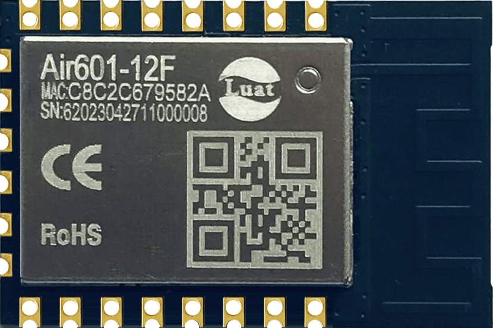
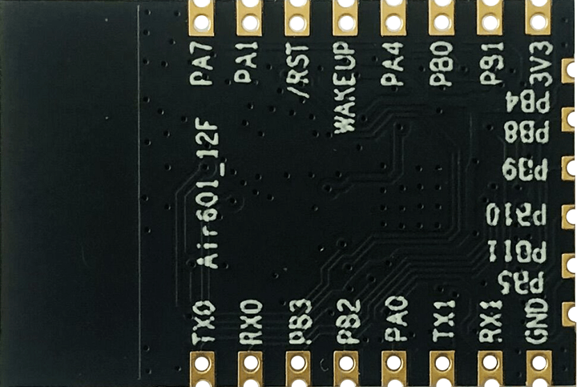

# Air601硬件资料

## 模块硬件资料

|    资料简介     |                           相关链接                           |
| :-------------: | :----------------------------------------------------------: |
|     规格书      | [Air601-12F_模块产品规格书_V1.2.pdf](https://cdn.openluat-luatcommunity.openluat.com/attachment/20230726105503590_Air601-12F_模块产品规格书_V1.2.pdf) |
|  硬件设计手册   | [Air601-12F_WIFI模块硬件设计手册_V1.0.1.pdf](https://cdn.openluat-luatcommunity.openluat.com/attachment/20230619165631229_Air601-12F_WIFI模块硬件设计手册_V1.0.1.pdf) |
| 原理图及PCB封装 | [Air601-12F-PADS.7z](https://cdn.openluat-luatcommunity.openluat.com/attachment/20230519111345019_Air601-12F-PADS.7z) |
| 开发板相关资料  | [开发板EVB_Air601-12F使用说明V1.0.0.pdf](https://cdn.openluat-luatcommunity.openluat.com/attachment/20230626161923628_开发板EVB_Air601-12F使用说明V1.0.0.pdf) [EVB-Air601-12F.zip](https://cdn.openluat-luatcommunity.openluat.com/attachment/20230524173150039_EVB-Air601-12F.zip) |

## 模块外形

|                 正面                  |                  反面                  |
| :-----------------------------------: | :------------------------------------: |
|  |  |
