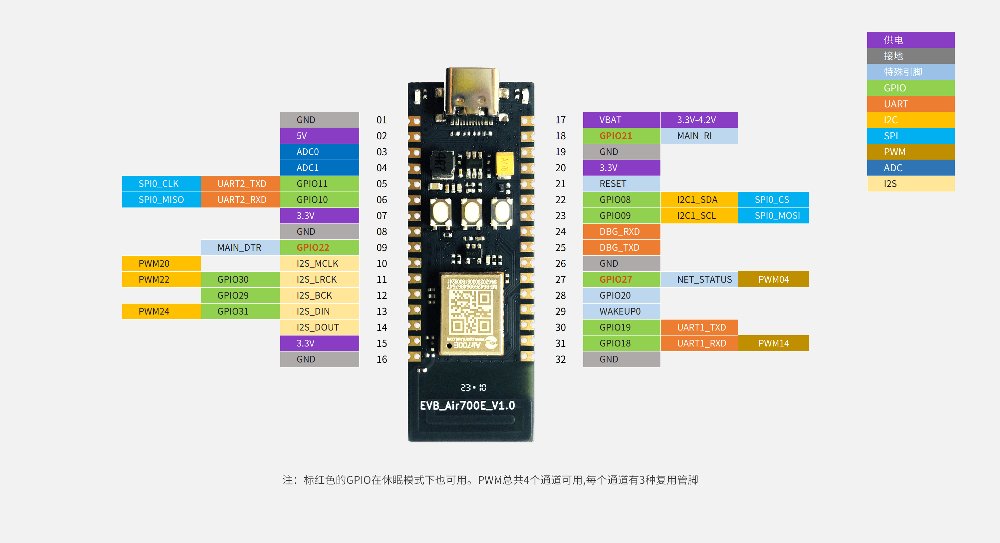

# Air700E的额外说明

## 特性说明

1. 仅支持TDD, 不支持FDD, 所以只支持中移动的网络
2. MAIN_RI与Air780E/Air780EG的GPIO是不同的, 为GPIO21
3. 开发板是不带codec的, 也不支持软DAC音频输出
4. 没有I2C0, 只有I2C1

## 关于封装和软件

1. 外部封装, Air700E是极限小封装
2. AT固件要V1120或以上, LuatOS固件要V1106或以上

## 开发板pinout

开发板上的按键分别是 BOOT(GPIO0), RESET(复位), PWR(开机键) LED灯(GPIO27)

