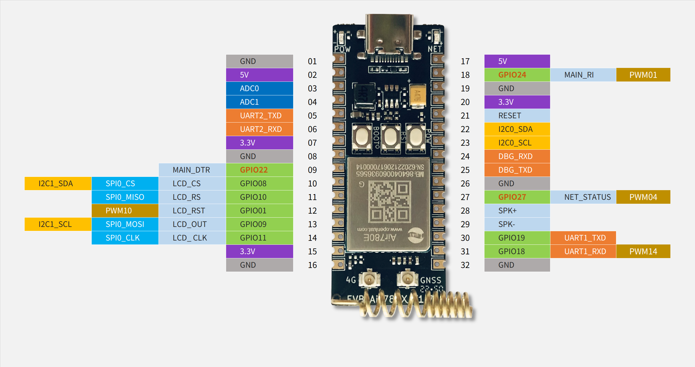

# Air780EG的额外说明

Air780EG是 Air780E + GNSS芯片6228, 所以95%的特性跟Air780E是一样的,这里挑不同的地方说.

GPS/GNSS 属于一堆事物的称呼, 下文如无特别说明,都是指"卫星定位系统"

## 内部接线

UART部分:

1. Air780EG的GPS芯片接在  `UART2/AUX_UART`, 所以这个端口是被占用的
2. 因为UART的特性, 虽然引出了UART2_RX, 但不可以外接数据线直接给GPS芯片发指令,需要走代码从780e内部发
3. 默认波特率是 115200
4. 使用的指令与Air510U是一样的, [Air510U资料网站](https://air510u.cn)

供电部分:

1. Air780EG的GPS的供电是 `GPIO13/PAD12`, 注意是 `PAD12/padaddr 12`, 非 `PAD28`
2. 芯片供电和有源天线的供电,是一起控制的, 只用了一个GPIO,一个API控制
3. 因为使用的是普通GPIO,`SLEEP1/LIGHT/SLEEP2/DEEP/HIB模式下会掉电`的
4. 在lua代码中, 控制供电API是 `pm.power(pm.GPS, true)`, 虽然有pm.GPS_ANT,但对Air780EG无效
5. 飞行模式是射频相关的控制,不影响GPIO供电,所以不影响GPS供电
6. 新款Air780EG带备电, 通过`GPIO23`控制,默认是打开

## 关于新款Air780EG的特别说明

新出货的Air780EG新增了备电, 支持热启动

如何分辨是不是新款: 看出厂时间, 2023.8.7 之后出厂的均为新款

查询方法: [合宙ERP的IMEI生产记录查询](https://erp.openluat.com/imei) , 输入imei号即可查询. 若未注册请先注册, 注册是免费的.

## 定位特性

如需详细的描述,请查阅Air780EG的硬件设计手册, 这里挑重点, 也补充了一些细节

1. 老款没有备份供电,新款有备电, 带备电的可以热启动
2. 是`只读版本`的GPS芯片, 意思是所有配置项都不能保存,星历/时间/参考坐标均不能保存
3. 在GPS信号良好的室外,有源天线的加持下, 无AGPS的首次定位时间小于30s
4. 三要素齐备(`星历`/`参考坐标`/`UTC时间`)的情况下, 若信号良好,可做到首次定位成功小于2秒
5. 输出的坐标系是WGS84, 也就是GPS坐标系, 在国内地图使用要转换成 GCJ02 或 BD09 等国内坐标系.
6. [GPS坐标纠偏网站](https://www.openluat.com/GPS-Offset.html)

## 辅助定位相关

内置的GPS芯片是掉电后数据全丢,所以辅助定位均依赖Air780EG中Cat.1芯片的能力

1. 星历, 通过http从合宙服务器下载 `http://download.openluat.com/9501-xingli/HXXT_GPS_BDS_AGNSS_DATA.dat`
2. 参考坐标, 两种方式, 基站定位库`lbsLoc` 或 `lbsLoc2`, 上次定位成功的坐标存文件系统
3. UTC时间, 中国移动/中国电信,联网后基站会下发时间(系统事件`NTP_UPDATE`), 中国联通, 走NTP. 例如lua里的API是`socket.sntp()`

## 关于星历

1. 合宙提供的星历是GPS+北斗的, 两个星座都有,大小5kb左右, 每半小时更新一次
2. GPS星历的有效时间是 `4小时`
3. 北斗星历的有效时间是 `1小时`
4. 实测标明, 北斗星历有帮助, 但主力还是GPS星历
5. 再次强调, GPS芯片本身不能保存星历,老款`掉电一样会丢`,新款关闭备电也会丢!!

## 关于GNSS的功耗

1. 状态有多种: 搜星状态(60~100ma),持续跟踪状态(40~60ma),备电状态(200~500ua),掉电状态(0)
2. GNSS功能没有低功耗指令,没有低功耗指令,没有低功耗指令
3. GNSS功能没有低功耗模式,没有低功耗模式,没有低功耗模式
4. 新款才有备电状态, 用`GPIO23`控制备电的开启或关闭, 默认是上电开启
5. 关闭GNSS功能后, 超低功耗与Air780E是一样的, 2uA

## 切换卫星系统,特别是单北斗模式

以下是演示指令, 可切换到不同的卫星系统组合,满足监管要求

```lua
-- 模式01, GPS L1+SBAS+QZSS 联合定位
-- uart.write(gps_uart_id, "$CFGSYS,H01\r\n") 
-- sys.wait(20)
-- 模式10, 单北斗 BDS B1
uart.write(gps_uart_id, "$CFGSYS,H10\r\n") 
sys.wait(20)
-- 模式11, GPS L1+BDS B1+QZSS 联合定位,默认是这种
-- uart.write(gps_uart_id, "$CFGSYS,H01\r\n") 
-- sys.wait(20)
```

## 关于封装和软件

1. 外部封装, Air780E和Air780EG是一样的, 区别在于UART2不能接其他设备
2. AT固件要V1112或以上, LuatOS固件要V1103或以上,才有Air780EG的完整支持

## 开发板pinout

默认不会自动开机, 要**长按pwrkey键2秒才会开机**

电源灯是接上电就亮的, **电源灯亮了不代表开机**, 接电脑且开机了才会有COM设备出现

请注意与Air780E开发板的差异点:

1. UART2不再有GPIO10/11的复用
2. UART2_RX 不要接外部输入
3. 要接GNSS天线, 开发板搭配的是有源GNSS天线, 板载的是4G天线, 不参与定位. 不接GNSS天线是无法定位成功的.
4. Air780EG支持无源和有源天线, 开发板默认搭配的是有源GNSS天线.

开发板排针尺寸:

1. 管脚之间的距离, 10mil, 2.54mm
2. 两排管脚之间的距离, 700mil, 17.78mm

开发板上的按键分别是 BOOT(GPIO0), RESET(复位), PWR(开机键) LED灯(GPIO27)


