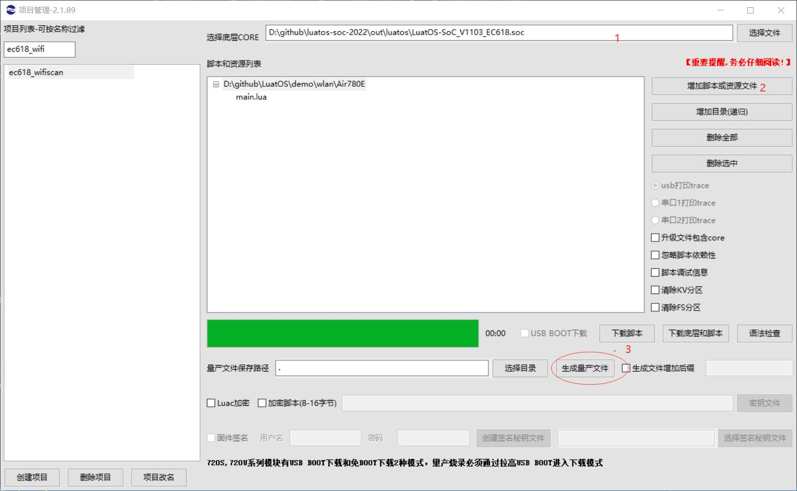

# 量产刷机的说明

本文档用于量产时批量下载LuatOS固件及脚本到目标模块, 适用于EC618全系模块, 包括但不限于

1. Air780E
2. Air600E
3. Air780EG

## 准备工作

2. LuaTools 2.1.91 或以上版本
3. 固件版本 V1103 及以上, 配合 libfota.lua
4. main.lua 内填写版本号要符合 `x.y.z` 形式, 其中 `x`/`y`/`z` 均为数值, 不限于个位数
5. 若fota使用合宙iot平台, 版本号中的 `y` 会被忽略, 推荐写0, 务必留意

## 准备量产文件

打开 LuaTools, 在项目管理界面, 添加固件和脚本后, 点击 "生成量产文件", 合成后得到 binpkg 后缀的文件.

注意, 该binpkg可使用Luatools/FlashTool/MulDownloader直接刷机, 但只推荐在`量产`时使用binpkg刷机.

**该binpkg不可用于差分包的生成!!**

