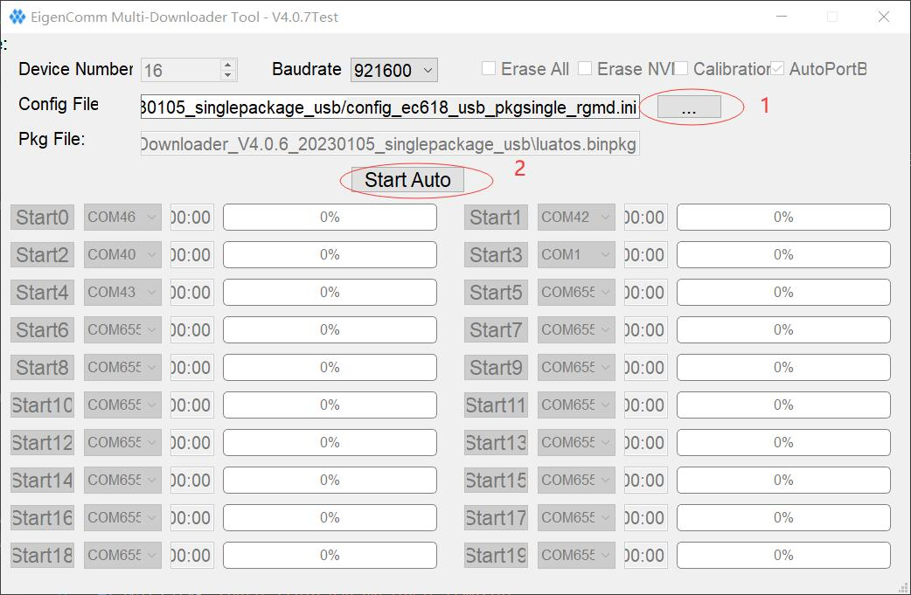

# 量产刷机的说明

本文档用于量产时批量下载LuatOS固件及脚本到目标模块, 适用于EC618全系模块, 包括但不限于
1. Air780E
2. Air600E
3. Air780EG

## 准备工作

1. 量产刷机工具单文件特别版 Multiownload_SinglePackage , [点击下载](https://gitee.com/openLuat/LuatOS/attach_files)
2. LuaTools 2.1.89 或以上版本
3. 固件版本 V1103 及以上, 配合 libfota.lua
4. main.lua 内填写版本号要符合 `x.y.z` 形式, 其中 `x`/`y`/`z` 均为数值, 不限于个位数
5. 若fota使用合宙iot平台, 版本号中的 `y` 会被忽略, 推荐写0, 务必留意

## 准备量产文件

打开 LuaTools, 在项目管理界面, 添加固件和脚本后, 点击 "生成量产文件", 合成后得到 binpkg 后缀的文件.

注意, 该binpkg若使用luatools直接刷机, 脚本区会丢失.

## 使用 Multiownload_SinglePackage 刷机

下载 Multiownload_SinglePackage 之后, 解压到 D盘 , 不要放太深, 不要有中文字符和特殊字符

1. 将 上一步 的 binpkg 覆盖到 工具目录下的 `luatos.binpkg`
2. 若存在 `pkg_extract_tmp` 目录, 删除掉, 这点非常重要
3. 双击启动 `MulDownloader.exe`
4. 配置文件选 `config_ec618_usb_pkgsingle_rgmd.ini`
5. 确定无误后, 点击 `Start Auto`
6. 操作设备/板子, 使其进入BOOT模式, 工具会自动开始刷机
7. 刷机完成后, 拔出设备/板子即可. 设备刷机后是不会自动复位重启的.

