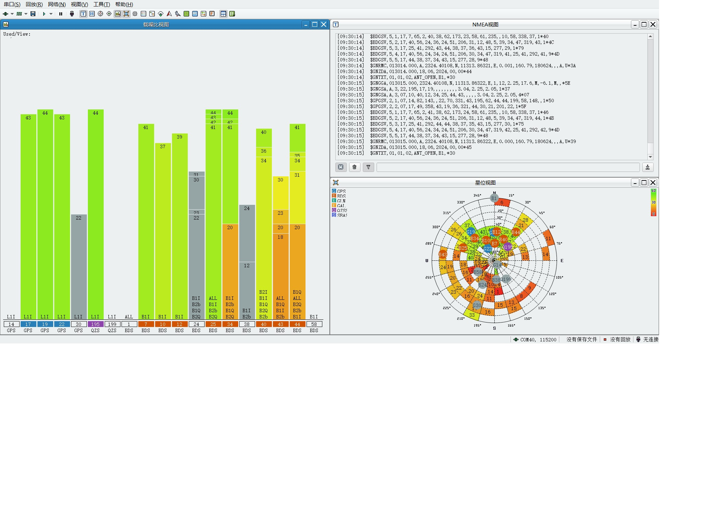

# Air780EPVH的额外说明

Air780EPVH是Air780EPV的变体，在Air780EPV的基础上增加了gnss/gps和codec

1. 支持GNSS/GPS,即卫星导航功能
2. 内置的音频codec 8311, 支持MIC/SPK输入输出

## GNSS/GPS功能介绍

1. 使用的GNSS芯片为HD8128
2. 供电控制是GPIO17, 备电供电脚是GPIO23
3. 需要打开26M输出
4. GNSS芯片接在UART2上, 截止到2024.5.25, 默认波特率是9600, 后续可能会改正为115200

csdk打开26M输出的方法

```c
luat_mcu_xtal_ref_output(1, 0);
```

luatos打开26M输出的方法, 需要2024.5.25之后编译的固件

```lua
mcu.XTALRefOutput(true, false)
```

切换波特率到115200的GPS指令, 通过UART发送给GNSS芯片

```
$PCAS01,5*19\r\n
```

## 支持的导航星座

* GPS L1I
* QZSS L1I
* 北斗 B1I/B1Q//B2I/B2b/B2Q

## 实测演示图



## 资料链接

1. [Air780EPVH资料](https://air780epvh.cn)
