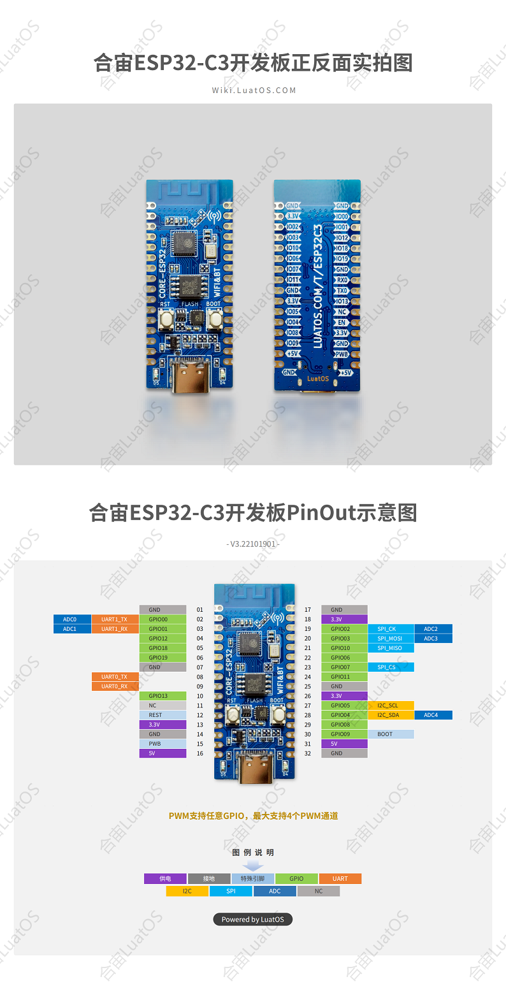

# ESP32C3-CORE开发板

## 特别注意

经典款（带TTL串口转USB的版本）一定要安装CH343的驱动才能正常下载固件，默认的CDC驱动只能打印日志，但是速率太慢会导致下载失败。[驱动传送门](http://www.wch.cn/downloads/CH343SER_EXE.html)

新款（USB直连）可以直接烧录，Win8及以上系统无需安装驱动。可以正常使用Luatools烧录，但是无法使用LuatIDE。除烧录时需要选择带`USB`字样的固件，*GPIO18/19会被占用为USB脚*, 应避免使用, 其他功能没有任何区别。

```{note}
注意，由于**win7**系统不自带`winusb`驱动，且该系统早在2020年微软就已停止支持，所以如需使用`简约版开发板`，请升级至**win8以上系统**，或前往[乐鑫原厂手册](https://docs.espressif.com/projects/esp-idf/zh_CN/latest/esp32c3/api-guides/jtag-debugging/configure-builtin-jtag.html)安装驱动
```

```{warning}
新款若需要使用GPIO18/19, 可外接USB-TTL到UART0进行刷机和查看日志,不使用板载TypeC进行刷机和日志查看.
```

## 刷机烧录教程

[串口烧录教程](https://wiki.luatos.com/boardGuide/flash.html)，**日志波特率为921600**

## 一、产品描述

CORE ESP32核心板是基于乐鑫ESP32-C3进行设计的一款核心板，尺寸仅有21mm*51mm，板边采用邮票孔设计，方便开发者在不同场景下的使用。核心板支持UART、GPIO、SPI、I2C、ADC、PWM等接口，可根据实际需要选择。

## 二、硬件资源

- 尺寸长宽 21mm*51mm
- 1路SPI FLASH，板载4MB，支持最高 16MB
- 2路UART接口，UART0~UART1,其中下载口为UART0
- 5 路 12 比特 ADC，最高采样率 100KSPS
- 1路低速SPI接口，支持主模式
- 1路IIC控制器
- 4路PWM接口,可使用任意GPIO
- GPIO外部管脚15路，可复用
- 2路贴片LED指示灯
- 1路复位按键+1路BOOT按键
- 1路USB转TTL下载调试口
- 2.4G PCB板载天线 

## 三、管脚定义



**详细管脚描述**

| **编号** | **名称** | **复位后默认功能**                      | **复用功能**    | **电源域** | **上下拉能力** |
| ------------ | -------- | --------------------------------------- | -----------| ---------- | -------------- |
| 32           | GND      | 接地                                    |            |            |                |
| 31           | 5V       | 5V电源接口，与USB的VBUS相连             |             |            |                |
| 30           | BOOT     | GPIO09,输入                             | BOOTMODE   | VDD3P3_CPU | UP/DOWN        |
| 29           | IO08     | GPIO08,输入，输出，高阻                 |             | VDD3P3_CPU | UP/DOWN        |
| 28           | IO04     | GPIO04,输入，输出，高阻                 | I2C_SDA/ADC_4| VDD3P3_RTC | UP/DOWN        |
| 27           | IO05     | GPIO05,输入，输出，高阻                 | I2C_SCL/ADC_5| VDD3P3_RTC | UP/DOWN        |
| 26           | 3.3V     | 芯片电源，3.3V                          |              |            |                |
| 25           | GND      | 接地                                    |              |            |                |
| 24           | PB_11    | GPIO11,输入，输出，高阻                 | VDD_SPI       | VDD3P3_CPU | UP/DOWN        |
| 23           | IO07     | GPIO07,输入，输出，高阻                 | SPI2_CS       | VDD3P3_CPU | UP/DOWN        |
| 22           | IO06     | GPIO06,输入，输出，高阻                 |               | VDD3P3_CPU | UP/DOWN        |
| 21           | IO10     | GPIO10,输入，输出，高阻                 | SPI2_MISO     | VDD3P3_CPU | UP/DOWN        |
| 20           | IO03     | GPIO03,输入，输出，高阻                 | SPI2_MOSI/ADC_3 | VDD3P3_RTC | UP/DOWN        |
| 19           | IO02     | GPIO02,输入，输出，高阻                 | SPI2_CK/ADC_2   | VDD3P3_CPU | UP/DOWN        |
| 18           | 3.3V     | 芯片电源，3.3V                          |                 |            |                |
| 17           | GND      | 接地                                    |                 |            |                |
| 16           | 5V       | 5V电源接口，与USB的VBUS相连             |                 |            |                |
| 15           | PWB      | 芯片3.3V供电控制,高电平有效，不用可悬空  |                 |            |                |
| 14           | GND      | 接地                                    |                 |            |                |
| 13           | 3.3V     | 芯片电源，3.3V                          |                 |            |                |
| 12           | RESET    | 芯片复位                                |                 | VDD3P3_RTC |                |
| 11           | NC       |                                         |                 |            |                |
| 10           | IO13     | GPIO13,输入，输出，高阻                 |                 | VDD3P3_CPU | UP/DOWN        |
| 09           | U0_RX    | GPIO20,输入，输出，高阻                 | UART0_RX        | VDD3P3_CPU | UP/DOWN        |
| 08           | U0_TX    | GPIO21,输入，输出，高阻                 | UART0_TX        | VDD3P3_CPU | UP/DOWN        |
| 07           | GND      | 接地                                    |                 |            |                |
| 06           | IO19     | GPIO19,输入，输出，高阻                 | USB_D+          | VDD3P3_CPU | UP/DOWN        |
| 05           | IO18     | GPIO18,输入，输出，高阻                 | USB_D-          | VDD3P3_CPU | UP/DOWN        |
| 04           | IO12     | GPIO12,输入，输出，高阻                 | SPIHD           | VDD3P3_CPU | UP/DOWN        |
| 03           | IO01     | GPIO1,输入，输出，高阻                  | UART1_RX/ADC_1  | VDD3P3_CPU | UP/DOWN        |
| 02           | IO00     | GPIO0,输入，输出，高阻                  | UART1_TX/ADC_0  | VDD3P3_CPU | UP/DOWN        |
| 01           | GND      | 接地                                    |                 |            |                |

* 任意GPIO均可作为PWM脚, 编号与GPIO一致, 但`同时只能开启4路PWM`,务必注意

## 四、功能介绍

### **1.** **供电电源**

CORE-ESP32-C3核心板支持以下3种方式供电：

- Type-C 接口供电（默认）
- 5V和GND排针供电
- 3V3 和 GND 排针供电 


 调试过程中优先推荐的供电方式：TYPE-C USB接口供电。 

### **2.** **LED控制**

合宙CORE ESP32核心板板载2颗LED，开发者可参考表4-1进行对应管脚的控制。

​         

表4-1

| **LED**编号 | **对应GPIO** | **管脚功能** | **描述**   |
| ----------- | ------------ | ------------ | ---------- |
| D4          | IO12         | GPIO12配置   | 高电平有效 |
| D5          | IO13         | GPIO13配置   | 高电平有效 |

### **3.** **按键介绍**

合宙CORE ESP32核心板板载两颗按键，其中BOOT键可实现BOOT下载功能，RST键可实现复位功能，管脚控制参考表4-2。

​           

 

表4-2 

| **按键编号** | **管脚功能**                 | **描述**   |
| ------------ | ---------------------------- | ---------- |
| BOOT/GPIO9   | 按键按下时，芯片进入下载模式 | 低电平有效 |
| RST          | 按键按下时，芯片复位         | 低电平有效 |

### **4.** **外置SPI FLASH控制**

管脚控制参考表4-3。

 


 

表4-3

| **flash管脚标号** | **对应GPIO** | **管脚功能**                  | **上下拉能力** |
| ----------------- | ------------ | ----------------------------- | -------------- |
| SPICS0            | -            | GPIO14配置，FLASH_CS，片选    | UP/DOWN        |
| SPIQ              | -            | GPIO17配置，FLASH_D1，数据脚1 | UP/DOWN        |
| SPID              | -            | GPIO16配置，FLASH_D0，数据脚0 | UP/DOWN        |
| SPICLK            | -            | GPIO15配置，FLASH_CK，时钟    | UP/DOWN        |

 注：CORE ESP32核心板搭载ESP32-C3是不带内置FLASH版本，默认贴装外置SPI FLASH，如遇到不贴装外置SPI FLASH的核心，需要注意主芯片的具体型号。 使用内置Flash的, `GPIO11/12/13` 不可用.

附表4-4

 


 

## **使用注意事项** 

1. **BOOT（IO09）管脚上电前不能下拉，ESP32会进入下载模式。**
2. **使用到IO08管脚进行设计，不建议外部直接下拉，因为在下载烧录时，IO08管脚为低电平，不能使用串口进行下载。**
3. **IO12（GPIO12）、IO13（GPIO13）在QIO模式下为SPI信号SPIHD和SPIWP复用，为了增加可用GPIO数量，开发板选择采用2线SPI的DIO模式，IO12、IO13并未连接flash，使用自己编译的软件时需要注意配置flash为DIO模式。**
4.  **外置SPI flash的VDD已链接至3.3V电源系统，使用时不需再配置其他电源，采用普通2线SPI通信方式，对应管脚如表4-3。**
5. **GPIO11默认为SPI flash的VDD引脚，需要配置后才能作为GPIO使用。**


## **相关资料链接**

[开源仓库链接](https://gitee.com/openLuat/luatos-soc-idf5)

[demo链接](https://gitee.com/openLuat/LuatOS/tree/master/demo)

