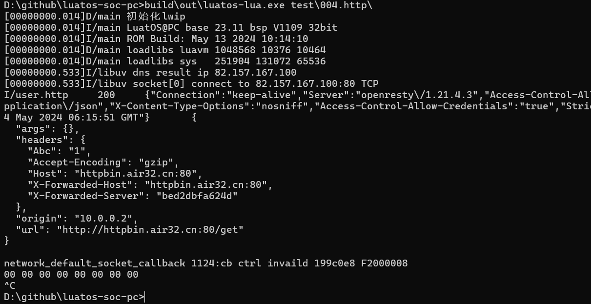
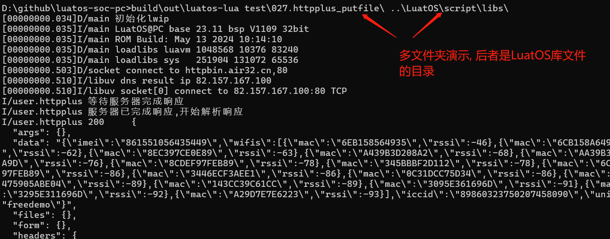

# 使用方法

## 获取方式

1. 通过[合宙网盘](https://pan.air32.cn/s/DJTr?path=%2FLuatOS%E6%A8%A1%E6%8B%9F%E5%99%A8(win32)), 选取`PC模拟器`下载
2. 自行编译, [源码地址](https://gitee.com/openLuat/luatos-soc-pc) 需搭配LuatOS主库一起编译

## 运行方式

### 交互式

这种方式是输入lua语句, 一行一行执行

* windows平台, 直接双击 `luatos-pc.exe` 即可运行
* linux平台, 直接运行 `./luatos-pc`

### 脚本运行

这种方式是执行一个lua文件, 或者一批lua文件

这种方式执行 `单个脚本`和`多目录执行` 两种方式, 需要在命令行下操作

以windows平台为例, 先进入控制台,并切换到当前目录

单脚本运行:

```cmd
chcp 65001
luatos-pc.exe main.lua
luatos-pc.exe test\001.helloworld\main.lua
```

多目录运行:

注意文件夹需要用`\`结尾,否则会当成文件

```cmd
chcp 65001
luatos-pc.exe test\001.helloworld\  ..\LuatOS\scrips\libs\
```

其中 `chcp 65001`的意思是切换控制台编码为UCS-2, 否则中文会出现乱码

运行效果如下:




