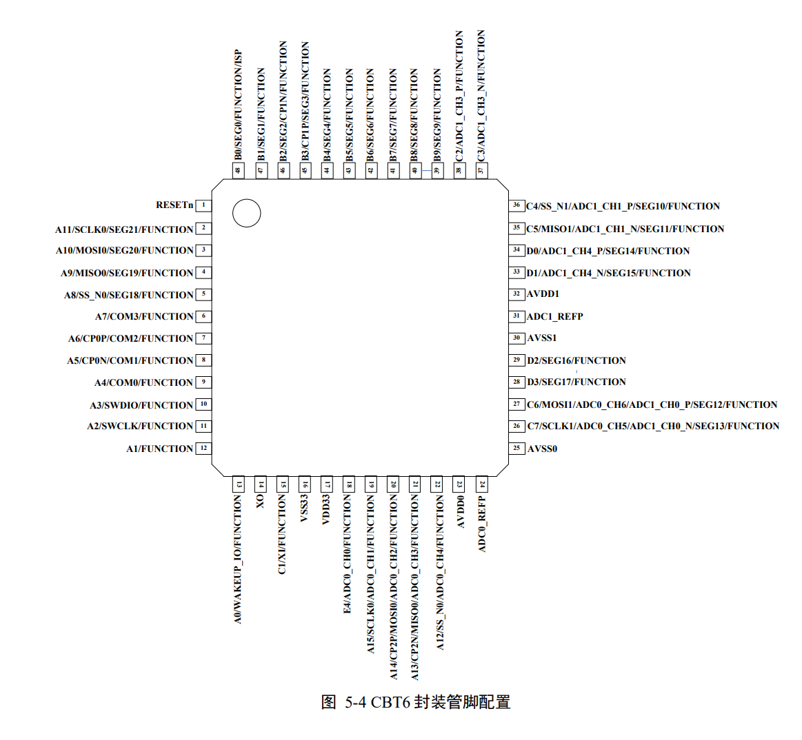

# SWM181CBT6芯片

## SWM181CBT6是什么?

SWM181CBT6采用32 位 ARM® Cortex™-M0 内核，拥有24 位系统定时器，工作频率最高 48MHz，硬件单周期乘法 ，集成嵌套向量中断控制器（NVIC），提供最多 32 个、4 级可配置优先级的中断 ，通过 SWD 接口烧录，内置 LDO，供电电压范围 2.3V（2.7V）至 3.6V 。

**SRAM 存储器** ： 16KB

**FLASH 存储器**：64KB/120KB/248KB，支持用户定制 ISP（在系统编程）更新用户程序，支持自定义 BOOT 程序。

**串行接口**，UART*4，具有独立 8 字节 FIFO，最高支持主时钟 16 分频

SPI*2，具有 8 字节独立 FIFO，支持 SPI、SSI 协议，支持 master/slave 模式

I2C*2，支持 8 位、10 位地址方式，支持 master/slave 模式

CAN*1，支持协议 2.0A(11bit 标识符)和 2.0B（29bit 标识符）

**PORTCON 控制模块**，支持 UART/I2C/COUNTER/PWM/CAN 功能引脚定义置任意 IO。

**PWM 控制模块** ，8 通道 16 位 PWM 产生器 ，可设置高电平结束或周期开始两种条件触发中断，具有普通、互补、中心对称等多种输出模式 ， 死区控制 ， 由硬件完成与 ADC 的交互。

**定时器模块** ，4 路 32 位通用定时器，可做计数器使用，1 路支持 HALL 接口。

**32 位看门狗定时器**，溢出后可配置触发中断或复位芯片。

**内置低功耗定时器模块**，使用内部 32KB 时钟，休眠计数并自唤醒 。

**DMA 模块** ，支持 SAR ADC/SIGMA-DELTA ADC/CAN 模块与 SRAM 间数据搬运 。

**除法器模块**，支持 32 位整数除法、整数求余、整数或小数开方运算 ，除法实现约 30 个时钟周期，整数开方约 16 个时钟周期，小数开方约 30 个时钟周期。

**旋转坐标计算模块**，已知角度计算 sin/cos/arctan 值，结果为 14bit，可保证 11bit 有效值。

**LCD 驱动模块**，工作电压范围：2.4V~3.6V，静态电流：＜1uA ，最大支持 4*32 段 LCD 面板 ，支持 1/4duty+1/3bias 或 1/3duty+1/2bias 可选。

**GPIO**，最多可达 56 个 GPIO，可配置 4 种 IO 模式，上拉输入，下拉输入，推挽输出，开漏输出。

**灵活的中断配置**，触发类型设置（边沿检测、电平检测） 触发电平设置（高电平、低电平、双电平）

**12 位 8 通道高精度 SAR ADC**，采样率高达 1MSPS，支持 single/scan 两种模式，独立结果寄存器，提供独立 FIFO，可由软件/PWM/TIMER 触发，支持 DMA，**16 位 6 通道高精度 SIGMA-DELTA ADC** ，采样率 16KSPS，单通道快速模式可达 50KSPS，支持 single/scan 两种模式 ，独立结果寄存器，提供独立 FIFO ，可由软件或 TIMER 触发

**3 路模拟比较器**，可以灵活选择片内、片外参考电压，比较结果可以触发中断通知 MCU 进行处理，欠压检测，支持 2.7V 欠压检测，支持欠压中断和复位选择

**时钟源**，24MHz、48MHz 精度可达 1%的片内时钟源，32KHZ 片内时钟源，片外 2～32Mhz 片外晶振，

**其他**，自定义 BOOT 程序

**低功耗**， 正常模式：30mA@48MHZ，浅睡眠：70uA，深睡眠：5uA

详细信息见数据手册，[华芯微特SWM181数据手册V2.07.pdf](https://cdn.openluat-luatcommunity.openluat.com/attachment/20220721163511464_华芯微特SWM181数据手册V2.07.pdf)

## 环境搭建教程

SDK压缩包[SWM181_Lib-211013.rar](https://cdn.openluat-luatcommunity.openluat.com/attachment/20220721163704765_SWM181_Lib-211013.rar)

[SWM81使用手册](https://wiki.luatos.com/chips/swm181/swm181.html)

## 模块购买

* [手机访问mall.m.openluat.com](https://mall.m.openluat.com)
* [淘宝店](https://luat.taobao.com)

## 芯片PinOut

