# SWM181使用手册

## 一、背景

- 背景：本文档主要解决SWM181系列芯片的KEIL开发环境搭建相关问题

- 技术定位：初级/中级/高级

- 目标群体：使用KEIL进行开发的用户

## 二、环境搭建

### 准备工作

1. 安装MDK5，具体方法请百度，安装后需要激活才能编译大文件
2. 下载安装SWM181的keil支持包[pack文件](https://cdn.openluat-luatcommunity.openluat.com/attachment/20220721163533324_Synwit.SWM32_DFP.1.20.3.pack)

### 安装支持包

双击pack包默认安装即可，安装后可在keil设备列表的Synwit目录看到SWM181的设备


### 新建工程

点击菜单栏的Project->New μVision Project

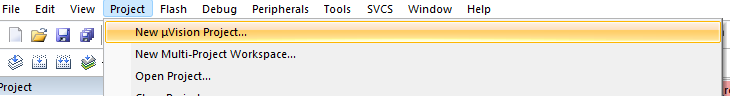

创建文件夹和工程名，路径根据自己实际选

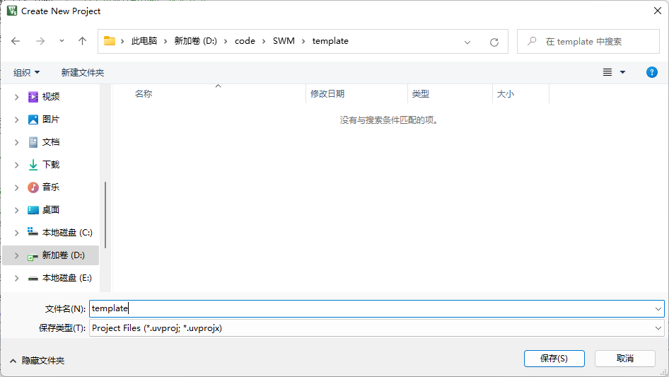

选择设备列表中的Synwit目录下的SWM181xB

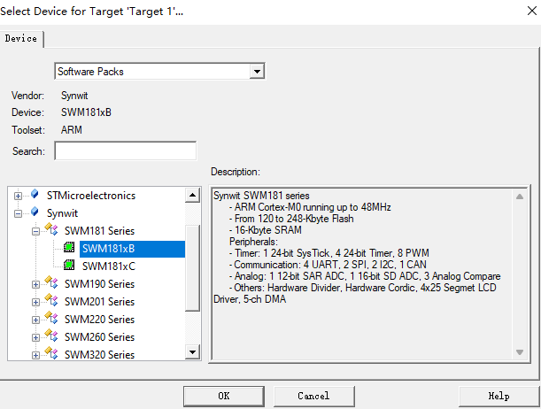

添加启动文件，勾选CMSIS下的CORE和Device下的Startup，即可自动配置启动文件

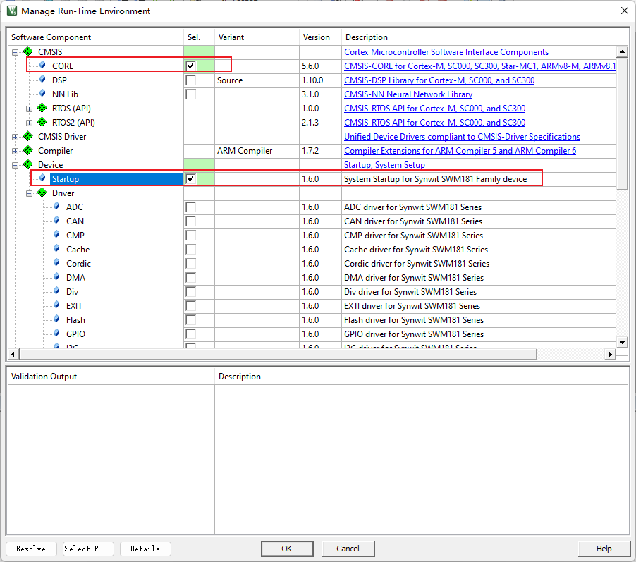

添加外设库支持，例如添加GPIO库，我们勾选GPIO和Port库，其他根据自己需要勾选即可，也可以全部勾选。

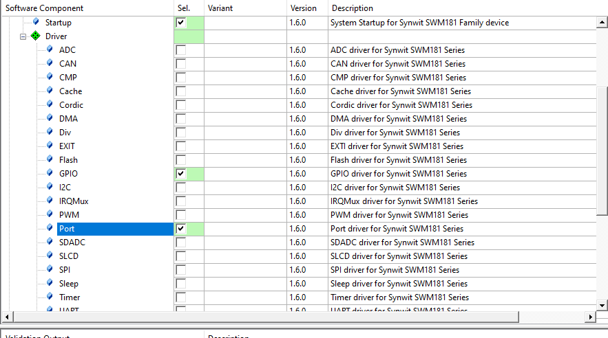

### 测试代码

添加文件，右键工程文件列表的文件夹，选择添加文件

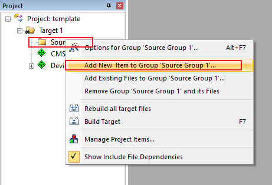

添加一个C文件，叫main.c

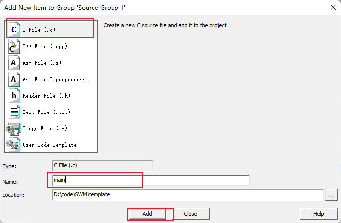

简单写个点灯的代码

```c
#include "SWM181.h"
int main(void)
{	
	SystemInit();	
	GPIO_Init(GPIOD, PIN0, 1, 0, 0, 0);			//输出，接LED	
	SysTick_Config(SystemCoreClock/4);			//每0.25秒钟触发一次中断			
	while(1==1)
	{
	}
}
void SysTick_Handler(void)
{	
	GPIO_InvBit(GPIOD, PIN0);	//反转LED亮灭状态
}
```

设置一下Waring的级别为AC5 like Warings

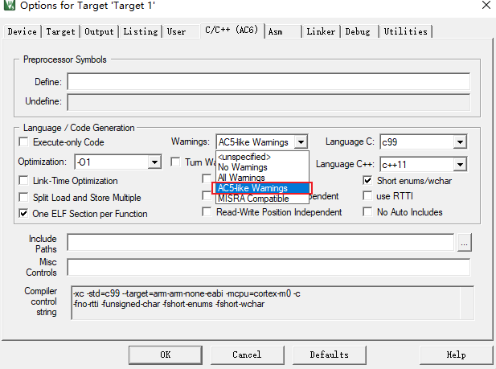

编译一下，没有问题

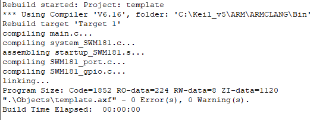

## 三、下载烧录

Air32F103开发板出厂默认为DAPLINK固件，所以可以直接作为调试器给另一个设备调试烧录。这里介绍DAPLINK的使用方法，其他调试器类似。

> 注意，由于**win7**系统不自带`winusb`驱动，且该系统早在2020年微软就已停止支持，所以如需使用DAPLINK功能，请升级至**win8以上系统**，或自行手动安装驱动：[Zadig驱动安装器](https://zadig.akeo.ie/)

AIR32F103开发板的DAPLINK固件，PB13连接被调试设备的SWDCLK，PB14连接被调试设备的SWDIO，PB0连接复位：

| 引脚 |     功能     |
| :--: | :----------: |
| PB13 |   SWD_CLK    |
| PB14 |   SWD_DIO    |
| PB0  |   RST复位    |
| PA2  | 虚拟串口的TX |
| PA3  | 虚拟串口的RX |

整体连接图如下图所示：

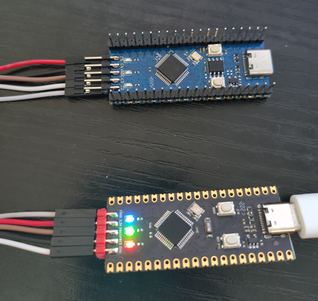

点击工程配置魔术棒，找到Debug选项卡，在下拉列表中选择CMSIS-DAP Debugger，点击Settings

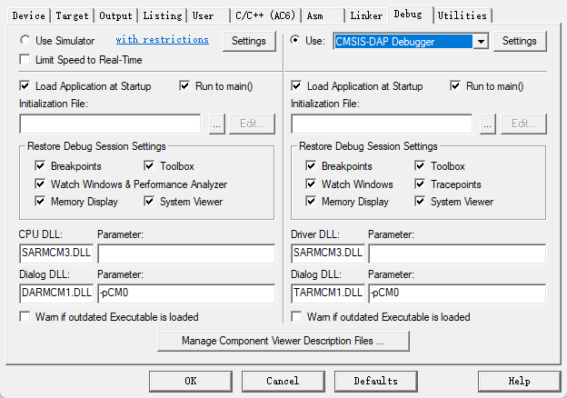

查看设备是否连接正常，连接正常可以在SW Device列表里看到设备，可以调整时钟速度提高效率

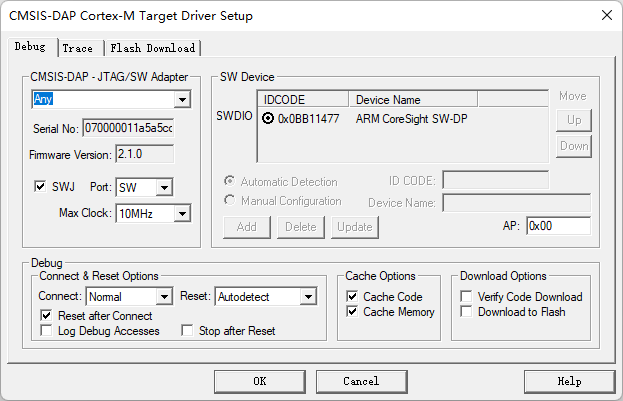

点击Flash Download选项卡，可以看到我们的支持包已经默认帮我们添加了下载算法，我们可以勾选Reset and Run选项卡，每次下载完自动复位运行代码，就不用手动按复位按钮了。

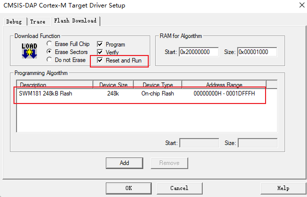

配置完成以后就可以直接点击烧录按钮下载烧录代码到设备了。

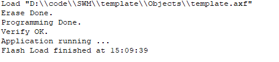

下载完成后设备自动重启，可以看到板子上的蓝灯一闪一闪的亮起来了。