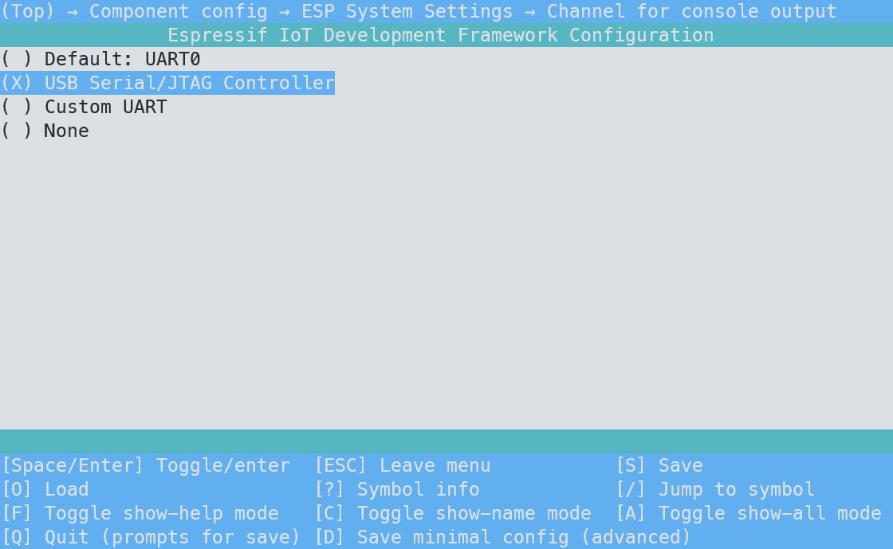

# 📡 ESP32C3

通常你不需要这份文档，这是用于自行扩展固件的高级文档。

我们提供的固件包就包含编译好的固件（soc后缀）

如果你只是想将已有的库添加到固件中，可以使用我们提供的[在线云编译](https://wiki.luatos.com/develop/compile/Cloud_compilation.html)生成自定义固件。

如果你是在找刷机/编译lua脚本之类的应用型文档，那么这份文档不是你需要查看的内容。

视频教程链接: [B站每日喝粥](https://www.bilibili.com/video/BV1D3411p7MK?p=1)

## 准备环境

安装好乐鑫官方的idf环境，目前为`ESP-IDFV4.4.1`，具体请见项目readme

### Windows平台用户

**装好[7-zip](https://www.7-zip.org/)，建议保持默认文件夹！！！**

安装IDF。对于国内用户，推荐直接安装离线包：[esp-idf-tools-setup-offline-4.4.1.exe](https://dl.espressif.com/dl/idf-installer/esp-idf-tools-setup-offline-4.4.1.exe)

详细信息请见乐鑫官方文档：[Windows 平台工具链的标准设置](https://docs.espressif.com/projects/esp-idf/zh_CN/latest/esp32/get-started/windows-setup.html)

### Linux平台用户

**装好7-zip**，各个平台装法不一样（apt/yum/pacman），自己搜吧

接着请直接参考乐鑫官方文档的步骤进行安装：[Linux 和 macOS 平台工具链的标准设置](https://docs.espressif.com/projects/esp-idf/zh_CN/latest/esp32/get-started/linux-macos-setup.html)

## 准备项目

将LuatOS主仓库clone到适当位置,推荐用git, 如果下载zip一定一定要解压后改文件夹名称!!!

如果不熟悉git, 强烈建立[入门](https://www.jianshu.com/p/db3396474b96)一下

```sh
git clone https://gitee.com/openLuat/LuatOS.git
```

再将ESP32C3项目clone到与LuatOS主仓库的同级目录

```sh
git clone https://gitee.com/dreamcmi/LuatOS-ESP32.git
```

必须按以下目录结构进行摆放, 以 `D:\gitee` 为例

```
LuatOS 主库代码 D:\gitee\LuatOS
ESP32C3 适配代码 D:\gitee\LuatOS-ESP32

检查点, 路径正确的情况下, 以下文件路径必存在, 找不到就肯定是命名问题, 手动添加是徒劳的 

D:\gitee\LuatOS\lua\src\lgc.c
D:\gitee\LuatOS-ESP32\components\luat\include\luat_conf_bsp.h
```

任何附加字符都不可用, 例如 `LuatOS-master` 就是错误的命名

## 定制固件里的库

打开`D:\gitee\LuatOS-ESP32\components\luat\include\luat_conf_bsp.h`，按需注释或取消注释。注意，如果功能太大导致固件放不下，会编译失败。

## 打开idf命令行工具

> 该步骤仅限`windows`用户需要做

## 配置项目目标芯片

在`IDF`命令行，进入`LuatOS-ESP32`仓库目录，执行命令`idf.py set-target esp32c3`

## 如果需要开启USB打印日志（新版开发板）

> 经典版开发板用户无需按此步骤操作，默认就是串口输出日志

在`IDF`命令行执行`idf.py menuconfig`命令

进入`Component config` -> `ESP System Settings` -> `Channel for console output`

勾上`USB Serial/JTAG Controller`，按S保存，再按Q退出



## 编译

在`IDF`命令行，进入`LuatOS-ESP32`仓库目录，执行`idf.py build` ,开始编译

<div id="xmake-record"></div>
<link rel="stylesheet" type="text/css" href="../../_static/css/asciinema-player.css"/>
<script src="../../_static/js/asciinema-player.min.js"></script>
<script>AsciinemaPlayer.create('../../_static/terminal/build_esp32c3.cast', document.getElementById('xmake-record'),{autoPlay:true,speed:4});</script>

当出现`Project build complete.`字样则表示编译成功

## 生成SOC烧录文件

进入`LuatOS-ESP32/tools`目录，执行下面的命令

```bash
pip install -r requirements.txt
python esp32v3.py -t esp32c3 -p
```

即可在`LuatOS-ESP32/tools`目录找到生成完毕的SOC文件
