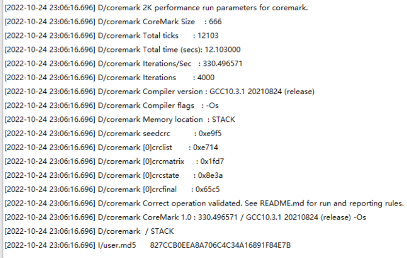
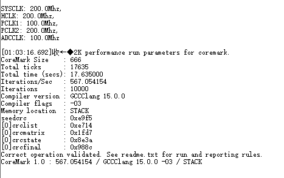

# 性能测试(基于coremark)

* 编译参数均调为 O3
* 截图/日志中的编译参数显示为固定值, 并非实际编译参数

## 数据汇总

|模块|主频|架构|得分|
|----|----|---|----|
|air103|240|xt804|606|
|air105|192|m4f|472|
|air780e|200|m3|330|

## 原始数据日志截图

### Air103

### Air105

### Air780E(基于EC618)

### Air32f103cbt6(200m主频下测试)

### Air32f103cbt6(256m主频下测试)

