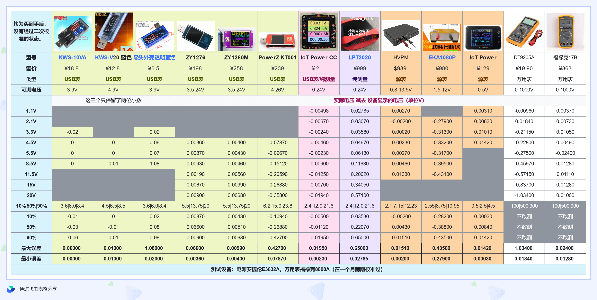
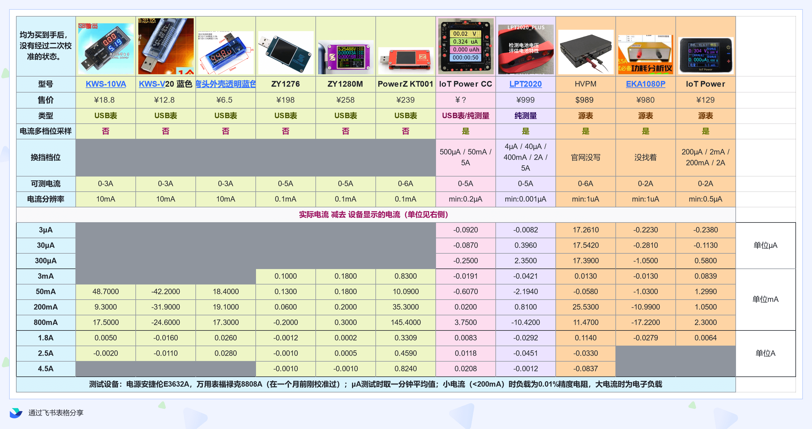
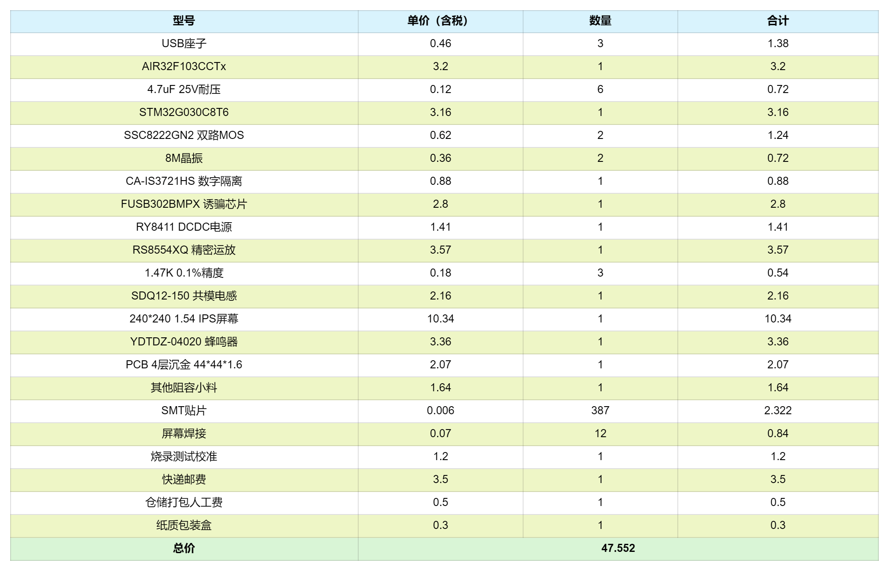

# ⚡ IoT Power - CC

IOT Power CC是一款功能齐全，稳定可靠的小型手持式高精度功率计，它可以：

- 通过USB C供电，测量低功耗设备的电压与电流
- 与其他USB表不同，测量输出端电压电流，更反映设备实际功耗
- 连接**PD快充**充电器（支持PPS），诱骗指定的电压与电流输出
- 电压最大24V，电流最大5A
- 电流**多通道同步采样**，无换挡延迟，最高分辨率0.15μA
- 精度高，误差小，详情可查阅[技术指标](https://wiki.luatos.com/iotpower/cc/tech.html)，欢迎验证
- 高达**10KHz采样速率**，满足蜂窝模组、蓝牙、WIFI等的功耗测试需求
- 可**连接PC客户端**查看与分析电流波形，也可使用命令行版本在任意设备(win/linux/mac)上抓取串口数据（如树莓派），使用pc客户端导入查看
- **BOM成本公开**（往下面拉就有），良心诚意之作，诚招有更优惠价格的供应商供货
- 外壳资料开放，[开源外壳地址](https://cdn.openluat-luatcommunity.openluat.com/attachment/20230515082541036_%E5%A4%96%E5%A3%B3%E8%B5%84%E6%96%99%E6%9B%B4%E6%96%B0.zip)

IOT Power CC是广大用户随身携带的理想测试工具。

::::{grid} 1 2 2 3
:gutter: 1 1 1 2

:::{grid-item-card} {octicon}`repo-forked;1.5em;sd-mr-1` 连接与组装
:link: parts
:link-type: doc
:img-top: img/font_small.jpg

展示CC与被测试设备的连接方式、外壳拼装说明

+++
[了解更多 »](parts)
:::

:::{grid-item-card} {octicon}`stopwatch;1.5em;sd-mr-1` 操作说明
:link: usage
:link-type: doc
:img-top: img/usage_small.png

详细描述设备各个功能的用法

+++
[了解更多 »](usage)
:::

:::{grid-item-card} {octicon}`law;1.5em;sd-mr-1` 技术指标
:link: tech
:link-type: doc
:img-top: img/comp.png

列举设备的各项参数与性能指标

+++
[了解更多 »](tech)
:::

::::

---

## 精度对比





## BOM成本公开

```{note}
此处价格均为批量含税价，如有更低的供货价格，提供品质一致的产品，请联系我们！
```



```{rubric} 更多资料
```

请选择左侧的具体页面查看各项资料。

```{toctree}
tech
parts
usage
question
```
