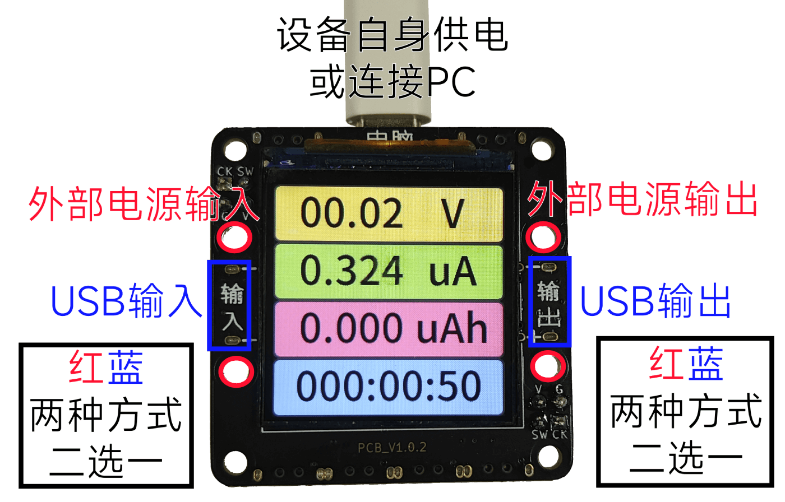
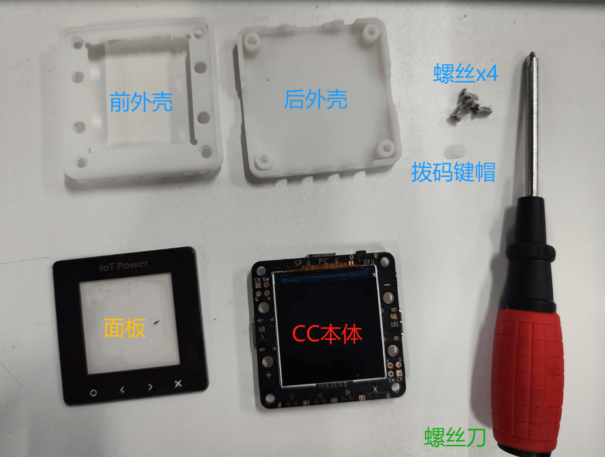
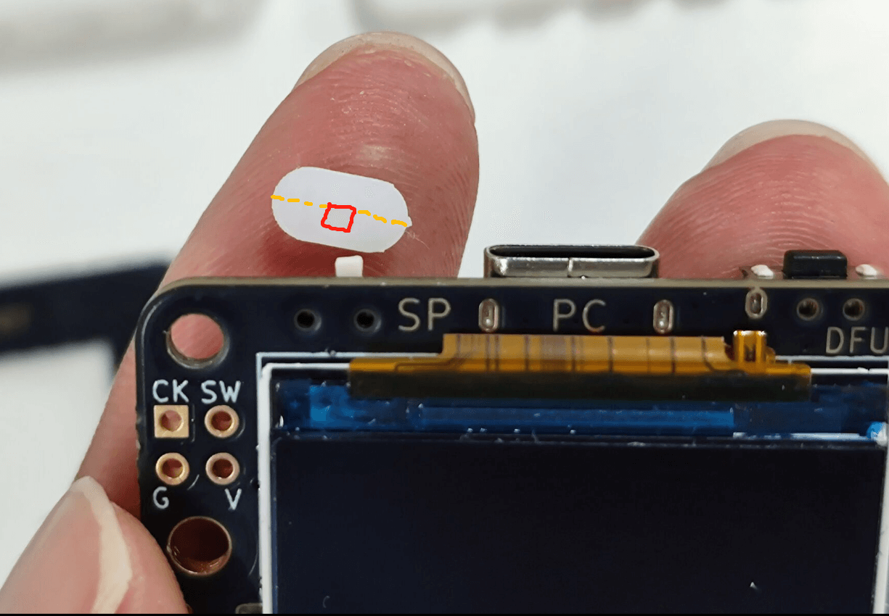
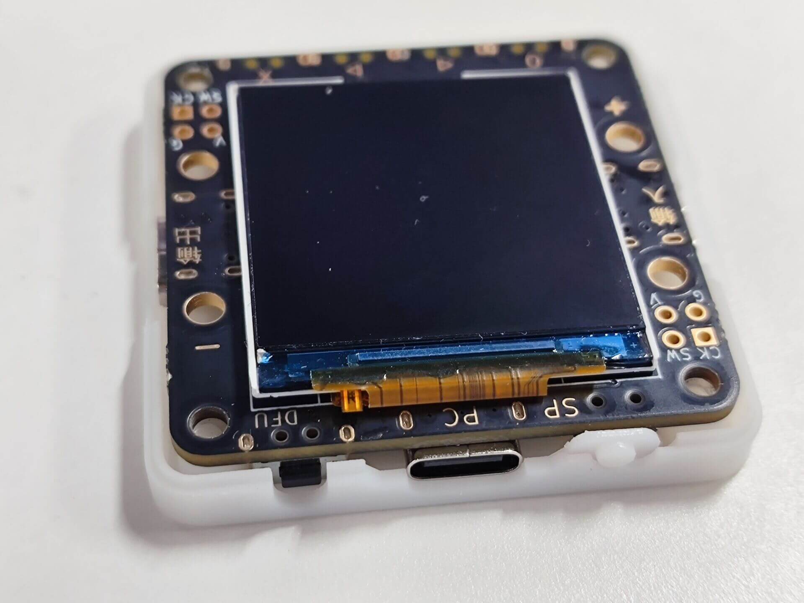
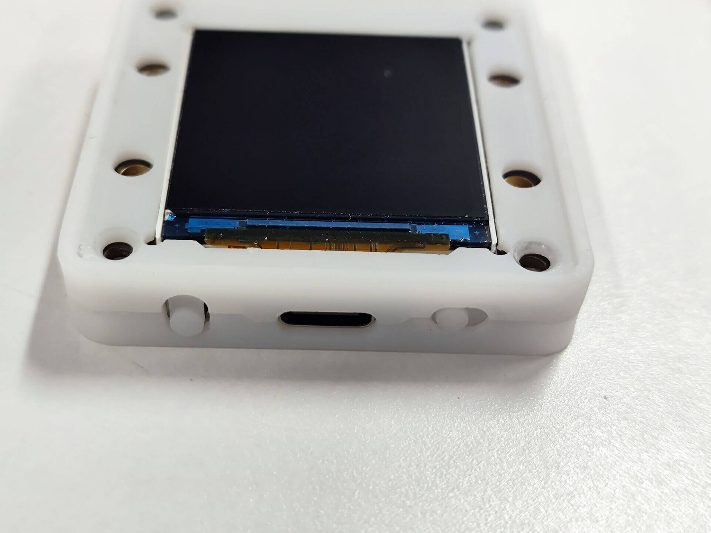
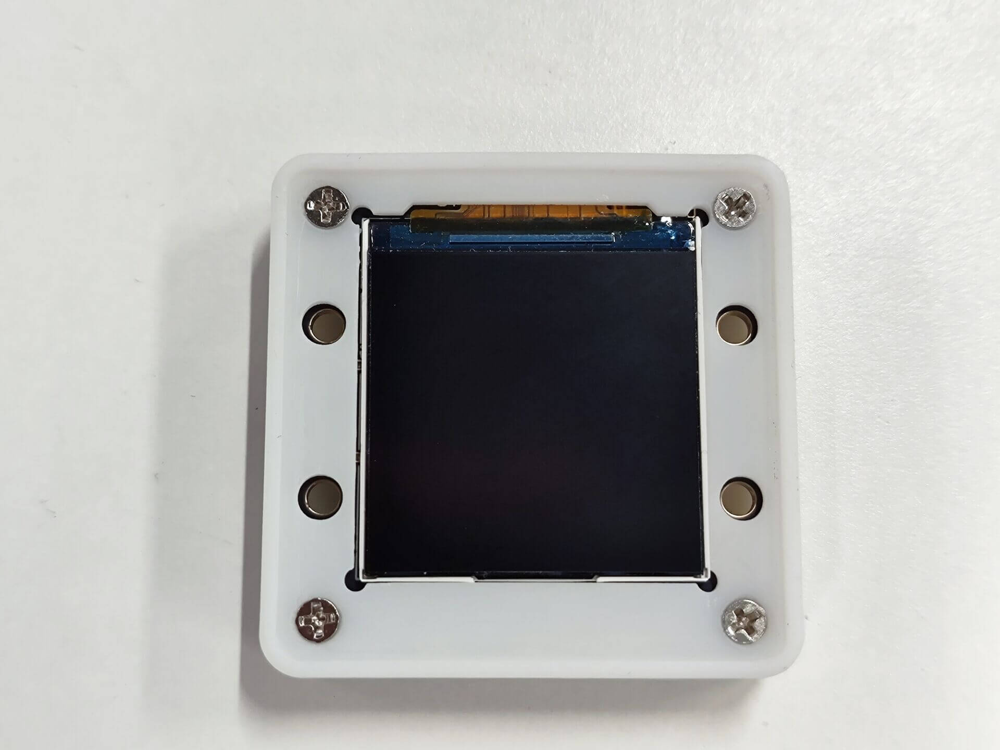
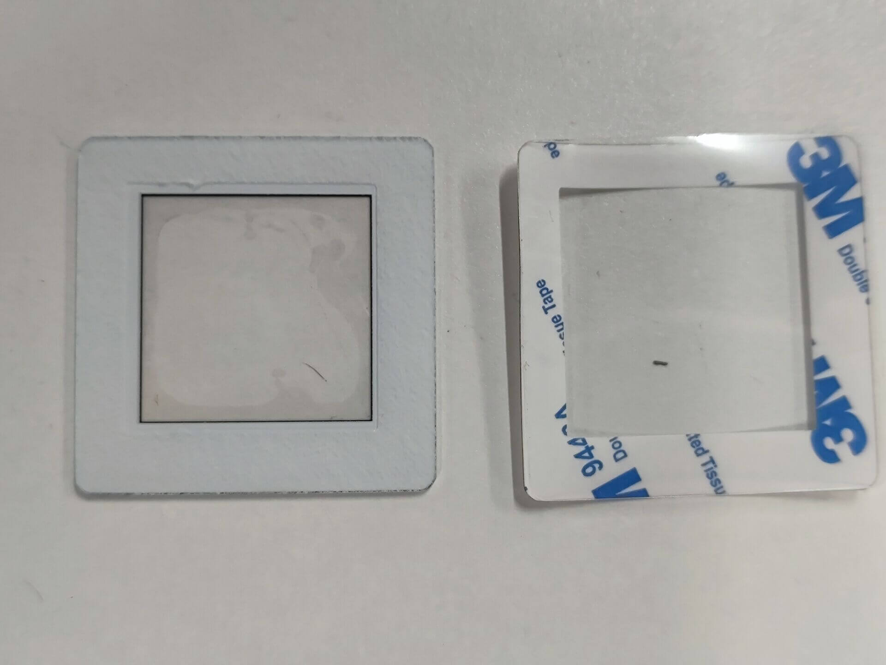
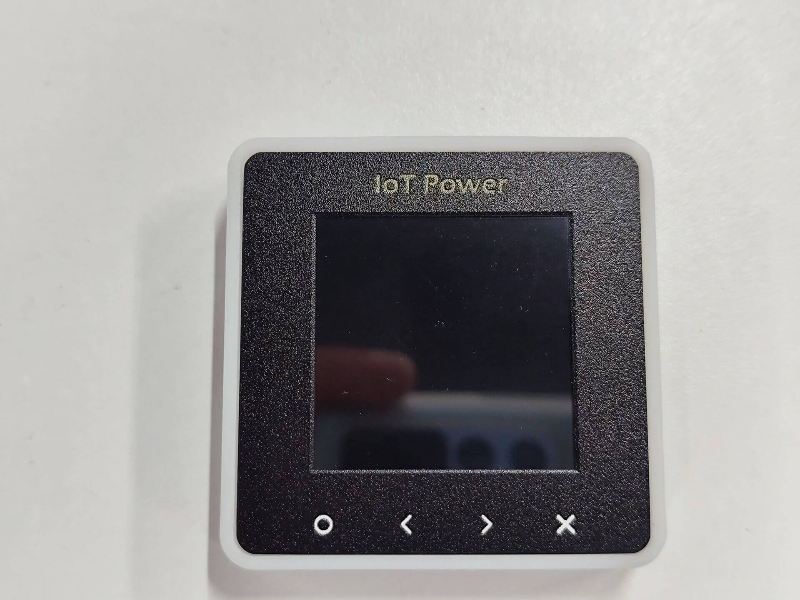
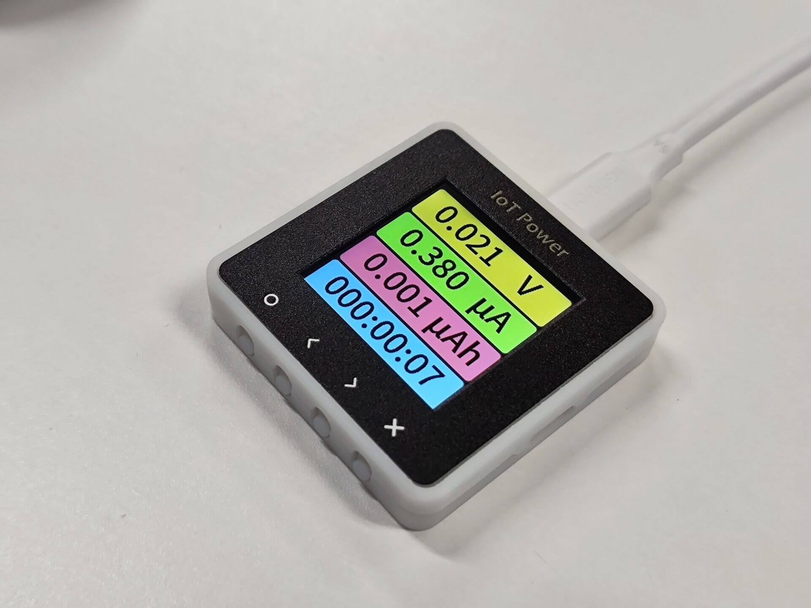

# 连接与组装

## 布局与功能

设备基本外观如下


|序号|功能|按键序号|按键功能|
|:-:|:-:|:-:|:-:|
|**①**|设备自身供电/PC客户端通讯|**⑧**|确定键 `O`|
|**②**|USB TYPE-C 供电输入|**⑨**|左移键 `<`|
|**③**|USB TYPE-C 供电输出|**⑩**|右移键 `>`|
|**④**|外部供电 正极+ （与②对应）|**⑾**|取消键 `X`|
|**⑤**|外部供电 负极- （与②对应）|**⑿**|翻页键/强制进入升级模式|
|**小拨码**|切换CC的供电来源（[用法见此](https://wiki.luatos.com/iotpower/cc/parts.html#id3)）||
|**⑥**|对外输出 正极+ （与③对应）||
|**⑦**|对外输出 负极- （与③对应）||

:::{dropdown} 使需使用香蕉座，可以参考这里
板子上的④⑤⑥⑦为香蕉座插孔，如有需要可以：

1. 购买香蕉座自行焊接，比如[这一家店卖的](https://item.taobao.com/item.htm?id=680807959486)`￠2*￠4*8+￠3*1.6（20个）`就可以匹配上这些孔
2. 将座子焊接上即可
:::

```{warning}
⚠风险提示：部分品牌快充充电头（如华为、小米等私有协议快充头）可能会误识别快充协议，导致向设备提供超过5.8V的高电压导致瞬间烧毁设备。  
建议尽量不要使用快充充电头连接设备的①设备自身供电口
```

## 供电方式

IOT Power CC支持两种方式取电

- 当设备左上角拨码拨向→右边时，需要通过①向设备自身供电，此时精度最佳，压降也最小
- 当设备左上角拨码拨向←左边时，设备将从②或④⑤供电口取电，此时会导致③或⑥⑦输出电压产生压降，但使用更为便捷

```{warning}
当拨码拨向←左边时，若充电头为USB C口，则需要提前在设置页将`开机自动启用PD`选项打开，不然无法取电开机
```

```{warning}
如果你输出端连接的是支持快充的手机/充电宝/电脑，请不要开启`开机自动启用PD`，不然两设备一起诱骗会导致干扰
```

```{note}
由于IOT Power CC测量的电压为输出端电压（③或⑥⑦）  
所以虽然输出端相比输入端会有一定压降，但被测设备的实际电源电压依旧是真实值，测试结果不会失真
```

## 连接方式

IOT Power CC支持两种连接方式：四线模式与双线模式

### 四线模式

该方式可以在测量电流的同时，测量电源输出端的电压。连接图如下：



用户可自由决定输入端与输出端的连接方式，输入端支持PD充电头

### 双线模式

该方式可以直接将设备串联进入已有电路的回路，该模式缺点为**必须**通过①对设备进行供电，且无法测量电压（此时电压显示值无参考性）。连接图如下：


你也可以使用两根`USB C口转鳄鱼夹`的线缆，均使用红色正极夹子，按上图的电流方向进行测量。

## 外壳拼装步骤

### 到手零件一览



### 组装外壳

首先装上键帽，注意，键帽的洞上下间距不对称，需要将孔偏下放置，如图



接着将板子放置在外壳底板上，卡住键帽不要掉下去，然后撕去屏幕上的贴膜



将上半部分外壳放上去，注意键帽要对齐



```{warning}
⚠重要提醒：一定要记得撕掉屏幕上的膜！
```

拧上四个螺丝，固定好，不需要拧太紧以免滑丝



### 安装面板

撕去面板底部的保护膜与3M胶贴纸



将面板贴到外壳屏幕一侧，建议尽量**抵住下面那一边**贴，不然屏幕容易被遮住



### 外壳拼装完成



---

可以继续查看下一页的`操作说明`
