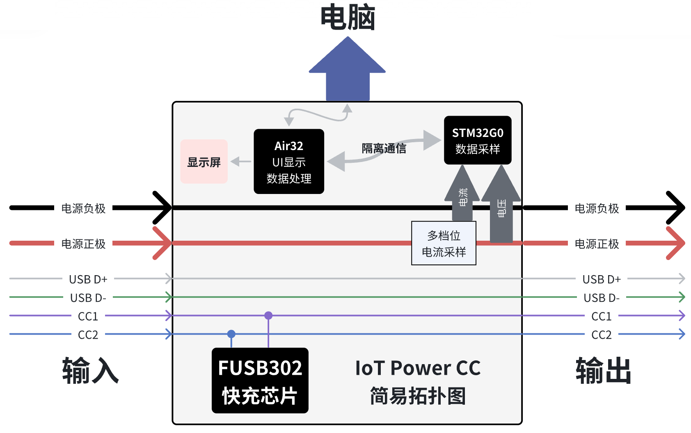

# 连接与组装

## 布局与功能

设备基本外观如下


|     序号     |                                        功能                                        | 底部按键 |  按键功能  |     |     |
| :----------: | :--------------------------------------------------------------------------------: | :------: | :--------: | --- | --- |
|   **PC口**   |                             设备自身供电/PC客户端通讯                              | **O键**  | 确定键 `O` |     |     |
| **电源输入** |                                USB TYPE-C 供电输入                                 | **<键**  | 左移键 `<` |     |     |
| **电源输出** |                                USB TYPE-C 供电输出                                 | **>键**  | 右移键 `>` |     |     |
|  **翻页键**  |                              翻页键/强制进入升级模式                               | **X键**  | 取消键 `X` |     |     |
|  **小拨码**  | 切换CC的供电来源（[用法见此](https://wiki.luatos.com/iotpower/cc/parts.html#id3)） |          |            |     |     |

:::{dropdown} 使需使用香蕉座，可以参考这里
板子上的④⑤⑥⑦为香蕉座插孔，如有需要可以：

1. 购买香蕉座自行焊接，比如[这一家店卖的](https://item.taobao.com/item.htm?id=680807959486)`￠2*￠4*8+￠3*1.6（20个）`就可以匹配上这些孔
2. 将座子焊接上即可
:::

```{warning}
⚠风险提示：部分品牌快充充电头（如华为、小米等私有协议快充头）可能会误识别快充协议，导致向设备提供超过5.8V的高电压导致瞬间烧毁设备。  
建议尽量不要使用此类充电头连接设备的**PC口**  
**PC口**，严禁反接或电压大于6V，反接或大于6V必烧！
```

## 内部连接拓扑图

下图展示了CC内部电气连接的部分信息，方便用户进行理解



## 供电方式

IoT Power CC支持两种方式取电

- 当设备左上角拨码拨向→右边时，需要通过**PC口**向设备自身供电，此时精度最佳，压降也最小
- 当设备左上角拨码拨向←左边时，设备将从**电源输入**口取电，此时会导致**电源输出**口输出电压产生压降，但使用更为便捷

```{warning}
当拨码拨向←左边时，若充电头为USB C口，则需要提前在设置页将`开机自动启用PD`选项打开，不然无法取电开机  
如果你输出端连接的是支持快充的手机/充电宝/电脑，请不要开启`开机自动启用PD`，不然两设备一起诱骗会导致干扰  
如果还是不理解，可以看[视频教程](https://www.bilibili.com/video/BV19X4y127k2/)
```

```{note}
由于IoT Power CC测量的电压为输出端电压（**电源输出**口）  
所以虽然输出端相比输入端会有一定压降，但被测设备的实际电源电压依旧是真实值，测试结果不会失真
```

## 连接方式

IoT Power CC支持两种连接方式：四线模式与双线模式

```{warning}
⚠风险提示：测量口的正负极严禁反接，反接设备必烧！  
如需使用超过20V的电压，需要先将供电设备设置为小于10V的低电压，连接到输入端，再调节供电设备到指定电压，否则有概率因为浪涌击穿PD诱骗芯片。
```

### 四线模式

该方式可以在测量电流的同时，测量电源输出端的电压。连接图如下：


用户可自由决定输入端与输出端的连接方式，输入端支持PD充电头

### 双线模式

该方式可以直接将设备串联进入已有电路的回路，该模式缺点为必须通过**PC口**对设备进行供电，且无法测量电压（此时电压显示值无参考性）。连接图如下：


你也可以使用两根`USB C口转鳄鱼夹`的线缆，均使用红色正极夹子，按上图的电流方向进行测量。

## 外壳拼装步骤

### 到手零件一览


### 组装外壳

首先装上键帽，注意，键帽的洞上下间距不对称，需要将孔偏下放置，如图


接着将板子放置在外壳底板上，卡住键帽不要掉下去，然后撕去屏幕上的贴膜


将上半部分外壳放上去，注意键帽要对齐


```{warning}
⚠重要提醒：一定要记得撕掉屏幕上的膜！
```

拧上四个螺丝，固定好，不需要拧太紧以免滑丝


### 安装面板

撕去面板底部的保护膜与3M胶贴纸


将面板贴到外壳屏幕一侧，建议尽量**抵住下面那一边**贴，不然屏幕容易被遮住


### 外壳拼装完成


---

可以继续查看下一页的`操作说明`
