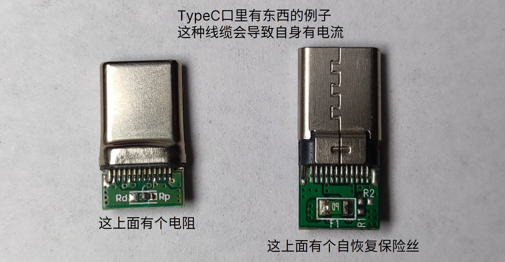

# 常见问题

## 为什么我插上usb不亮？

请仔细阅读[供电方式](https://wiki.luatos.com/iotpower/cc/parts.html#id3)章节

## 为什么我无法升级固件

1. 如果你是win7，请先安装客户端下载页面提供的驱动，并且需要手动安装驱动（包括升级模式的驱动）
2. 你需要先打开客户端，点击第一页的`连接`按钮连上设备
3. 如果无法识别设备，请检查设备管理器是否有设备，如果没有，请换根线

## 为什么我的充电头无法识别PD/PPS？明明手机可以快充

即使能使用手机触发快充，也不能证明支持PD，具体信息请见[操作说明](usage.md)--`有关PD功能的注意事项`章节

## 能触发手机的快充吗，我不想使用自带的诱骗功能

可以，如需测试，请**关闭设备自身的pd诱骗功能（重启新上电后生效）**，不然会干扰。另外某些手机充电头区分正反面，请自行排列组合测试方向

```{note}
部分设备快充协议为非标，使用输入口供电时可能无法触发快充。此时需要使用PC端供电测试，使设备自身的供电与快充相隔离
```

## 为什么我输出端连上手机/充电宝/电脑后，电压会一会儿开一会儿关

如果你输出端连接的是支持快充的手机/充电宝/电脑，请**不要开启**`开机自动启用PD`（重启新上电后生效），不然两设备一起诱骗会导致干扰

## 为什么我从输入口供电，CC会一直重启？

同上

## 为什么我的充电头支持20V，但是设备上不能

设备默认会进入PPS模式，某些充电器的PPS支持范围小于PD固定档位范围。可以前往设置关闭PPS功能，只使用固定档位功能

## 为什么电脑不能设置PD数值，设备上显示支持PD固定档位

PC只支持设置PPS数值，请确认你的充电器支持

## 支持非标PPS吗（MIPPS等）

不支持，只支持标准PPS/PD。如若发现无法触发标准PPS的bug，请抓取PD协议包，反馈给群主修复

```{note}
此设备为低功耗测试仪，并非USB快充检测表，不会添加协议检测相关功能
```

## 为什么输出端连上TypeC线后，就会有几μA的电流

某些线缆中会有电阻或芯片，他们会导致有小电流出现。

```{note}
合宙官方售卖的`TypeC转鳄鱼夹`线中没有这个现象，可以放心使用  
但是合宙售卖的`十元十根`线材中，TypeC转TypeC线，黑色那端内部有电阻，并且四线芯（无CC线），无法触发PD快充
```

这些线缆的连接头如下图：



## 为什么输出端连上TypeC线后，电压直接变成了5V

你的线头里可能带CC下拉电阻（参考上图），或者被测设备下拉了CC引脚

## 为什么什么都没连，电压和电流不为0

小知识：1A = 1 000 000μA

## 我使用**Iot Power V1/V2**供电，串接了**Iot Power CC**

### 为什么电流示数不一致？

测试时两个设备不可共地，请分别使用不同的电源供电，不然power测的电流是负载电流cc采样分流电流

### 我已经分开供电没有共地了，为什么电流示数还是不一致？

如果使用了四线模式，CC采样电阻会消耗部分电流。如需电流示数完全一致，请使用双线模式

## 我的设备启动不了了，可以重刷固件吗？

请参考[操作说明](usage.md)--`手动进入升级模式`章节，强制刷机
