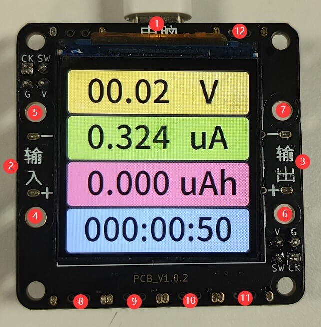
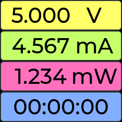
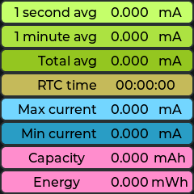
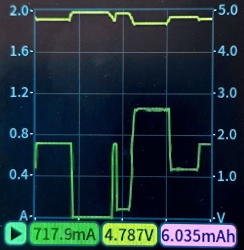
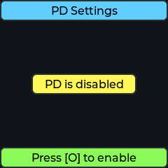
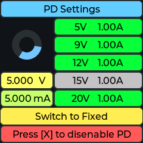
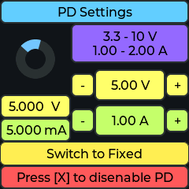
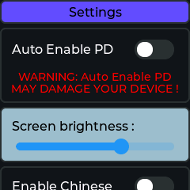

# Operating Instructions

This section will explain the specific meaning of each part of the device and the operation of the keys

The device supports bilingual switch between English and Chinese

## Product appearance and button function

The basic appearance of the device is as follows



|Serial Number|Function|Key Serial Number|Key Function|
|:-:|:-:|:-:|:-:|
|**①**|Device own power supply/PC client communication|**⑧**|OK key `O`|
|**②**|USB TYPE-C power input|**⑨**|Left shift key `<`|
|**③**|USB TYPE-C Power Out|**⑩**|Right Shift Key `>`|
|**④**|External Power Supply Positive+ (corresponds to ②)|**11**|Cancel key `X`|
|**⑤**|external power supply negative- (corresponds to ②)|**(12)**|page-turn key/forcing into upgrade mode/Zero Calibration|
|**Small Dial**|Switch the power supply source of CC||
|**⑥**|External Output Positive+ (corresponds to ③)||
|**⑦**|External output Negative- (corresponds to ③)||

```{warning}
⚠Risk Note: Some brands of fast charging heads (such as Huawei, Xiaomi and other private protocol fast charging heads) may misidentify the fast charging protocol, resulting in providing a high voltage of more than 5.8V to the device resulting in instantaneous device burnout.  
It is recommended not to use the fast charging head to connect to the device's ① device's own power supply port
```

## Data overview page



The values displayed on this page, from top to bottom, are

- Voltage transient value
- Current instantaneous value
- Current power consumption or current power
- Device statistics time

- Press the `O` key to rotate the screen
- Press the `<` key to toggle the display of `Wh`, `Ah` and `W`.
- Press the `>` key to toggle the display style.
- Press the `X` key to clear the totalized data (time, power, etc.) and recalculate from the beginning
- Long press **(12)** for 5 seconds to zero calibration

## Detailed data page



This page shows the average current, peak and valley current with more detailed power statistics (amp-hours and watt-hours)

- Press the `X` key to clear all the data and recalculate from the beginning
- Long press **(12)** for 5 seconds to zero calibration

## Waveform preview page



This page provides an easy preview of the current waveform data

- Press the `O` key to restart or pause the current waveform refresh
- Press the `<` key to toggle the display of `Wh`, `Ah` and `W`
- Press the `<` key to toggle the y axis range of current, fixed or auto
- Press the `X` key to clear current waveform data

## PD voltage and current switching page



This page can set the target voltage and current value of PD decoy

- Press the `O` key to turn on the PD function, please follow the pop-up description to continue the operation




When entering the PD/PPS page, you can switch the voltage and current gears

- Press `O` key to perform the operation of the currently selected item
- Press the `<` and `>` keys to switch the buttons of the value to be selected in order
- Press the `X` key to turn off the PD decoy function

### Notes about PD function

1. Only PD, PPS fast charging protocols are supported for decoy, other fast charging protocols are not supported
2. PD uses CC pins for communication, the standard connection line is `USB-C port` - `USB-C port`, the general A-port line is not available
3. even if you can use the phone to trigger fast charging, it does not prove support for PD
4. Most of the charging heads included with the phone manufacturers, support for non-standard PD, not necessarily good, it is recommended to buy a third-party head
5. part of the `USB-C port`-`USB-C port` cable, there are only four cores, this can not be used. Must be used with CC pins of six cores of the line
6. After triggering PD and changing the voltage, the voltage may jump to 5V, so it is recommended to disconnect the output before changing the voltage
7. When the `Enable PPS function` option is turned on in the setting page, it will automatically enter PPS mode on charging heads that support PPS function. As some charging heads have different PD and PPS support range, if you want to use pure PD fixed gear mode, please go to the setting to turn off this function.

## Setup Page



This page allows you to set various parameters in the device

- Press the `O` key to turn on the function or adjust the value to the left
- Press the `<` and `>` keys to toggle items up or down
- Press the `X` key to turn off the function or adjust the value to the right

## Manually enter the upgrade mode

If the user makes a mistake on the way to upgrade the device, resulting in the device not working properly, you can manually enter the upgrade mode (DFU) to upgrade manually

You can first disconnect the device's power connection, press and hold the `(12) page button/forced to enter upgrade mode`, and then plug in the USB power supply, then you can see the information of DFU mode displayed on the **device screen**, you can also find the device named `IotPower DFU` in the `Universal Serial Bus Device` of the `Device Manager` of the computer

Finally, open the client - `Device and Software Settings` - `Forced Firmware Upgrade` and perform the upgrade operation
