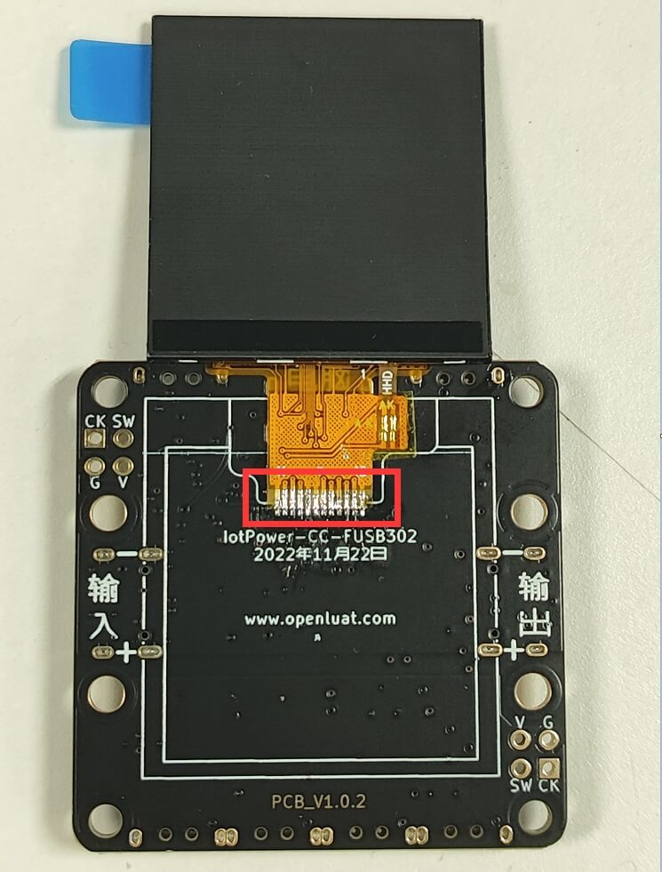
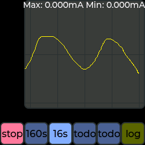

# 操作说明

该部分内容将讲解设备各部分功能的具体含义与按键操作方式

设备支持中英文双语切换，下方截图只提供了英文界面截图，不影响实际理解

## 产品外观与按键功能

设备基本外观如下

|序号|功能|按键序号|按键功能|
|:-:|:-:|:-:|:-:|
|**①**|设备自身供电/PC客户端通讯|**⑧**|确定键 `O`|
|**②**|USB TYPE-C 供电输入|**⑨**|左移键 `<`|
|**③**|USB TYPE-C 供电输出|**⑩**|右移键 `>`|
|**④**|外部供电 正极+ （与②对应）|**⑾**|取消键 `X`|
|**⑤**|外部供电 负极- （与②对应）|**⑿**|翻页键/强制进入升级模式|
|**⑥**|对外输出 正极+ （与③对应）||
|**⑦**|对外输出 负极- （与③对应）||

:::{dropdown} 不带屏幕版本的用户可以参考这里
如果您购买的是不带屏幕的版本，可以按此处自行焊接屏幕

> 当然不需要屏幕也能用，连PC客户端用就好，不需要再看这里的使用说明了

1. 购买兼容该产品的屏幕，这里推荐购买[中景园1.54寸240*240高清ips显示屏](https://item.taobao.com/item.htm?id=600467790218)
2. 将屏幕焊接上即可

:::

## 数据概览页

该页由上到下显示的值分别为：

- 电压瞬时值
- 电流瞬时值
- 当前耗电量
- 设备统计时间

## 详细数据页

该页显示了平均电流、峰谷电流与更加详细的电量统计（安时与瓦时）

## 波形预览页

该页可简易预览当前的电流波形数据

- 按下`O`键，可重新开始或暂停当前的波形刷新
- 按下`<`与`>`键，可切换波形一屏的时长
- 按下`X`键，可切换为对数坐标，纵坐标为十倍步进

## PD电压电流切换页

该页可设置PD诱骗的目标电压与电流值

- 按下`O`键，可开启PD功能，请按弹窗描述继续操作

当进入PD/PPS页面时，可以切换电压电流档位

- 按下`O`键，可执行当前选中项目的操作
- 按下`<`与`>`键，可左右切换需要选择的值
- 按下`X`键，可关闭PD诱骗功能

## 设置页

该页可设置设备中的各项参数

- 按下`O`键，可切换到下一个项目
- 按下`<`与`>`键，可更改当前选定项目的值
- 按下`X`键，可切换到上一个项目

## 手动进入升级模式

如果用户在升级设备的途中出错，导致设备无法正常使用，可以手动进入升级模式（DFU）手动升级

可以先断开设备的电源连接，按住`⑿翻页键/强制进入升级模式`，再插入USB供电，这时可以看见**设备屏幕上显示DFU模式的信息**，也可以在电脑的`设备管理器`的`通用串行总线设备`中找到名为`IotPower DFU`的设备

最后打开客户端--`设备与软件设置`--`强制升级固件`，进行升级操作即可
