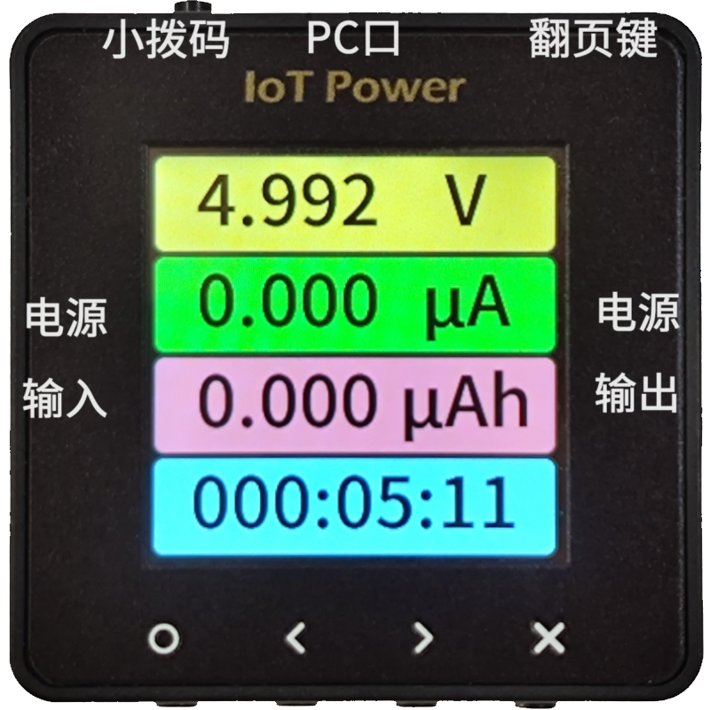

# 操作说明

该部分内容将讲解设备各部分功能的具体含义与按键操作方式

设备支持中英文双语切换，下方截图只提供了英文界面截图，不影响实际理解

```{warning}
⚠风险提示：  
**PC口**，严禁反接或电压大于6V，反接或大于6V必烧！  
测量口的正负极严禁反接，反接设备必烧！  
不听就把设备烧，只能群里发牢骚！
```

## 产品外观与按键功能

设备基本外观如下

{w=300px align=center}

|     序号     |                                        功能                                        | 底部按键 |  按键功能  |     |     |
| :----------: | :--------------------------------------------------------------------------------: | :------: | :--------: | --- | --- |
|   **PC口**   |                             设备自身供电/PC客户端通讯                              | **O键**  | 确定键 `O` |     |     |
| **电源输入** |                                USB TYPE-C 供电输入                                 | **<键**  | 左移键 `<` |     |     |
| **电源输出** |                                USB TYPE-C 供电输出                                 | **>键**  | 右移键 `>` |     |     |
|  **翻页键**  |                              翻页键/强制进入升级模式                               | **X键**  | 取消键 `X` |     |     |
|  **小拨码**  | 切换CC的供电来源（[用法见此](https://wiki.luatos.com/iotpower/cc/parts.html#id3)） |          |            |     |     |

:::{dropdown} 使需使用香蕉座，可以参考这里
板子上的④⑤⑥⑦为香蕉座插孔，如有需要可以：

1. 购买香蕉座自行焊接，比如[这一家店卖的](https://item.taobao.com/item.htm?id=680807959486) `￠2*￠4*8+￠3*1.6（20个）`就可以匹配上这些孔
2. 将座子焊接上即可
   :::

```{warning}
⚠风险提示：部分品牌快充充电头（如华为、小米等私有协议快充头）可能会误识别快充协议，导致向设备提供超过5.8V的高电压导致瞬间烧毁设备。
建议尽量不要使用快充充电头连接设备的**PC口**
```

## 数据概览页


该页由上到下显示的值分别为：

- 电压瞬时值
- 电流瞬时值
- 当前耗电量或当前功率
- 设备统计时间
- 按下 `O`键，可旋转屏幕
- 按下 `<`键，可切换 `Wh`、`Ah`与 `W`的显示
- 按下 `>`键，可切换显示风格
- 按下 `X`键，可清空累加数据（时间、电量等），从头重新统计
- 按下 `翻页/DFU`键5秒以上再松开，可清空底电流归零

## 详细数据页


该页显示了平均电流、峰谷电流与更加详细的电量统计（安时与瓦时）

- 按下 `X`键，可清空所有数据，从头重新统计
- 按下 `翻页/DFU`键5秒以上再松开，可清空底电流归零

## 波形预览页


该页可预览当前的电流波形数据

- 按下 `O`键，可重新开始或暂停当前的波形刷新
- 按下 `<`键，可切换 `Wh`、`Ah`与 `W`的显示
- 按下 `>`键，可更改电流波形纵坐标范围，固定或自适应
- 按下 `X`键，可清空当前数据，重新抓取

## PD电压电流切换页


该页可设置PD诱骗的目标电压与电流值

- 按下 `O`键，可开启PD功能，请按弹窗描述继续操作


当进入PD/PPS页面时，可以切换电压电流档位

- 按下 `O`键，可执行当前选中项目的操作
- 按下 `<`与 `>`键，可按顺序切换需要选择的值按钮
- 按下 `X`键，可关闭PD诱骗功能

### 有关PD功能的注意事项

1. 仅支持PD、PPS快充协议的诱骗，其他快充协议不支持
2. PD使用CC引脚进行通信，标准的连接线为 `USB-C口`--`USB-C口`，一般A口的线都不行
3. 即使能使用手机触发快充，也不能证明支持PD
4. 大部分手机厂家附赠的充电头，支持的为非标准PD，不一定好使，建议买第三方的头
5. 部分 `USB-C口`--`USB-C口`线缆，只有四根线芯，这种不能使用。必须要用带CC引脚的六根线芯的线
6. 触发PD并更改电压后，电压可能会跳到5V，所以建议更改电压前断开输出
7. 当设置页开启 `启用PPS功能`选项后，将在支持PPS功能的充电头上自动进入PPS模式。因某些充电头的PD与PPS支持范围不同，如需使用纯PD固定档位模式，请前往设置关闭该功能

## 设置页


该页可设置设备中的各项参数

- 按下 `O`键，可开启功能，或将值向左调整
- 按下 `<`与 `>`键，可向上下切换项目
- 按下 `X`键，可关闭功能，或将值向右调整

## 手动进入升级模式

如果用户在升级设备的途中出错，导致设备无法正常使用，可以手动进入升级模式（DFU）手动升级

可以先断开设备的电源连接，按住 `⑿翻页键/强制进入升级模式`，再插入USB供电，这时可以看见**设备屏幕上显示DFU模式的信息**，也可以在电脑的 `设备管理器`的 `通用串行总线设备`中找到名为 `IotPower DFU`的设备

最后打开客户端--`设备与软件设置`--`强制升级固件`，进行升级操作即可
