#🖥 PC Client

## Download

- Microsoft Store download: [Microsoft Store page](https://www.microsoft.com/store/apps/9N8S8M8226SH)
- Standalone exe version: [IOT Power.exe](https://llcom.papapoi.com/iotpower/latest.html) (note Microsoft antivirus misrepresentation)
- **All Platform** command line data logger, dll/so dynamic runtime library please go to [gitee repository](https://gitee.com/openLuat/iot-power) to view

:::{dropdown} win7 users may need
(Win10 or above no need to manually install driver)

IoT Power V1 CP2102 driver: [CP210x_Windows_Drivers](https://www.silabs.com/documents/public/software/CP210x_Windows_Drivers.zip)

IoT Power CC driver: [IoTPower_CC_usb_driver.7z](https://llcom.papapoi.com/iotpower/IoTPower_CC_usb_driver.7z)

net framework 4.6.2: [Installer](https://dotnet.microsoft.com/zh-cn/download/dotnet-framework/thank-you/net462-offline-installer)
:::

## Client Introduction

The following functions are available on the client and may continue to be added:

- View current waveforms
- Record historical data
- Analyze data for a specified time period
  - Average current
  - Average voltage
  - Average power
  - Max, min current
  - Max, min voltage
- Import and export of captured data, support export as standalone exe
- Upgrade firmware for devices
- Run lua scripts to control the output and simulate the discharge curve of batteries and other devices


```{note}
This tutorial was written in ``2.0.7.11`` version, if there are any new or changed features not mentioned, please leave a message at the bottom of the page to remind to update, thanks!
```

## Software Interface

The layout of the software home page is shown below

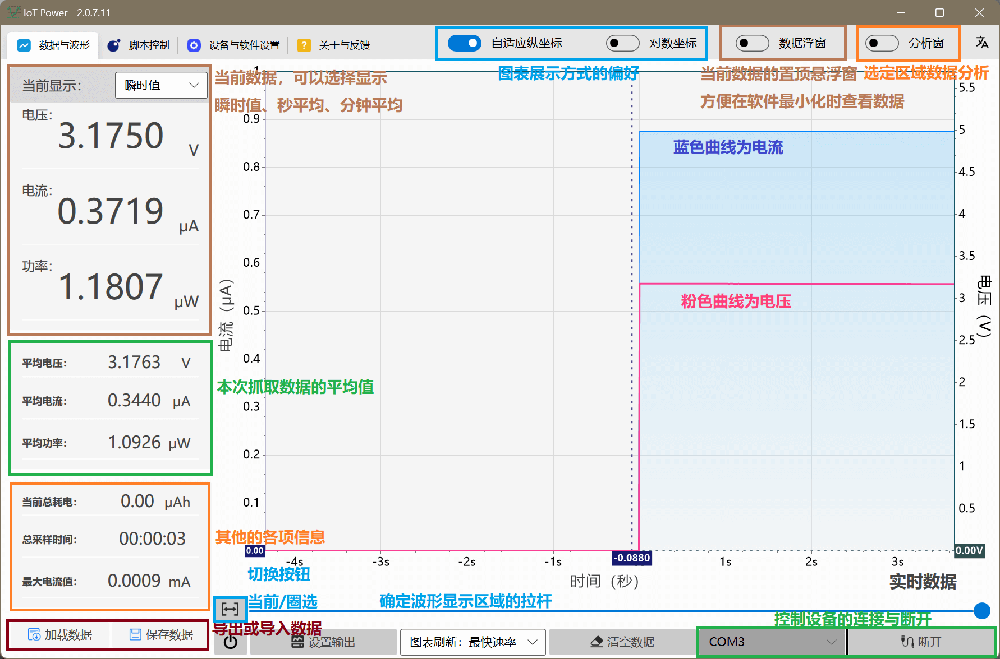

### Current display

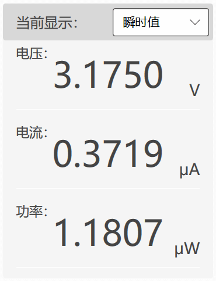
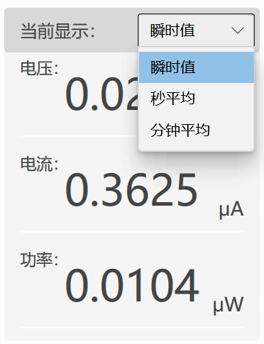

The value in this area is the current data after the device is connected, and can be switched to a sliding average or instantaneous value

The **data floating window** switch at the top of the software can open the floating window, which displays the exact same data as here, and is always displayed at the top, making it easy to view real-time data after minimizing the software

> If you are in the instantaneous value slot, it may be inconsistent with the display on the device side, which is normal, because the refresh time point is not exactly the same

### Average data

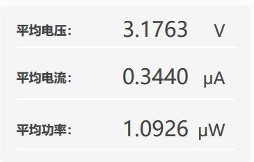

The data here is, **the average of all data** since this device was connected, cleared to zero after clearing

### Other data

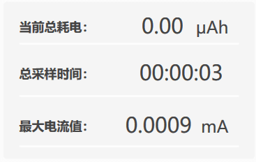

The data here is the cumulative data related to **all data** since this device was connected, cleared and zeroed out

## Chart area

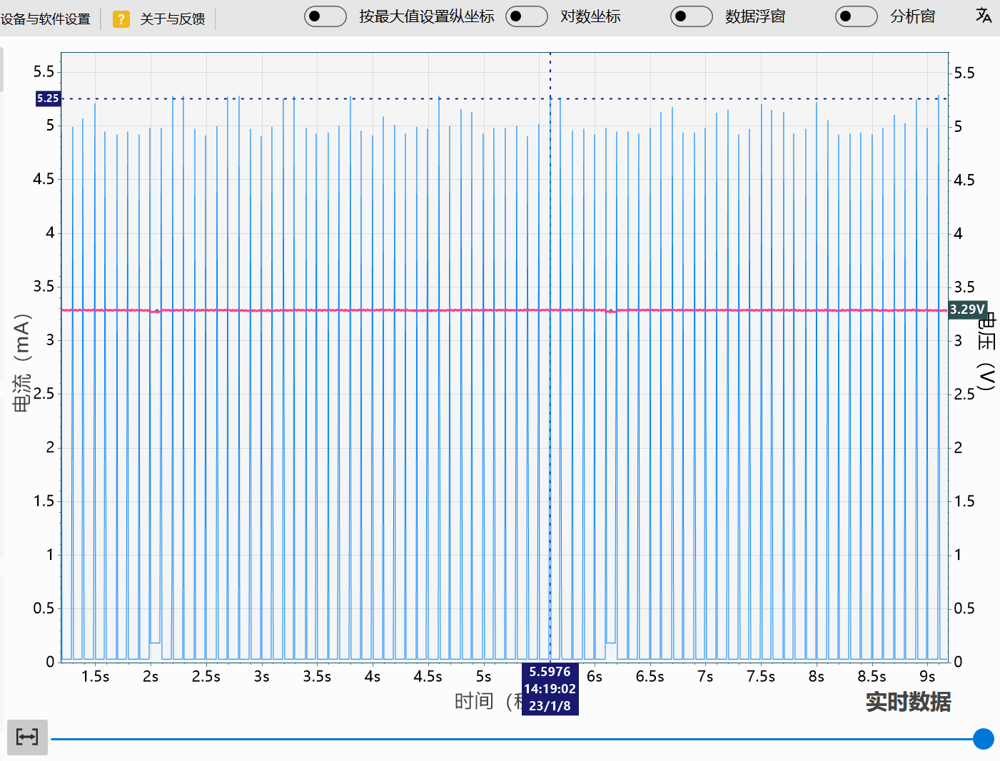

This area is the graph display area, you can preview the waveform graph

### Adjusting the display

- Adaptive coordinates: dynamically determine the range of vertical coordinates according to the maximum value of the current display area
- Set vertical coordinates by maximum value: fixes the vertical coordinate range by the maximum value of this grabbed data
- Logarithmic coordinates: when the absolute value of current data is extremely different, this function can be enabled and the value of vertical coordinates will be displayed in multiples of 10

### Toggle data display


Press this button to toggle between two display modes, **Real Time Data/Historical Data** and **Select a Region**, which are described below

### Real-time data/historical data (no zoom)

When the mouse is in the chart or on the drag axis, you can use the **mouse wheel** to adjust the temporal position of the waveform


You can also drag the joystick below to control the time position of the currently displayed waveform

```{note}
When viewing historical data, the waveform graph refresh will be paused in order not to be pushed out of change by new data.
So when in this mode and the `display waveform time position is on the far right side` (the latest time), only then will the `real-time refresh of the currently captured data` be performed.  
```

### Selecting a region (with zoom enabled)

Use the **left mouse button to drag** to select a region of data to view and enter `select region data` mode

When in `select area data` mode, you can use the **mouse wheel** to adjust the time position of the waveform

You can also **hold down the CTRL key and scroll the mouse wheel** to zoom in or out of the currently displayed area

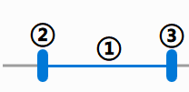

The pull bar here can also be used to control the range of the selection display

- Mouse drag ①: you can adjust the time position of the waveform
- Mouse drag ② or ③: you can adjust the start or end point of the waveform display
- Double click ①: you can switch to view the global data directly

### Analyze data

When in any mode, you can **right-click and drag** the mouse to select a time period to analyze the data

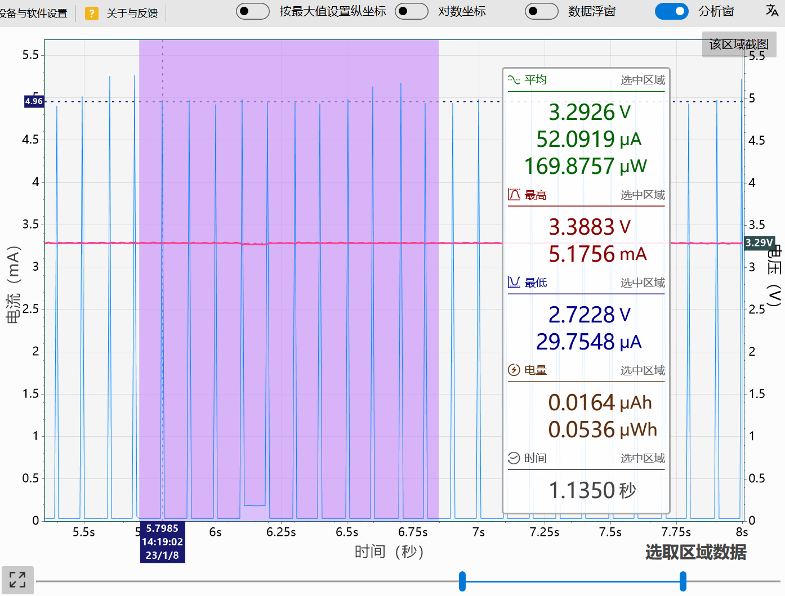

When a segment is selected, the `analysis window` will pop up to show the results of the analysis

## Control device output


- Control the output and shutdown state of the device with the `power symbol` button
- Set the output voltage and current of the device via the `device output` button

```{note}
This function is only available for `power products` and products with `PPS decoy` function
```

## Importing and Exporting Data

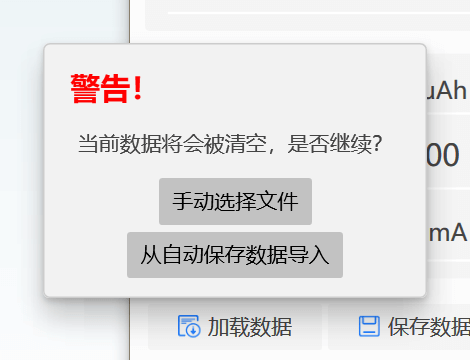
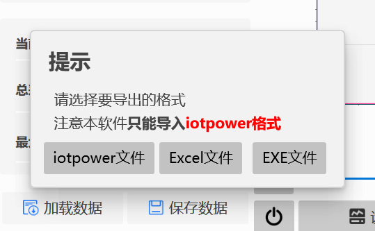

### Importing data

- Manually select the file to import the IoT Power-specific `.iotpl` file
- Importing an autosave file means importing from an autosave file. The autosave function usually appears when closing and re-capturing

### Exporting data

Data can be freely exported as `.iotpl` files, `.csv` table files, `.exe` self-executing files  
The difference is that the `.csv` table file is used for the user to analyze the original data by himself and cannot be re-imported  
While `.iotpl` files can be re-imported into the software, `.exe` self-executing files can also be exported as `.iotpl` files for import

## Script function


This function enables automatic control of output voltage and current  
The script uses the `Lua language`, adapted to the `LuaTask` framework ([tutorial](https://wiki.luatos.com/luaGuide/luatask.html))  
For the specific interface documentation, you can refer to [this repository's documentation](https://gitee.com/openLuat/iot-power)

## Forced firmware upgrade

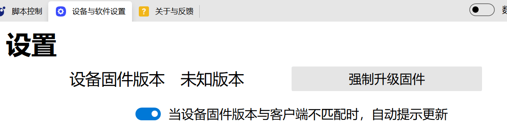

Normally, the device firmware will automatically prompt for an upgrade. However, sometimes when the device is interrupted on the way to upgrade or the firmware is corrupted for other reasons, the firmware can be manually flashed in

- Click the `Forced Firmware Upgrade` button to force the firmware that comes with the client to be flashed. Note: If the device has an upgrade mode, please enter the upgrade mode first before brushing.
- Right-click the `Forced Firmware Upgrade` button to force the user to refresh the firmware file manually selected by the user for testing functions and verifying bug fixes.

## Data caching method

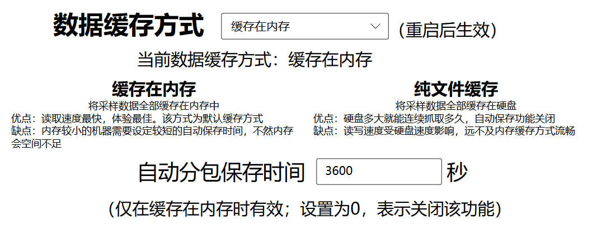

Because the sampling rate of the device is very high, the amount of data is very large, and storing it in memory may cause the computer memory to be insufficient  
So the software provides an auto-save function, which automatically saves the data to a file when the time is reached to prevent it from taking up too much memory

Of course, in order to store the huge amount of data that some users have perverted (such as continuous capture for more than ten hours), the software also provides the function of using the hard disk to cache the data  
In this mode, some of the smoothness is sacrificed in exchange for a much lower memory footprint, and the auto-save is not triggered to ensure the continuity of the data
