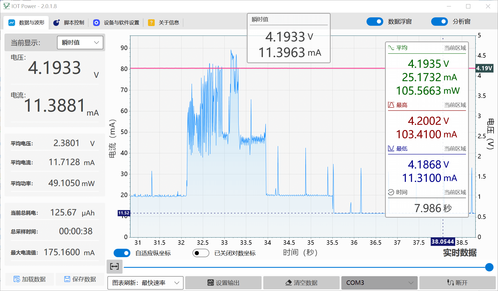
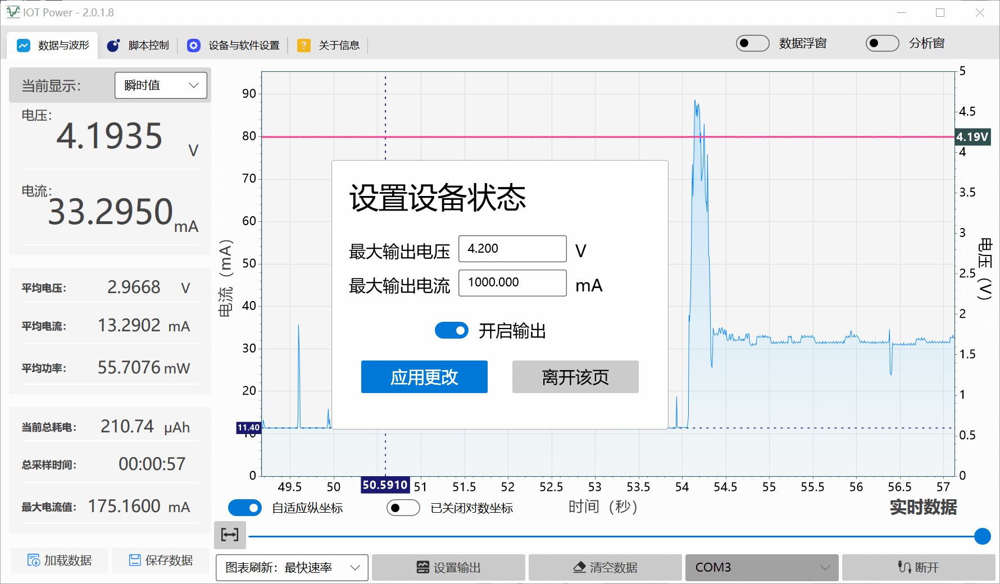
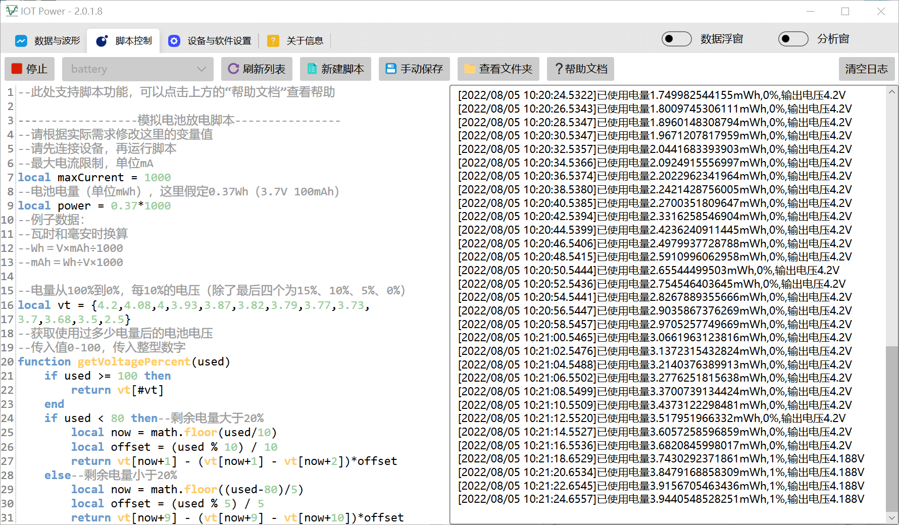

# 🖥 PC客户端

## 下载

- 独立版exe：[IOT Power.exe](https://cdn.openluat-luatcommunity.openluat.com/attachment/20221021103631246_IOT%20Power.exe)（[如果浏览器拦截，请按此方法解决](https://cn.bing.com/search?q=edge%E6%B5%8F%E8%A7%88%E5%99%A8%E9%98%BB%E6%AD%A2%E6%96%87%E4%BB%B6%E4%B8%8B%E8%BD%BD)）
- 微软商店版：[微软商店页面](https://www.microsoft.com/store/apps/9N8S8M8226SH) （交了保护费不会报毒或拦截，但更新慢一拍。）
- **全平台**命令行数据记录器、win/linux动态库请前往[gitee仓库](https://gitee.com/openLuat/iot-power)查看

```{note}
win7用户可能需要

cp2102驱动：[CP210x_Windows_Drivers](https://www.silabs.com/documents/public/software/CP210x_Windows_Drivers.zip)

.net framework 4.6.2：[安装包](https://dotnet.microsoft.com/zh-cn/download/dotnet-framework/thank-you/net462-offline-installer)
```

## 客户端简介

客户端可提供以下功能，可能会继续增加：

- 查看电流波形
- 记录历史数据
- 分析指定时间段的数据
  - 平均电流
  - 平均电压
  - 平均功率
  - 峰值、最小电流
  - 峰值、最小电压
- 导入与导出抓取的数据，支持导出为独立exe
- 为设备升级固件
- 运行lua脚本控制输出，模拟电池等设备放电曲线







## 客户端使用教程

<div class="admonition">
    <p class="title">【功耗测试器】iotPower客户端使用教程</p>
    <iframe id="spjc" src="//player.bilibili.com/player.html?aid=340988459&bvid=BV1vR4y1K7Q9&cid=582305801&page=1" scrolling="no" border="0" frameborder="no" framespacing="0" allowfullscreen="true" width="100%"> </iframe>
    <script type="text/javascript">
    document.getElementById("spjc").style.height=document.getElementById("spjc").scrollWidth*0.76+"px";
    </script>
</div>
